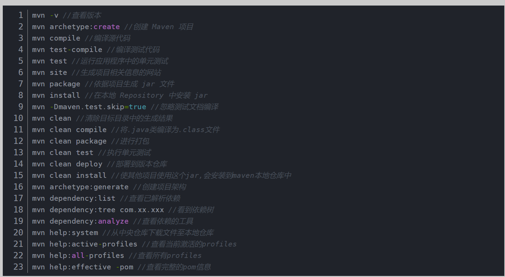
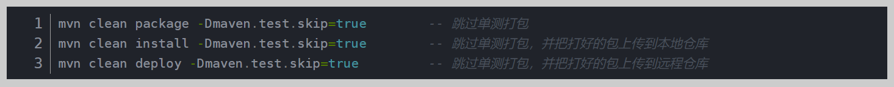

# maven安装配置,命令

*本说明使用工程 [idea-maven知识(默认)](material\idea-mavne-knowledge.bat)* 

## maven的安装与配置

1. [下载maven架构工具](https://maven.apache.org/download.cgi),解压,配置环境变量:

   > M2_HOME=解压后的maven路径名

   然后在 Path 中加入:

   > %M2_HOME%bin

   打开 cmd 面板,输入以下指令检查版本
   ```sh
   mvn -v
   ```

2. 配置:maven的配置文件为你刚解压的目录中的路径: apache-maven-版本号\conf\settings.xml ,备份该文件,然后重新创建同名文件,基本架构为:
   ```xml
   <?xml version="1.0" encoding="UTF-8"?>
   <settings xmlns="http://maven.apache.org/SETTINGS/1.2.0"
     xmlns:xsi="http://www.w3.org/2001/XMLSchema-instance"
     xsi:schemaLocation="http://maven.apache.org/SETTINGS/1.2.0 https://maven.apache.org/xsd/settings-1.2.0.xsd">
   </settings>
   ```
   
   配置本地仓库位置,在其中添加:
   ```xml
   <localRepository>D:\maven\repository</localRepository>
   ```
   
   配置阿里云镜像仓库:
   ```xml
   <mirrors>
       <mirror>
         <id>aliyunmaven</id>
         <mirrorOf>*</mirrorOf>
         <name>阿里云公共仓库</name>
         <url>https://maven.aliyun.com/repository/public</url>
       </mirror>
   </mirrors>
   ```
   
   配置java版本:
   ```xml
   <profiles>
       <profile>
           <id>jdk-21</id>
           <activation>
               <activeByDefault>true</activeByDefault>
               <jdk>21</jdk>
       	</activation>
           <properties>
               <maven.compiler.source>21</maven.compiler.source>
               <maven.compiler.target>21</maven.compiler.target>
               <maven.compiler.compilerVersion>21</maven.compiler.compilerVersion>
           </properties>
       </profile>
   </profiles>
   ```
   
   注意:当执行相关的mvn命令后,在用户目录下生成 [settings.xml](C:\Users\Administrator\.m2\settings.xml) 文件,当再次使用mvn命令后将会读取该文件.如果想要重新修改maven配置,需要连同这个文件一起修改
## 关于maven的常用一般命令



## 关于maven的常用打包命令

