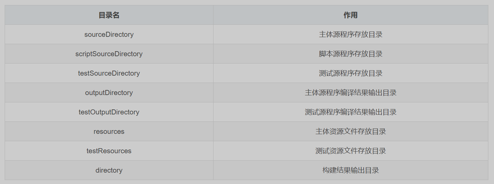
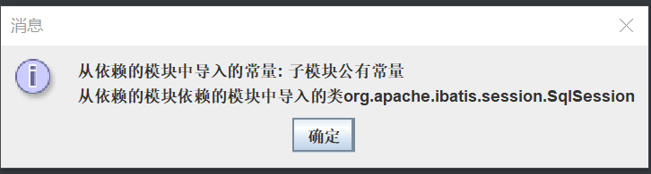

# pom文件架构,maven多模块

## pom文件

### 基本

1. 以工程  [mavne-knowledge](material\mavne-knowledge) 为例.对于一个 [pom.xml](material\mavne-knowledge\pom.xml) 文件,除了基本架构,至少应该声明项目的坐标三要素:
   ```xml
   <?xml version="1.0" encoding="UTF-8"?>
   <project xmlns="http://maven.apache.org/POM/4.0.0"
            xmlns:xsi="http://www.w3.org/2001/XMLSchema-instance"
            xsi:schemaLocation="http://maven.apache.org/POM/4.0.0 http://maven.apache.org/xsd/maven-4.0.0.xsd">
       <modelVersion>4.0.0</modelVersion>
       <!--以上为pom文件的schema文档约束以及版本,皆为固定写法-->
   
       <groupId>org.giccqer</groupId><!--公司id,模块id,版本号,可以由这些在maven仓库中定位某个依赖-->
       <artifactId>mavne-knowledge</artifactId>
       <version>0.0.1</version>
   
   </project>
   ```

   可以在此基础上添加项目的属性标签 <properties> (可以不写,默认采用全局配置)
   ```xml
   <properties><!-- 工程编译,构建使用的jdk版本,读取源码时所使用的编码方式 -->
       <maven.compiler.source>21</maven.compiler.source>
       <maven.compiler.target>21</maven.compiler.target>
       <project.build.sourceEncoding>UTF-8</project.build.sourceEncoding>
       <jdbc.version>9.0.0</jdbc.version><!--自定义的属性,用于下方声明相关jdbc依赖的版本号-->
   </properties>
   ```
   
   同理,可以添加 <repositories> 标签来配置阿里云镜像仓库位置,由于已在全局配置中声明所以也可以不写
   
   ```xml
   <repositories>
       <repository>
           <id>aliyun</id>
           <url>https://maven.aliyun.com/repository/public</url>
       </repository>
   </repositories>
   <pluginRepositories>
       <pluginRepository>
           <id>aliyun-plugin</id>
           <url>https://maven.aliyun.com/repository/public</url>
       </pluginRepository>
   </pluginRepositories>
   ```
   
2. 可以添加 <name> 标签声明该项目的名称(也是打包后的名称)
   ```xml
   <name>maven-knowledge</name>
   ```

   添加 标签声明其打包方式,分三种:
   默认 jar (或不写) :示这个工程是一个Java工程,打jar包
   war :表示这个工程是一个Web工程,打包后由tomcat服务器使用(打war包)
   pom :表示这个工程是某(些)子模块的父工程,父工程不写业务代码,可以将src文件删除.父工程本身可以是别的工程的子工程

   ```xml
   <packaging>pom</packaging>
   ```

### 依赖管理

添加 <dependencies> 标签声明本项目所导入的依赖,对于非父项目表示当前工程所依赖的jar包.某些依赖会依赖其他的依赖,这些都会被导入.对于父依赖,所有的子项目全部依赖于这些依赖,即使子项目没有声明,这些依赖的<scope>标签要被声明为compile(默认),否则没有意义,当子模块编译时这些依赖也会同时被编译
关于<scope>标签的种类

| <scope>标签值 |                             用法                             | 是否被打包 |
| :-----------: | :----------------------------------------------------------: | :--------: |
| compile(默认) |              参与项目的编译,测试,运行,可以不写               |     是     |
|    runtime    |                  不参与编译,但参与测试运行                   |     是     |
|   provided    |                      参与编译,测试,运行                      |     否     |
|     test      |                     仅在测试时编译和运行                     |     否     |
|    system     | 与provided用法相同,依赖仅会从本地系统导入,需要添加 systemPath 属性定义路径 |     否     |
|    import     | 只能用在<dependencyManagement>标签中,表示在自身的<dependencyManagement><br />标签中复制依赖中的<dependencyManagement>标签中的依赖项 |     否     |

默认<scope>标签值声明为 compile 才可以向依赖自身的项目传递自身的依赖,如果不希望传递,则可以添加<optional>标签并声明其值为true即可.同理,如果想要排除某依赖中的依赖,则可以使用<exclusions>标签进行排除.以下为maven依赖管理示例
```xml
<dependencies>
    <dependency><!--根据父项目中的dependencyManagement标签中的可选依赖声明导入的依赖,不需要写版本号-->
        <groupId>org.springframework.boot</groupId>
        <artifactId>spring-boot-starter-web</artifactId>
        <exclusions>
            <exclusion><!--使用excludes标签排除依赖的依赖,以防止与其他依赖或依赖的依赖冲突(如版本冲突),无需写版本号-->
                <groupId>org.springframework.boot</groupId>
                <artifactId>spring-boot-starter-tomcat</artifactId>
            </exclusion>
        </exclusions>
    </dependency>
    <dependency>
        <groupId>io.netty</groupId>
        <artifactId>netty-all</artifactId>
        <version>4.1.113.Final</version>
        <scope>compile</scope><!--依赖范围,不写则默认是compile,编译、测试、运行时需要,会被打包-->
        <optional>true</optional><!--声明为true时,依赖本项目的工程不会向其传递这个依赖,不影响子模块-->
    </dependency>
    <dependency>
        <groupId>org.ow2.asm</groupId>
        <artifactId>asm</artifactId>
        <version>9.7</version>
        <scope>provided</scope><!--运行时不需要,不会被打包,不可传递-->
    </dependency>
    <dependency>
        <groupId>com.mysql</groupId>
        <artifactId>mysql-connector-j</artifactId>
        <!--使用上方自定义属性来指定jdbc版本,如果引入了很多同版本的项目,可以以此来统一并快速修改版本号-->
        <version>${jdbc.version}</version>
        <scope>runtime</scope><!--只参与项目的运行和测试,不参与编译,会被打包-->
    </dependency>
    <dependency>
        <groupId>org.junit.jupiter</groupId>
        <artifactId>junit-jupiter-api</artifactId>
        <version>5.10.3</version>
        <scope>test</scope><!--只在测试时需要,不会被打包-->
    </dependency>
</dependencies>
```

### 插件管理

在<build>标签中添加<plugins>标签添加插件,用以规定项目目录,管理生命周期.父标签下的插件会自动导入子标签中,这里演示如何添加 mybatis 逆向工程插件
```xml
<build>
    <plugins><!-- plugins 标签就是所管理的插件集 -->
        <plugin>
            <groupId>org.mybatis.generator</groupId><!--mybatis逆向工程相关插件,使用坐标三要素定位-->
            <artifactId>mybatis-generator-maven-plugin</artifactId>
            <version>1.4.2</version>
            <configuration><!--不同插件configuration标签下的元素是不同的,具体情况要具体处理-->
                <verbose>true</verbose>
                <overwrite>true</overwrite>
            </configuration>
            <dependencies><!--mybatis逆向工程插件所需要导入的依赖,写法同上-->
                <dependency>
                    <groupId>com.mysql</groupId>
                    <artifactId>mysql-connector-j</artifactId>
                    <version>${jdbc.version}</version>
                </dependency>
            </dependencies>
        </plugin>
    </plugins>
</build>
```

以下为<build>标签中的内容详表:


## maven多模块

### 父项目的构建与依赖管理

对于父项目的 [pom.xml](material\mavne-knowledge\pom.xml) ,必须添加以下声明标签
```xml
<packaging>pom</packaging>
```

父项目<dependencies>标签中的依赖会被子项目加载,同时可以创建<dependencyManagement>声明可以选择性加载的依赖.对于一般项目,声明在<dependencyManagement>标签中的依赖在<dependencies>中引用时可以不写版本号,而子项目会继承父项目的<dependencyManagement>标签.

```xml
<dependencyManagement>
    <dependencies>
        <dependency><!--在本标签中要写上版本号-->
            <groupId>org.mybatis</groupId>
            <artifactId>mybatis</artifactId>
            <version>3.5.16</version>
        </dependency>
</dependencyManagement>
```

### 子项目的继承

可以在pom文件中添加<parent>标签来声明自身的父项目是谁,即便自己本身是某些项目的父项目,如在[pom.xml](material\mavne-knowledge\pom.xml)中添加springboot依赖:
```xml
<parent><!--声明该项目的父工程,使用坐标三要素定位,建议写在前面-->
    <groupId>org.springframework.boot</groupId>
    <artifactId>spring-boot-starter-parent</artifactId>
    <version>3.3.4</version>
</parent>
```

自定义子模块的创建:在idea中右键父模块,在**新建**中选择**模块......**,输入好名称(本项目命名为 depend-on-father )即可创建.此时在父模块的pom文件中会多出一个自动创建的标签<modules>,本标签声明了父模块项目中所包含的其他模块(注:不一定是子模块,只要包含在父模块项目工程下的模块都要声明否则idea无法识别)

```xml
<modules>
    <module>depend-on-father</module>
</modules>
```

对于该子模块(工程名 [depend-on-father](material\mavne-knowledge\depend-on-father) )的 [pom.xml](material\mavne-knowledge\depend-on-father\pom.xml) 文件,会自动生成有关继承的父模块的信息:
```xml
<parent>
    <groupId>org.giccqer</groupId>
    <artifactId>mavne-knowledge</artifactId>
    <version>0.0.1</version>
</parent>
```

声明模块坐标时,如果模块的公司id和版本号与父模块相同则可以省略<groupId>和<version>标签
```xml
<artifactId>depend-on-father</artifactId>
```

根据父模块和父模块的父模块<dependencyManagement>标签中的依赖,在自身<dependency>标签中声明自己要用到的依赖:
```xml
<dependencies>
    <dependency><!--声明依赖父标签dependencyManagement中的项目,子模块依赖版本号可以不声明.若声明则覆盖父标签的版本号-->
        <groupId>org.mybatis</groupId>
        <artifactId>mybatis</artifactId>
    </dependency>
    <dependency> <!--同理,不过声明导入的是父依赖的父依赖中的dependencyManagement标签中的项目-->
        <groupId>org.springframework.boot</groupId>
        <artifactId>spring-boot-starter-data-redis</artifactId>
    </dependency>
</dependencies>
```

在子模块中创建 [SubModuleMain.java](material\mavne-knowledge\depend-on-father\src\main\java\org\giccqer\SubModuleMain.java) 类并运行其中的主方法,测试依赖传递是否正确:
```java
public class SubModuleMain {
    public static void main(String[] args) {
        //netty依赖已在父标签中强制声明使用
        System.out.println("检测 netty 依赖是否导入成功: " + ByteBuf.class.getName());
        //mybatis依赖在子标签中根据父依赖中声明的dependencyManagement标签内的依赖自行导入
        System.out.println("检测 mybatis 依赖是否导入成功: " + SqlSession.class.getName());
        //springboot-redis依赖在子标签中根据父依赖的父依赖中声明的dependencyManagement标签内的依赖自行导入
        System.out.println("检测 springboot-redis 依赖是否导入成功: " + StringRedisTemplate.class.getName());
    }
}
```

### 子项目之间的相互引用

在父项目的 [pom.xml](material\mavne-knowledge\pom.xml) 文件中将刚创建好的子项目纳入<dependencyManagement>依赖管理标签中(可以不写):
```xml
<dependencyManagement>
    <dependencies>
        <dependency><!--自行编译的依赖,子模块,声明该模块可以被其他子模块调用(可以不写)-->
            <groupId>org.giccqer</groupId>
            <artifactId>depend-on-father</artifactId>
            <version>0.0.1</version>
        </dependency>
    </dependencies>
</dependencyManagement>
```

在父项目下创建子项目(此处命名为 [use-brother-module-dependency](material\mavne-knowledge\use-brother-module-dependency) ),在本子项目的 [pom.xml](material\mavne-knowledge\use-brother-module-dependency\pom.xml) 文件中声明对上述子项目的依赖:
```xml
<dependencies>
    <dependency><!--声明调用父模块中的另一个子模块作为依赖,若父标签的dependencyManagement没有声明则需要添加版本号-->
        <groupId>org.giccqer</groupId>
        <artifactId>depend-on-father</artifactId>
    </dependency>
</dependencies>
```

在本子项目中创建类 [SubModuleMain2.java](material\mavne-knowledge\use-brother-module-dependency\src\main\java\org\giccqer\SubModuleMain2.java) 并运行其中的主方法来测试依赖传递:
```java
public static void main(String[] args) {
    //来自另一个子模块中的常量
    String subModuleMessage = "从依赖的模块中导入的常量: " + SubModuleMain.SUB_MODULE_STRING;
    //来自自身所依赖的依赖中的类
    String myModuleMessage = "从依赖的模块依赖的模块中导入的类" + SqlSession.class.getName();
    //弹出对话框并输出相关信息
    JOptionPane.showMessageDialog(null, subModuleMessage + "\n" + myModuleMessage, "消息", JOptionPane.INFORMATION_MESSAGE);
}
```

执行该主方法后将会弹出输出相关消息的对话框.
在父模块执行build任务(如打包,发布,清理)后,所有的子模块都会按照正确的顺序执行相应的任务(打包任务就是从最底层开始),所以对于多模块项目其整体build的任务可以在父模块中执行,而通常单独一个子模块几乎无法执行打包任务.注意:当子模块需要相互依赖的时候,不要让模块间循环依赖,如A依赖B,B依赖C,C依赖A

### 父项目纳入其他父项目的版本管理

由于一个项目最多只继承一个父项目,当需要"继承"更多的父项目时,需要在自身<dependencyManagement>标签中进行指定,在父项目的 [pom.xml](material\mavne-knowledge\pom.xml) 中的<dependencyManagement>标签中添加:
```xml
<dependencyManagement>
    <dependencies>
        <dependency><!--该项目本身为父项目,导入该项目后本项目将其<dependencyManagement>标签中的依赖纳入自身-->
            <groupId>org.springframework.cloud</groupId>
            <artifactId>spring-cloud-dependencies</artifactId>
            <version>2023.0.3</version>
            <type>pom</type><!--声明其为pom文件类型-->
            <scope>import</scope><!--声明为import标签,表示引入其依赖管理-->
        </dependency>
    </dependencies>
</dependencyManagement>
```

在子标签中进行测试:在 depend-on-father 子模块的 [pom.xml](material\mavne-knowledge\depend-on-father\pom.xml) 中的<dependencies>里添加:

```xml
<dependencies>
    <dependency><!--同理,根据父标签的dependencyManagement标签中的依赖声明需要的依赖-->
        <groupId>org.springframework.cloud</groupId>
        <artifactId>spring-cloud-starter-netflix-eureka-server</artifactId>
    </dependency>
</dependencies>
```

在该子模块 [SubModuleMain.java](material\mavne-knowledge\depend-on-father\src\main\java\org\giccqer\SubModuleMain.java) 的主方法中添加下面一句并运行该主方法:
```java
System.out.println("检测 spring-cloud-starter-netflix-eureka-server 依赖是否导入成功:" + EnableEurekaServer.class.getName());
```

## maven打包为可执行的jar文件

1. maven的默认打包命令为 mvn package ,但对于普通项目来说,该命令即无法将依赖导入到生成的jar包中也无法自行声明主方法.本次使用 maven-assembly-plugin 插件进行普通项目的打包(注:如果是存在父子关系的多项目工程,请在父项目中进行打包操作),在父工程 [mavne-knowledge](material\mavne-knowledge) 中的 [pom.xml](material\mavne-knowledge\pom.xml) 文件里的<build>标签下,添加如下构建配置:
   ```xml
   <build>
       <finalName>my-package</finalName><!--指定打包后的名称-->
           <plugins><!-- plugins 标签就是所管理的插件集 -->
               <plugin>
                   <!--maven专用的普通项目打包插件,以下坐标三要素为固定写法-->
                   <!--若想打包成功,请主动打开cmd终端并执行命令: mvn package assembly:single -->
                   <groupId>org.apache.maven.plugins</groupId>
                   <artifactId>maven-assembly-plugin</artifactId>
                   <version>3.7.1</version>
                   <executions>
                       <execution>
                           <id>make-assembly</id>
                           <phase>package</phase>
                           <goals>
                               <!--将所有(子)项目打包成一个单一的jar包.有时idea会在此处标红,属于正常现象,不影响打包-->
                               <goal>single</goal>
                           </goals>
                       </execution>
                   </executions>
                   <configuration>
                       <archive>
                           <manifest><!--指定哪个方法为该jar程序的入口-->
                               <mainClass>org.giccqer.SubModuleMain2</mainClass>；
                           </manifest>
                       </archive><!--jar包的输出目录-->
                       <outputDirectory>${project.build.directory}/full-integration-package</outputDirectory>
                       <descriptorRefs><!--设置打包后的jar目录结构(默认)-->
                           <descriptorRef>jar-with-dependencies</descriptorRef>
                       </descriptorRefs>
                   </configuration>
               </plugin>
           </plugins>
       </build>
   ```

   
   请主动打开cmd终端窗口,输入以下指令打包:
   
   ```sh
   mvn package assembly:single
   ```
   
   请勿在idea的窗口中使用默认的 mvn package 或是 mvn assembly:single 打包指令,这样做的话打出的包不完整
   
   本配置以子工程 [use-brother-module-dependency](material\mavne-knowledge\use-brother-module-dependency) 中的主方法类 [SubModuleMain2.java](material\mavne-knowledge\use-brother-module-dependency\src\main\java\org\giccqer\SubModuleMain2.java) 作为jar程序的入口.最终会被完整打包到该子项目的 target/full-integration-package 文件夹下(注意:我已经把它复制到 [此文件夹](material/full-integration-package) 下了),双击该jar包,观察是否能正确打开对话框,结果如下:
   
   
