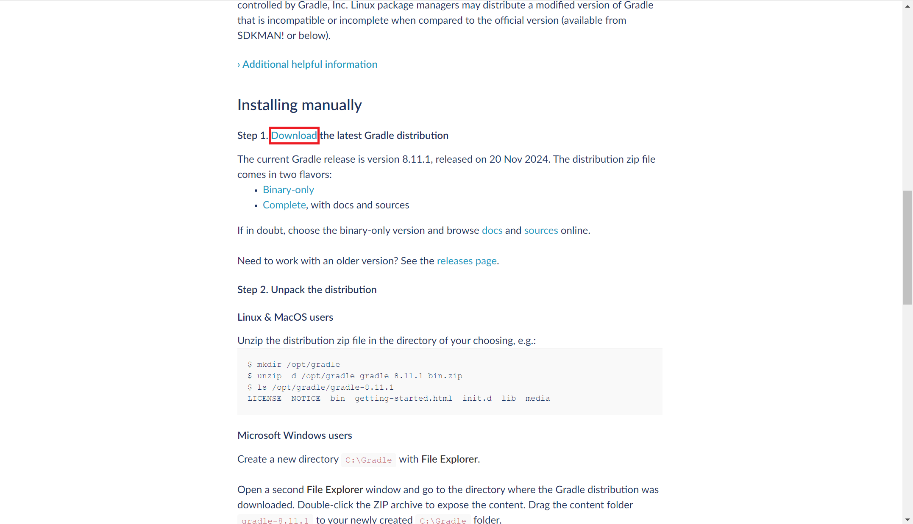
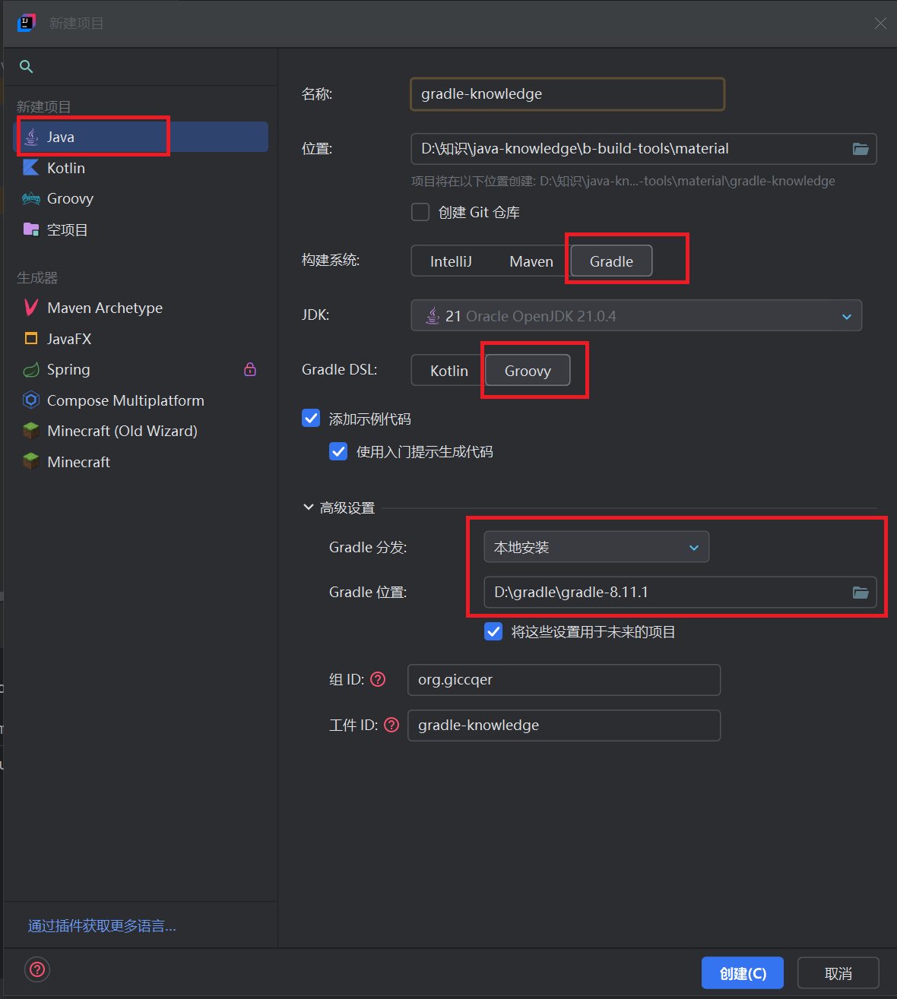
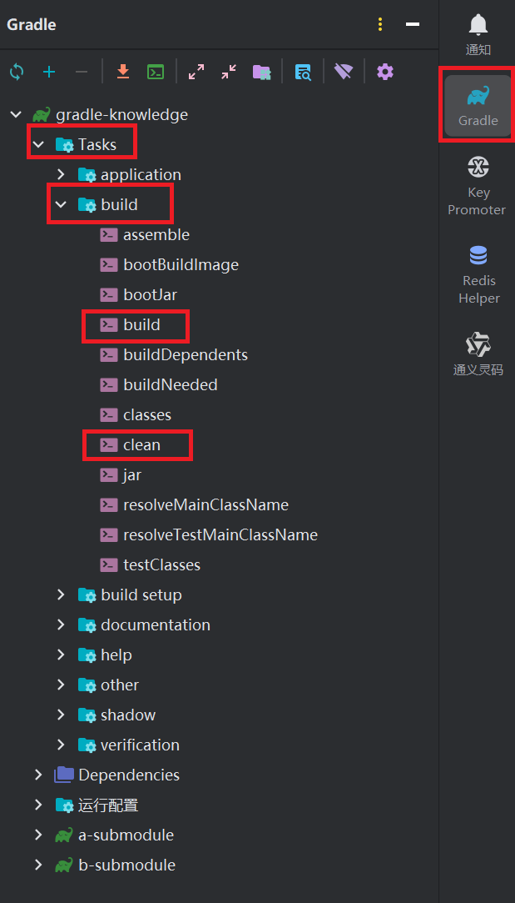
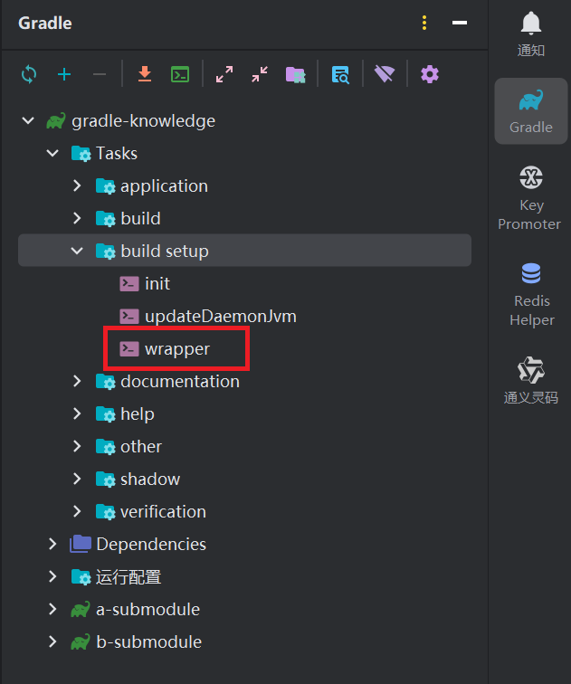
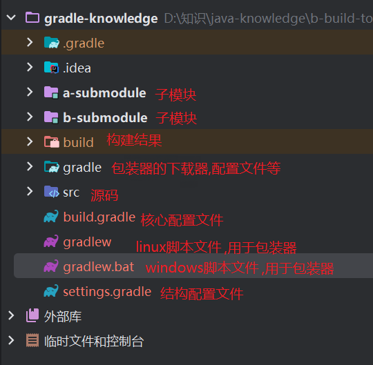
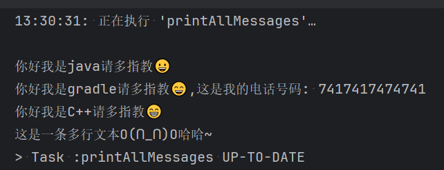
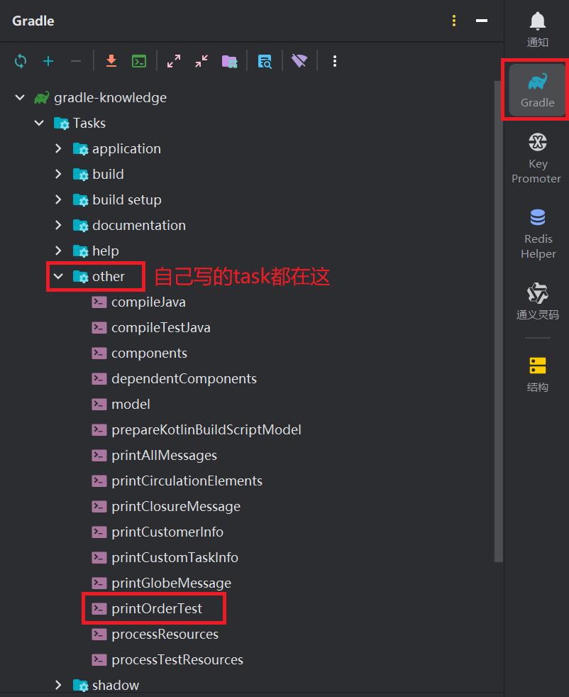
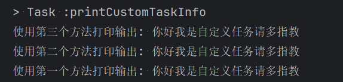
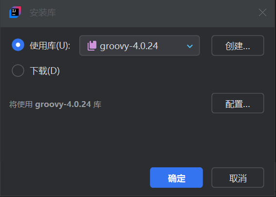
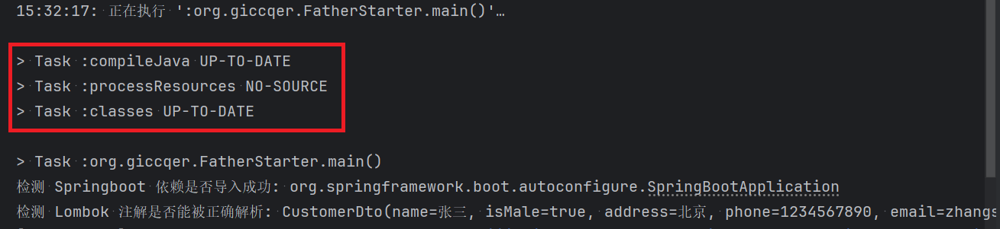

# gradle安装,配置,命令,语法,groovy

## 概述

> gradle作为替代maven的新一代构建工具,有着比maven更快的构建速度和更简洁的语法说明
> 相对于maven使用xml文件配置构建,gradle使用 .gradle 作为脚本文件, task任务 作为方法进行构建

## gradle安装

- 下载 [gradle压缩包](https://gradle.org/install/) :
   
   👉解压至任意位置👉添加环境变量:

   ```properties
   GRADLE_HOME=Gradle文件夹地址
   GRADLE_USER_HOME=gradle仓库地址
   #gradle会根据以下配置寻找maven仓库的地址
   M2_HOME=maven仓库地址
   ```

   ☞写入环境变量PATH:

   ```properties
   PATH=%GRADLE_HOME%\bin
   ```

   ☞打开CMD输入:
   ```sh
   gradle -version
   ```

   ✔输出版本号

## gradle配置

- > 将gradle的下载源更换为 [阿里云仓库](https://developer.aliyun.com/mvn/guide) 

   进入解压后的gradle文件夹☞gradle-版本号\init.d☞创建 init.gradle :
   ```groovy
   allprojects {
       repositories {
           //mavenLocal() //表示优先使用maven本地仓库,按情况配置
       	maven { name "Alibaba" ; url "https://maven.aliyun.com/repository/public" 		}
       	maven { allowInsecureProtocol=true //允许使用未经安全协议认证的仓库,下方也要加
                   name "Bstek" ; url "http://nexus.bsdn.org/content/groups/public/" 		}
           mavenCentral()
   }
    
       buildscript { 
           repositories { 
               maven { name "Alibaba" ; url 'https://maven.aliyun.com/repository/public' }
               maven { allowInsecureProtocol=true
                   name "Bstek" ; url 'http://nexus.bsdn.org/content/groups/public/' }
               maven { name "M2" ; url 'https://plugins.gradle.org/m2/' }
           }
       }
   }
   ```

## 创建gradle项目,测试构建运行

*本例使用工程 [idea-gradle知识(默认)](material\idea-gradle-knowledge.bat)* 

> 使用cmd指令 gradle init 可以快速构建一个gradle项目(结构稍微复杂些)
> 这里仅展示使用idea构建

1. 打开idea☞新建项目:
   
   ☞项目结构☞项目SDK选择java版本☞运行Main.java✔输出结果
   
   > 在生成的项目中 **gradle.build 是构建系统的核心配置文** , 相当于maven中的pom.xml
   > **settings.gradle 用于定义和管理多项目构建的结构和配置,如父子模块关系,各模块的项目名等**
   
2. 工具窗口gradle:
   
   ☞双击build✔控制台BUILD SUCCESSFUL☞双击clean✔控制台BUILD SUCCESSFUL,build文件夹被删除

3. 工具窗口终端☞输入cmd指令:
   ```sh
   gradle build
   ```

   ✔控制台BUILD SUCCESSFUL,生成build文件夹☞再次输入cmd指令:
   ```sh
   gradle clean
   ```

   ✔控制台BUILD SUCCESSFUL,build文件夹被删除

## gradle包装器的安装,配置,升级

> 有时,不同程序员所使用的gradle版本不尽相同,而不同版本的gradle语法功能差距很大,因此可以使用指定版本的包装器代替系统安装的gradle(或干脆不使用系统安装的gradle)
> 使用指令 gradlew 以使用包装器(本质上是启用bat或sh脚本)
> 反之,如果不需要使用它,则删除多余的 gradle文件夹 ,gradlew文件 和 gradlew.bat文件

1. 工具窗口gradle:
   

   ☞双击wrapper✔控制台BUILD SUCCESSFUL,**并生成 [gradle](material\gradle-knowledge\gradle) 文件夹, [gradlew](material\gradle-knowledge\gradlew) 与 [gradlew.bat](material\gradle-knowledge\gradlew.bat) 文件**☞工具窗口终端☞输入cmd指令:

   > 生成的文件结构目录如下:
   > 

   ```sh
   ./gradlew.bat build
   ```

   > (注意) 在windows系统的cmd窗口中,正确的指令为: gradlew build
   > 输入指令后,需要一定时间下载组件
   
   ✔控制台BUILD SUCCESSFUL,生成build文件夹☞再次输入cmd指令:

   ```sh
   ./gradlew.bat clean
   ```
   
   ✔控制台BUILD SUCCESSFUL,build文件夹被删除
   
1. > 配置包装器
   
   ☞ [gradle-wrapper.properties](material\gradle-knowledge\gradle\wrapper\gradle-wrapper.properties) :
   ```properties
   #解压后的Gradle包装器存放的根路径
   distributionBase=GRADLE_USER_HOME
   #解压后的Gradle包装器存放的具体路径
   distributionPath=wrapper/dists
   #Gradle包装器下载地址
   distributionUrl=https\://services.gradle.org/distributions/gradle-8.11.1-bin.zip
   #下载超时时间
   networkTimeout=10000
   #是否在下载前验证下载的Gradle包装器的URL是否有效
   validateDistributionUrl=true
   #Gradle包装器的zip压缩包缓存根路径
   zipStoreBase=GRADLE_USER_HOME
   #Gradle包装器的zip压缩包缓存的具体路径
   zipStorePath=wrapper/dists
   ```
   
2. > 将包装器升级至指定版本

   ☞工具窗口终端☞输入cmd指令:

   ```sh
   ./gradlew wrapper --gradle-version 8.11.1
   ```

   ✔控制台BUILD SUCCESSFUL

## gradle语法演示

### 局部字段的定义

- 创建  [grammar-test.gradle](material\gradle-knowledge\grammar-test.gradle) 脚本☞在 [build.gradle](material\gradle-knowledge\build.gradle) 引用该脚本,写入:
   ```groovy
   apply { from 'grammar-test.gradle' } //引入自定义脚本,该脚本与build.gradle在同一目录下,要写在plugins标签下方
   ```

   ☞在 [grammar-test.gradle](material\gradle-knowledge\grammar-test.gradle) 写入:
   ```groovy
   String customMessage1 = '你好我是java请多指教😀' //自定义的单行文本,在gradle中所有的分号都可以省略
   def insertNumber = 7417417474741 //使用def自定义的long型(推断类型)
   //将上long类型对象插入下方文本中,使用${}占位符
   def customMessage2 = "你好我是gradle请多指教😄,这是我的电话号码: ${insertNumber}" //使用def定义的GString
   def customMessage3 = '''你好我是C++请多指教😁
   这是一条多行文本O(∩_∩)O哈哈~''' //使用三个单引号创建的多行文本
   //println customMessage1 + '\n' + customMessage2 + '\n' + customMessage3 //写在task外则该方法无论如何都会执行
   tasks.register('printAllMessages') { //自定义的可执行的task任务
       //使用print()方法输出字符串.在gradle中,若不引起歧义,括号()大括号{}皆可省略
       println customMessage1 + '\n' + customMessage2 + '\n' + customMessage3
   }
   ```

   ☞点击自定义task右侧的播放按钮✔控制台输出:
   

### 全局字段的定义

   - 在 [grammar-test.gradle](material\gradle-knowledge\grammar-test.gradle) 写入:
      ```groovy
      ext { //在ext闭包中定义的变量为全局变量,可以向上传导至build.gradle中
          customMessage4 = "你好我是全局变量请多指教😊" //不可以显式定义该变量类型,在ext中的变量默认是动态类型
      }
      ```

      ☞在 [build.gradle](material\gradle-knowledge\build.gradle) 写入:
      ```groovy
      tasks.register('printGlobeMessage') {
          println customMessage4 //来自脚本的全局变量
      }
      ```

      ✔点击播放按钮,观察该task的输出

### 循环,List,Map

   - 在 [grammar-test.gradle](material\gradle-knowledge\grammar-test.gradle) 写入:
      ```groovy
      def numberList = [1, 2, 3] //定义一个List,默认类型是ArrayList
      numberList << 4 //使用<<号向List尾部添加元素
      numberList -= 1 //使用-=号从List中移除元素值为1的元素
      //定义一个Map,默认类型是LinkedHashMap
      def personInfoMap = ['姓名': '王大美', '性别': '女', '年龄': 18, '电话': 12345678910, '生日': new Date()]
      tasks.register('printCirculationElements') {
          for (i in 1..3) println '普通循环次数: ' + i //使用for循环遍历1到3的数字
          for (element in numberList) println '循环输出List中的元素: ' + element //使用for-in循环遍历List
          for (info in personInfoMap) println '循环输出Map中的元素: ' + info.key + '---' + info.value //使用for-in循环遍历Map
      }
      ```

      ✔点击播放按钮,观察该task的输出

### 闭包(函数)

- 在 [grammar-test.gradle](material\gradle-knowledge\grammar-test.gradle) 写入:
   ```groovy
   //自定义闭包(函数),没有形参或只有一个形参时可省略对形参的定义,只有一个形参时函数体内用it代表它
   def printOneMessage = { println it } 
   def mergeThreeMessage = { message1, message2, message3 -> //定义拥有三个形参的闭包(函数)
       message1 + '\n' + message2 + '\n' + message3 //闭包中以最后一句话作为方法返回值,可不写return
   }
   tasks.register('printClosureMessage') {
       printOneMessage '你好我是闭包请多指教😘'
       println mergeThreeMessage('我的世界是全世界最好玩的游戏!', 'java是全世界最好用的语言', 'gradle是全世界最好用的构建工具')
   }
   ```

   ✔点击播放按钮,观察该task的输出

### 类

- 在 [grammar-test.gradle](material\gradle-knowledge\grammar-test.gradle) 写入:
   ```groovy
   //定义一个类,兼容使用传统java方法定义,默认类和字段以public修饰(可省略),并自动生成全参构造,无参构造,getter和setter方法
   class CustomerInfo {
       String name
       boolean isMale
       int age
       Long phoneNumber
       Date birthday
       @Override
       String toString() {
           "CustomerInfo{name=" + name + ", isMale=" + isMale + ", age=" + age + ", phoneNumber=" + phoneNumber + ", birthday=" + birthday + '}'
       }
   }
   //创建实例时,使用 字段名:值 的方法为其中的字段赋值
   def customerInfo = new CustomerInfo(name: '王小明', isMale: true, age: 18, phoneNumber: 12345678910, birthday: new Date())
   tasks.register('printCustomerInfo') {
       println customerInfo
   }
   ```

   ✔点击播放按钮,观察该task的输出

### task,doFirst,doList

1. > 在idea中,有三种方法执行gradle task

   在 [grammar-test.gradle](material\gradle-knowledge\grammar-test.gradle) 写入:

   ```groovy
   tasks.register('printOrderTest') { //在task定义时使用doFirst方法和doLast方法可以决定该task在构建时要执行什么方法
       doFirst { //doFirst方法在doLast方法执行前倒序执行
           println 'doFirst1 方法执行'
       }
       doFirst {
           println 'doFirst2 方法执行'
       }
       println '核心方法执行,本task的名字是: ' + it.name //name为task的一个属性值
       doLast { //doLast方法在doFirst方法执行后顺序执行
           println 'doLast1 方法执行'
       }
       doLast {
           println 'doLast2 方法执行'
       }
   }
   ```

   ✔点击播放按钮,观察该task的输出:
   

2. 在控制台输入:

   ```sh
   gradle printOrderTest
   ```

   ✔观察控制台输出

3. 在idea gradle窗口双击 printOrderTest :
   
   ✔观察控制台输出

### 自定义task类执行多个task

- 在 [grammar-test.gradle](material\gradle-knowledge\grammar-test.gradle) 写入:
   ```groovy
   class CustomTask extends DefaultTask { //自定义task类,继承DefaultTask,可以定义多个方法倒序执行
       @Input
       //该字段不能为空,可以在定义task时传入值
       String info = '默认信息'
       @TaskAction
       //将该方法视为一个task,可以被注册发现
       def printInfo1() {
           println '使用第一个方法打印输出: ' + info
       }
       @TaskAction
       def printInfo2() {
           println '使用第二个方法打印输出: ' + info
       }
       @TaskAction
       def printInfo3() {
           println '使用第三个方法打印输出: ' + info
       }
   }
   tasks.register('printCustomTaskInfo', CustomTask) { //第二个参数是自定义的task类
       info = '你好我是自定义任务请多指教' //在闭包中定义该字段的值
   }
   ```

   ✔点击播放按钮,观察该task的输出:
   

## (可选)Groovy安装,使用

> gradle本身内置了groovy语言库文件,但可以单独下载groovy用以学习相关语法

1. 下载 [groovy压缩包](https://groovy.apache.org/download.html) 👉解压至任意位置👉添加环境变量:
   ```properties
   GROOVY_HOME=groovy位置
   ```

   ☞写入环境变量PATH:
   ```properties
   PATH=%GROOVY_HOME%\bin
   ```

   ☞打开CMD输入:
   ```sh
   groovy -v
   ```

   ✔输出版本号
   
2. 在idea的 src/main/java 源代码中,创建 [GroovyStarter.groovy](material\gradle-knowledge\src\main\java\org\giccqer\GroovyStarter.groovy) 写入:
   ```groovy
   package org.giccqer
   static void main(String[] args) {
       println '大家好我是Groovy😘'
   }
   ```

   ☞配置groovy sdk:
   

   ☞在 [build.gradle](material\gradle-knowledge\build.gradle) dependencies一项中写入:
   ```groovy
   dependencies {
       //为项目添加本地groovy语言支持,fileTree表示指定本地目录及其子目录中的文件集合,使用闭包配置该文件树导入的文件类型
       implementation fileTree('D:/gradle/groovy-4.0.24/lib') {
           include '*.jar'
           include '*/*.jar'
       }
   }
   ```
   
   ☞执行 [GroovyStarter.groovy](material\gradle-knowledge\src\main\java\org\giccqer\GroovyStarter.groovy) 主方法✔观察控制台输出

## 汇总

### gradle命令

> 对于拥有包装器的项目,可以使用 gradlew 命令

|      命令       |           说明            |
| :-------------: | :-----------------------: |
|  gradle bulid   |  构建项目,生成build文件   |
|  gradle clean   |  清除缓存,删除build文件   |
| gradle projects |     列出父模块,子模块     |
|  gradle tasks   |   列出工程中的所有task    |
|   gradle test   |       执行单元测试        |
|   gradle jar    |          打jar包          |
|   gradle init   | 创建一个gradle demo的项目 |

### task执行结果的标记

> 当gradle的task执行完毕后,往往会向控制台输出一些内容以告知执行结果,如当执行源代码src的main方法时,往往会在执行main之前运行多个task:
> 
> 以下为gradle task执行结果的标记

| task结果标记 |                 说明                 |
| :----------: | :----------------------------------: |
|   EXCUTED    |         task正常执行,最常见          |
|  UP-TO-DATE  |        表示task的输出没有改变        |
|  FOME-CACHE  | 表示可以从缓存中复用上一次的执行结果 |
|   SKIPPED    |               表示跳过               |
|  NO-SOURCE   |  有输入和输出,但没有来源,不执行task  |

### 语法:字符串的引号

|     引号     |               作用                |
| :----------: | :-------------------------------: |
|   ' 内容 '   |             纯字符串              |
|   " 内容 "   |    可引用变量${}和运算的字符串    |
| ''' 内容 ''' |         可换行的纯字符串          |
| """ 内容 """ | 可引用变量${}可运算可换行的字符串 |

### 语法:对象赋值取值方法

|             赋值方法              |     取值方法     |
| :-------------------------------: | :--------------: |
|          对象.属性名=xxx          |   对象.属性名    |
|         对象的setter方法          | 对象的getter方法 |
|        对象["属性名"]=xxx         |  对象["属性名"]  |
| new 对象(属性名1:xxx,属性名2:xxx) |                  |

