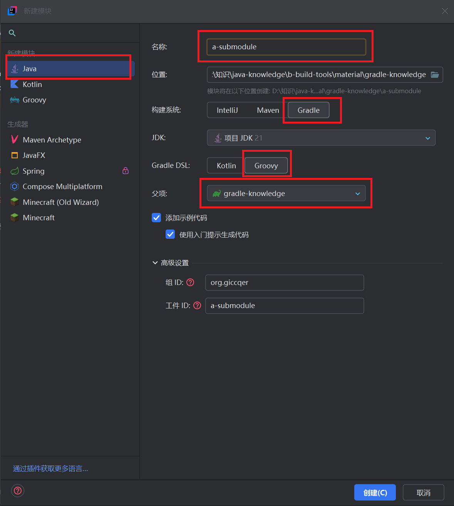
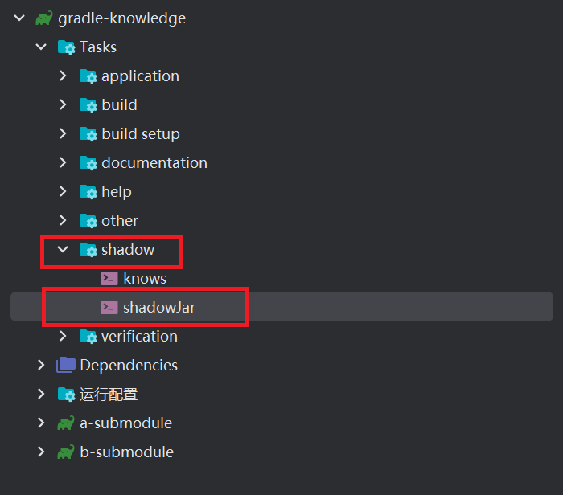

# build文件架构,gradle多模块

*本例使用工程 [idea-gradle知识(默认)](material\idea-gradle-knowledge.bat)* 

## 基础配置

### plugins 标签

- > plugins 标签用于声明和应用构建脚本所需的插件,这些插件作用于整个项目的生命周期如编译,测试,打包,发布等,相当于maven的<build>标签,必须独立写在顶部,不能应用于诸如 allprojects 这样的标签内部
  >
  > 创建gradle工程时会默认使用 java 插件,建议将其替换为功能更多的 java-library 插件
  >
  > 对于Springboot:官方默认的做法是添加 org.springframework.boot 和 io.spring.dependency-management 插件以实现对web和版本管理的支持

   [build.gradle](material\gradle-knowledge\build.gradle) 写入:
  ```groovy
  plugins { //必须独立写在顶部
      //id 'java' //java插件,gradle默认启用该插件,该插件提供了编译,测试,打包等基本功能
      id 'java-library' //java库插件,相当于java插件的增强版,添加了 api 等方法
      id 'org.springframework.boot' version '3.4.0' //Springboot 核心插件
      id 'io.spring.dependency-management' version '1.1.6' //Springboot 依赖版本管理插件
  }
  ```

### 配置java源码和编译的版本

-  [build.gradle](material\gradle-knowledge\build.gradle) 写入:
  ```groovy
  java { //传入一个闭包进行配置
      sourceCompatibility = JavaVersion.VERSION_21
      targetCompatibility = JavaVersion.VERSION_21
  }
  ```

### 配置以UTF-8对源码编码

-  [build.gradle](material\gradle-knowledge\build.gradle) 写入:
  ```groovy
  tasks.withType(JavaCompile).configureEach { //选择所有类型为JavaCompile的任务,对每个选中的任务进行配置
      options.encoding = 'UTF-8'
  }
  ```

### (可选)远程仓库依赖源配置

1.  [build.gradle](material\gradle-knowledge\build.gradle) 写入:
   ```groovy
   repositories { //dependencies依赖的源仓库,如果使用安装时的gradle配置文件则可以不写
       mavenLocal()//本地maven仓库(不是gradle仓库)
       maven { //阿里云仓库
           url 'https://maven.aliyun.com/repository/public'
           name 'aliyun'
       }
       mavenCentral()//远程maven仓库
   }
   ```

2.  [settings.gradle](material\gradle-knowledge\settings.gradle) 写入:
   ```groovy
   pluginManagement { //配置在构建过程中使用的插件仓库,要写在顶部.gradle和maven使用的插件往往不同
       repositories {
           gradlePluginPortal() //在Gradle中央插件库中查找依赖项
           maven {
               url 'https://maven.aliyun.com/repository/public'
               name 'aliyun-plugin'
           }
           mavenCentral()
       }
   }
   ```

### 项目名,项目组名,版本号

1. 在 [build.gradle](material\gradle-knowledge\build.gradle) 写入:
   ```groovy
   group = 'org.giccqer' //项目组名
   version = '0.0.1' //版本号
   ```

2. 在 [settings.gradle](material\gradle-knowledge\settings.gradle) 写入:
   ```groovy
   rootProject.name = 'gradle-knowledge' //根项目名,如果只有一个项目那就是自己的项目名,会自动生成
   ```

## 依赖管理

### 添加普通依赖

- > 项目依赖管理,添加依赖的通用格式为: implementation '组名:项目名:版本号'
  > 如果项目被纳入了依赖管理(被置入dependencyManagement标签中或使用plugins标签中的插件)则不必写版本号

  在 [build.gradle](material\gradle-knowledge\build.gradle) 写入:

  ```groovy
  ext {
      jdbcVersion = '9.1.0' //自定义全局变量,写在 ext 标签中,可对依赖的版本进行统一管理
  }
  dependencies {
      //gradle中的根项目不可以像maven那样声明自身为某项目的子项目(没有parent标签),以下Springboot的声明依赖相关插件
      //implementation 相当于 compile,编译,测试,运行时需要,会被打包,但不会将其传递给依赖当前项目的其他项目
      implementation('org.springframework.boot:spring-boot-starter-web') { //为避免歧义,要加括号
          exclude group: 'org.springframework.boot', module: 'spring-boot-starter-tomcat'// 排除某个依赖
      }
      api 'io.netty:netty-all:5.0.0.Alpha2'//同implementation,但会传递给依赖当前项目的其他项目,需java-library插件
      compileOnly 'org.ow2.asm:asm:9.7' //compileOnly 相当于provided,编译时需要,运行时不需要,不会被打包
      //runtimeOnly相当于runtime,只参与项目的运行和测试,不参与编译,不会被打包.该段字符串使用ext全局变量,必须加双引号
      runtimeOnly "com.mysql:mysql-connector-j:${jdbcVersion}"
      compileOnly 'org.projectlombok:lombok' //只在编译时需要
      annotationProcessor 'org.projectlombok:lombok' //annotationProcessor 指定编译器在编译时需要使用的注解处理器
  }
  ```

### 添加版本管理

- 在 [build.gradle](material\gradle-knowledge\build.gradle) 写入:
  ```groovy
  dependencyManagement { //该标签相当于maven中的dependencyManagement标签,用于管理依赖的版本
      dependencies {
          dependency 'org.mybatis:mybatis:3.5.16' //纳入版本管理中的依赖
          imports { //imports表示引入这些依赖的依赖管理而不是依赖本身,相当于scope=pom
              //直接将Springboot纳入版本依赖管理,导入Springboot的另一种非官方方式
              //mavenBom 'org.springframework.boot:spring-boot-dependencies:3.3.4'
              //目前没找到spring cloud相关的插件,这是唯一导入spring cloud的方法
              mavenBom 'org.springframework.cloud:spring-cloud-dependencies:2023.0.4'
          }
      }
  }
  ```

### 版本依赖检验

1. 在源码 src/main/java 中创建 dto 文件夹并创建 [CustomerDto.java](material\gradle-knowledge\src\main\java\org\giccqer\dto\CustomerDto.java) 写入:
   ```java
   @Data
   @NoArgsConstructor
   @AllArgsConstructor
   public class CustomerDto {
       private String name;
       private Boolean isMale;
       private String address;
       private Long phone;
       private String email;
   }
   ```

2. 创建主类 [FatherStarter.java](material\gradle-knowledge\src\main\java\org\giccqer\FatherStarter.java) 写入:
   ```java
   public class FatherStarter {
       public static void main(String[] args) {
           CustomerDto customerDto = new CustomerDto("张三", true, "北京", 1234567890L, "zhangsan@163.com");
           //Springboot相关依赖在父项目中导入完毕
           System.out.println("检测 Springboot 依赖是否导入成功: " + SpringBootApplication.class.getName());
           //测试 Lombok 注解能否被正确解析:
           System.out.println("检测 Lombok 注解是否能被正确解析: " + customerDto);
       }
   }
   ```

   ✔执行主方法,查看控制台输出

### 添加测试依赖并检验

1. 在 [build.gradle](material\gradle-knowledge\build.gradle) dependencies标签中添加:
   ```groovy
   dependencies {
       //以下二者为junit5测试依赖,缺一不可.api负责编译,engine负责运行
       //testImplementation相当于test,只在测试时需要,不会被打包
       testImplementation 'org.junit.jupiter:junit-jupiter-api:5.11.3'
       testRuntimeOnly 'org.junit.jupiter:junit-jupiter-engine:5.11.3' //testRuntimeOnly 当运行测试方法时不会参与编译
   }
   ```

   ☞添加测试配置:
   ```groovy
   test { //测试相关配置,可以直接执行,运行后会同时执行所有被 @Test 标记的方法
       useJUnitPlatform() //使用junit5
       include 'org/giccqer/test/**' //指定测试类
   }
   ```

2. 在 src/test/java 中创建 [PrintTest.java](material\gradle-knowledge\src\test\java\org\giccqer\test\PrintTest.java) 写入:
   ```java
   public class PrintTest {
       @Test
       public void printHello() {
           System.out.println("方式1-打印消息:你好!");
       }
       @Test
       public void printFaces() {
           System.out.println("方式2-打印表情:😍😊😜");
       }
       @Test
       public void printAphorism() {
           System.out.println("方式3-打印格言:如果是玫瑰,它总会开花的");
       }
   }
   ```

   ☞点击左侧任意播放按钮✔控制台输出结果

3.  [build.gradle](material\gradle-knowledge\build.gradle) 中,点击 test 标签左侧播放按钮✔控制台输出全部test结果

## gradle多模块

### 创建子模块

- 父项目名右击☞新建☞模块:
  
  ☞创建( [a-submodule](material\gradle-knowledge\a-submodule) )✔在  [settings.gradle](material\gradle-knowledge\settings.gradle) 中自动添加以下配置:

  ```groovy
  rootProject.name = 'gradle-knowledge'
  include 'a-submodule' //设定子模块项目名,要与模块目录名一致
  ```

### 通用配置设置与检测

1. > 与maven不同,gradle采用 allprojects{} 方法定义哪些脚本代码段是父子模块共享的
   > 其中 plugins{} 标签不可以写入其中,要使用其他方法传递到子模块

   在 [build.gradle](material\gradle-knowledge\build.gradle) 中创建 allprojects 标签(方法):
   ```groovy
   //allprojects:对父项目与所有子项目有效
   //subproject:对所有子项目有效
   //不添加该标签:只对父项目有效
   allprojects {
       apply { //传统的插件应用方式,为了保证能将上述插件传递到子项目,需要写上
           plugin 'java-library'
           plugin 'org.springframework.boot'
           plugin 'io.spring.dependency-management'
       }
   	//将诸如dependencies,dependencyManagement,test等标签移动到下面
   }
   ```
   
     ☞将其他所有标签(plugins除外)移动至allprojects使用的闭包中
   
2. 重写子模块 [a-submodule](material\gradle-knowledge\a-submodule) 的 [build.gradle](material\gradle-knowledge\a-submodule\build.gradle) :
   ```groovy
   //与maven不同,只要父项目包含的东西不需要更改,子项目就什么都不需要写
   dependencies {
       //以下项目皆被纳入父项目的版本管理中了,注意:使用api方法前需要导入 java-library 插件
       implementation 'org.springframework.cloud:spring-cloud-starter-netflix-eureka-server'
       api 'org.mybatis:mybatis' //与implementation用法相同,但被api声明的依赖会被传递到子项目中,而implementation不会
       implementation 'org.springframework.boot:spring-boot-starter-data-redis'
   }
   ```

   ☞在子模块源码中创建 [FirstSubModuleStarter.java](material\gradle-knowledge\a-submodule\src\main\java\org\giccqer\FirstSubModuleStarter.java) :
   ```java
   public class FirstSubModuleStarter {
   	//该常量用以测试子模块之间的依赖引用.
       public static final String SUB_MODULE_STRING = "子模块公有常量";
       public static void main(String[] args) {
           //netty依赖已在父标签中强制声明使用
           System.out.println("检测 netty 依赖是否导入成功: " + ByteBuf.class.getName());
           //mybatis依赖在子标签中根据父依赖中声明的dependencyManagement标签内的依赖自行导入
           System.out.println("检测 mybatis 依赖是否导入成功: " + SqlSession.class.getName());
           //springboot-redis依赖根据父标签的Springboot插件所管理的版本依赖导入
           System.out.println("检测 springboot-redis 依赖是否导入成功: " + StringRedisTemplate.class.getName());
           //spring-cloud-starter-netflix-eureka-server依赖在子标签中根据父依赖从另一个父依赖纳入的dependencyManagement标签内的依赖自行导入
           System.out.println("检测 spring-cloud-starter-netflix-eureka-server 依赖是否导入成功:" + EnableEurekaServer.class.getName());
       }
   }
   ```

   ☞执行该主方法✔控制台输出信息

### 子模块间的常量与依赖传递检测

- 创建子模块 [b-submodule](material\gradle-knowledge\b-submodule) ☞重写其 [build.gradle](material\gradle-knowledge\b-submodule\build.gradle) :
  ```groovy
  dependencies {
      //声明将另一个子模块项目作为自身的依赖,括号内的内容为引入的子模块项目名,要与settings.gradle中书写的一致
      implementation project(':a-submodule')
  }
  ```

  ☞在该模块源码中创建 [SecondSubModuleStarter.java](material\gradle-knowledge\b-submodule\src\main\java\org\giccqer\SecondSubModuleStarter.java) :
  ```java
  public class SecondSubModuleStarter {
      public static void main(String[] args) {
          //来自另一个子模块中的常量
          String subModuleMessage = "从依赖的模块中导入的常量: " + FirstSubModuleStarter.SUB_MODULE_STRING;
          //来自自身依赖的使用api标记的依赖中的类
          String myModuleMessage = "从依赖的模块依赖的模块中导入的类" + SqlSession.class.getName();
          //弹出对话框并输出相关信息
          JOptionPane.showMessageDialog(null, subModuleMessage + "\n" + myModuleMessage, "消息", JOptionPane.INFORMATION_MESSAGE);
      }
  }
  ```

  ☞执行该主方法✔弹出对话框:
  

## gradle输出可执行的jar包

> 与maven同理,该操作需要额外的shadow插件依赖
> 所有的打包命令请在父项目中执行,最终生成的可执行jar文件位于依赖关系最靠后的子项目的build文件中

- 在父项目的 [build.gradle](material\gradle-knowledge\build.gradle) plugins 标签中添加插件:
  ```groovy
  plugins {
      id 'com.github.johnrengelman.shadow' version '8.1.1' //shadow 插件,用于打jar包
  }
  ```

  ☞将该插件传递至子项目,在 allprojects-apply 标签中添加:
  ```groovy
  allprojects {
      apply {
          plugin 'com.github.johnrengelman.shadow'
      }
  }
  ```

  ☞再在 allprojects 标签中添加配置:
  ```groovy
  archivesBaseName = 'gradle-package' //打包后的jar文件名
  shadowJar { //shadow 插件配置,该插件用于打包jar
      manifest { //配置jar的manifest文件
          attributes 'Main-Class': 'org.giccqer.SecondSubModuleStarter' //配置jar的启动类
      }
  }
  ```

  ☞执行 gradle clean 命令☞执行 gradle shadowJar 命令(时间可能有点长):
  
  
  ☞执行子模块 [b-submodule](material\gradle-knowledge\b-submodule) 的 build/libs 中(或 [这里](material/full-integration-package) )的 [gradle-package-0.0.1-all.jar](material\full-integration-package\gradle-package-0.0.1-all.jar) ✔弹出对话窗口

