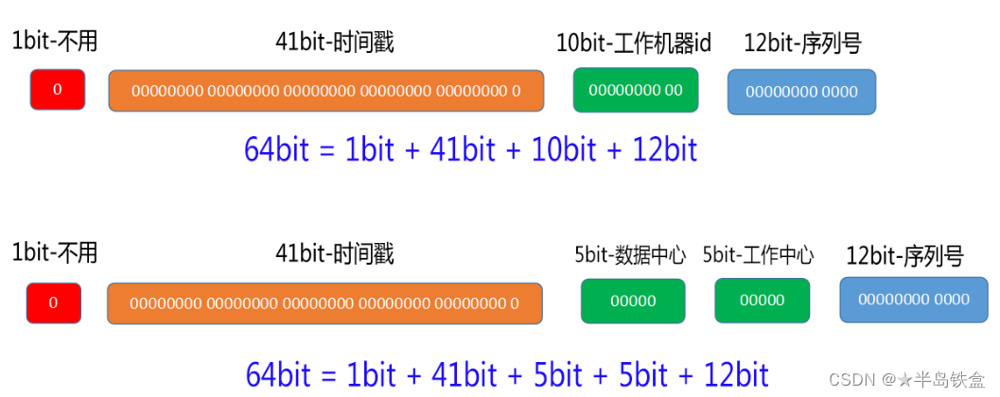

# 雪花算法,日期与时间,MapStruct

## 雪花算法

1. 雪花算法概述:
   雪花算法是一种根据用户操作的时间戳生成其对应的全局唯一的id的一种策略算法.该算法生成的 id 值为Long类型,占用8字节,其二进制数据拥有64个比特位,结构如下:

   

2. 一般选择第二种作为id结构策略.第一位时间戳固定位 0 表示id为正数,时间戳一般使用(当前时间戳 - 固定开始时间戳)的差值作为标识,41位的时间戳可以使用69年.数据中心和工作中心id分别可以容纳32个节点,序列号最多可累加至4095,用于区分在同一毫秒时刻生成的不同id

3. 创建测试类 [SnowFlakeTest.java](material\mybatis-knowledge\src\test\java\mybatis\SnowFlakeTest.java) ,创建方法用来获取当前时间的时间戳.
   ```java
   public class SnowFlakeTest {
       @Test
       public void getCurrentTimeMillis() {
           System.out.println("系统当前的时间戳为: " + System.currentTimeMillis()); //对应常量 START_TIME_STAMP
       }
   }
   ```

4. 将该时间戳作为起始时间戳,创建工具类 [SnowFlakeUtil.java](material\mybatis-knowledge\src\main\java\mybatis\util\SnowFlakeUtil.java) ,编写雪花生成算法:
   ```java
   public class SnowFlakeUtil {
       //起始时间戳,生成id时需要计算当前时间戳和该起始时间戳之间的差值,时间戳占位41bit.
       //该常量一旦被确定,在任何环境下都尽可能不要去改动,除非你将数据库表中的相关所有id数据完全清空
       private static final long START_TIME_STAMP = 1726803514266L;
   	//上次生成id的时间戳,每运行一次生成id的方法,该值都会被重置为当前时间戳.
       private static long lastTimeStamp = System.currentTimeMillis();
       //数据中心的id,在分布式服务中表示你在哪里(某公司,某团队,某工作室等)部署该服务器,占位5bit.
       //可以根据实际情况调整其占位,也可以将该字段的占位与下方工作机器id占位合并
       private static final long DATA_CENTER_ID = 1L;
       //具体的服务器中某台工作机器的id,占位5bit.
       private static final long WORKER_ID = 1L;
   	//序列号,若某几个id在同一毫秒时刻生成,则用此来区分这些id,占位12bit.
       private static long sequence = 0L;
   	//序列号掩码,也是序列号的最大值,用于计算序列号的值是否过大,12bit.
       private static final long SEQUENCE_MASK = ~(-1L << 12); // 4095
   	//使用雪花算法生成独一无二的id.
       public synchronized static long generateId() {
           long currentTimeStamp = System.currentTimeMillis(); //当前时间戳
           // 如果当前时间戳比上次生成的时间戳id大,说明系统时钟回拨了,抛出异常(否则可能造成id重复)
           if (currentTimeStamp < lastTimeStamp) {
               throw new RuntimeException("时钟回拨异常");
           } //如果当前时间戳与上次生成的时间戳相同,说明是同一毫秒内生成的id,需要计算序列号
           if (currentTimeStamp == lastTimeStamp) {
               sequence = (sequence + 1) & SEQUENCE_MASK; //使用掩码限制序列号值的位数
               if (sequence == 0L) { //如果序列号值过大(超过12位),等待一毫秒再重新生成id
                   try {
                       Thread.sleep(1);
                   } catch (InterruptedException e) {
                       throw new RuntimeException(e);
                   }
                   return generateId(); //递归调用本方法
               }
           } else {
               sequence = 0L; //当前时间戳发生改变后,重置序列号
           }
           lastTimeStamp = currentTimeStamp; //更新上次生成id的时间戳
           // 计算二者时间戳的相对值,其结果左移22位,数据中心id左移17位,机器id左移12位,最后与序列号合并
           return ((currentTimeStamp - START_TIME_STAMP) << 22) | (DATA_CENTER_ID << 17) | (WORKER_ID << 12) | sequence;
       }
   }
   ```

   类中的静态常量字段可以使用 spring 注入的方式从配置文件中加载

5. 在测试类 [SnowFlakeTest.java](material\mybatis-knowledge\src\test\java\mybatis\SnowFlakeTest.java) 中测试本方法,连续循环生成20个id,观察控制台输出的id中是否有重复的
   ```java
   @Test
   public void generateIdTest() {
       System.out.println("使用雪花算法循环生成20个id: ");
       for (int i = 0; i < 20; i++) {
           System.out.println(SnowFlakeUtil.generateId());
       }
   }
   ```

## mysql表中日期时间字段

1. 在使用 mysql workbench 创建数据表的 timestamp 类型字段时,若其声明为非空则会触发:当向数据表插入该字段的值为 NULL 时会自动添加一个当前时间的时间戳,可以通过设置默认值的方式避免这种情况的发生

2. mysql有以下常用的与时间类型有关的 **字段类型** :

   | 字段类型  |                             说明                             |
   | :-------: | :----------------------------------------------------------: |
   |   date    |                 仅存储日期,格式为YYYY-MM-DD                  |
   |   time    |                    仅存储时间,格式为HH:MM                    |
   | datetime  |            存储日期和时间,格式为YYYY-MM-DD HH:MM             |
   |   year    |                  仅存储年份,格式为YYYY或YY                   |
   | timestamp | 时间戳类型,格式为YYYY-MM-DD HH:MM,范围从1970-01-01 00:00:00到2038年 |

   向字段中插入或更新时间类型的数据时,可以直接使用与字段类型格式相对应的**文本**或与时间相关的**函数**作为插入或更新的value值
   使用文本插入时,除year字段外都可以接受完整的 'YYYY-MM-DD HH:MM' 文本,但会将其解析为与自身类型相对应的值,所以不会存储除此之外多余值的部分,你不可能从date类型字段对应的值中获取小时分钟秒所对应的值

   > **'2024-9-20 14:18:00'** : 可插入类型为 datetime 或 timestamp 的字段中
   > '**2024-9-20**' :可插入类型为 date 的字段中
   > '**14:18:00**' :可插入类型为 time 的字段中
   > '**2024**' :可插入类型为 year 的字段中

   sql语句样例:
   ```sql
   INSERT INTO `knowledge_database`.`time_table` (`id`, `description`, `date`, `time`, `date_time`, `time_stamp`, `year`) VALUES ('1382593728515', 'timeText','2024-9-20','14:18:00','2024-9-20 14:18:00','2024-9-20 14:18:00','2024');
   ```

   使用函数插入对应的值时,其存储的方式与文本插入时一致,相关的函数有(画横线的位置有补充说明):

   |           函数            |                             说明                             |
   | :-----------------------: | :----------------------------------------------------------: |
   | NOW(),CURRENT_TIMESTAMP()‌ | 返回当前的日期和时间,CURRENT_TIMESTAMP<br />被视为系统关键字,若函数无参可省略括号 |
   |         ‌SYSDATE()         |                返回执行SQL时的当前日期和时间                 |
   |         CURDATE()         |                        返回当前的日期                        |
   |         CURTIME()         |                     返回当前的小时分钟秒                     |
   |       YEAR(时间值)        | 根据时间值返回其对应的年份,其他的函数诸如<br />MONTH(),DAY(),HOUR() 等同理 |
   |  <u>FROM_UNIXTIME()</u>   |        <u>将UNIX时间戳转换为日期时间格式,单位为秒</u>        |
   | DATE_FORMAT(时间值,格式)  |                以对应的格式显示日期或时间数据                |

   补充:对于 <u>FROM_UNIXTIME()</u> 其表示的时间戳单位为妙,而在java语句中 System.currentTimeMillis() 表示的时间戳单位为毫秒,二者有着1000倍的差距

   sql语句样例
   ```sql
   INSERT INTO `knowledge_database`.`time_table` (`id`, `description`, `date`, `time`, `date_time`, `time_stamp`, `year`) VALUES ('1382593728516', 'timeFunction',CURDATE(),CURTIME(),NOW(),CURRENT_TIMESTAMP,YEAR(NOW()));
   ```

3. 关于时区的设置:使用java读取mysql数据库表中的时间数据时,若在登陆时不声明时区则默认以UTC时区(世界标准时间)为准,即默认serverTimezone=UTC ,使得读取到的时间会延后8小时(在中国如此).若想读取准确需配置:

   > 设置为北京时区: serverTimezone=GMT%2B8

   或者

   > 设置为上海时区: serverTimezone=Asia/Shanghai

   完整的登陆地址配置样例:

   ```properties
   url=jdbc:mysql://localhost:3306/knowledge_database? characterEncoding=utf8&useSSL=false&serverTimezone=Asia/Shanghai
   ```

4. 本次使用表 time_table 进行mybatis测试,创建对应的 entity 类,mapper 接口和xml:
    [TimeTable.java](material\mybatis-knowledge\src\main\java\mybatis\entity\TimeTable.java) 

   ```java
   import lombok.Data;
   import java.sql.Date;
   import java.sql.Time;
   import java.sql.Timestamp;
   import java.time.Year;
   @Data
   public class TimeTable {
       private Long id;
       private String description;
       private Date date;
       private Time time;
       private java.util.Date dateTime;
       private Timestamp TimeStamp;
       private Year Year;
   }
   ```

   补充:在本类中,可以使用 java.sql 包下的 Date,Time,Timestamp 表示日期,时间,日期与时间,或使用 java.util.Date 表示完整的日期与时间,或使用 java.time 包下的类对时间进行操作.当然,也可以把这些时间字段的类型都设置为 String 
   ```java
   private String date;
   private String time;
   private String dateTime;
   private String TimeStamp;
   private String Year;
   ```

    [TimeTableMapper.java](material\mybatis-knowledge\src\main\java\mybatis\mapper\TimeTableMapper.java) 

   ```java
   public interface TimeTableMapper {
       List<TimeTable> selectAll();
   }
   ```

    [TimeTableMapper.xml](material\mybatis-knowledge\src\main\resources\mapper\TimeTableMapper.xml) 
   ```java
   <?xml version="1.0" encoding="UTF-8"?>
   <!DOCTYPE mapper PUBLIC "-//mybatis.org//DTD Mapper 3.0//EN" "http://mybatis.org/dtd/mybatis-3-mapper.dtd">
   <mapper namespace="mybatis.mapper.TimeTableMapper">
       <select id="selectAll" resultType="mybatis.entity.TimeTable">
           select * from time_table
       </select>
   </mapper>
   ```

5. 创建主方法包装类 [TimeTable.java](material\mybatis-knowledge\src\main\java\mybatis\entity\TimeTable.java) ,获取全部的数据表数据.

   ```java
   mapper.selectAll().forEach(System.out::println);
   ```

   运行结果如下:

   ```java
   TimeTable(id=1382593728514, description=timeStamp, date=2024-09-20, time=11:38:34, dateTime=Fri Sep 20 11:38:34 CST 2024, TimeStamp=2024-09-20 11:38:34.0, Year=2024)
   TimeTable(id=1382593728515, description=timeText, date=2024-09-20, time=14:18:00, dateTime=Fri Sep 20 14:18:00 CST 2024, TimeStamp=2024-09-20 14:18:00.0, Year=2024)
   TimeTable(id=1382593728516, description=timeFunction, date=2024-09-20, time=19:50:44, dateTime=Fri Sep 20 19:50:44 CST 2024, TimeStamp=2024-09-20 19:50:44.0, Year=2024)
   ```

   注意:如果实体类字段类型与数据表字段类型不匹配可能会导致日期时间打印不准确,如使用 java.util.Date 类型字段去匹配 data 数据表字段,输出的年月日是准确的但时分秒会是错误的(其实不应该输出时分秒)

## MapStruct

???

   