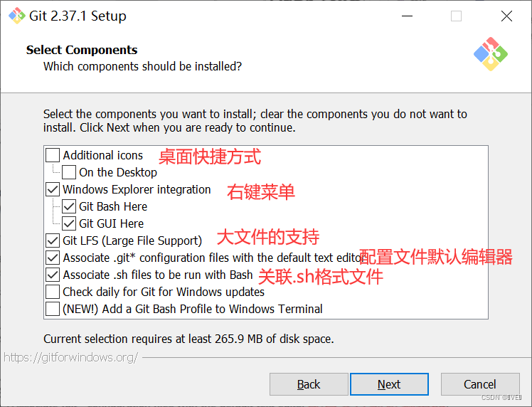

# git下载配置,基本操作与命令

## git的下载与配置

1. [下载](https://git-scm.com/downloads)后,除以下窗口需要注意外,全部选择next和install即可:
   
   
   
2. 在任意位置右键,选择Git Bash Here,打开命令行界面.输入以下指令设置用户名和用户所有使用的邮箱(注意:**在git中默认 Ctrl+Ins 是复制. Shift+Ins 是粘贴**)

   ```sh
   git config --global user.name 用户名
   git config --global user.email 邮箱地址
   ```

   输入以下指令查看你设置的用户名和邮箱地址
   
   ```sh
   git config --global user.name
   git config --global user.email
   ```
   
   或打开文件 C:\User\你的用户名\\.gitconfig 中的 [user] 属性查看或配置它们,输入以下指令可以查看该文件的所有配置信息:
   
   ```sh
   git config --global --list
   ```
   
   该配置为全局配置,位于某一仓库下的 .git/config 文件为针对某仓库的配置
   
   在git窗口中,输入  git -v  获取其版本号,  git help  获取指令帮助.如果想获取具体某条指令的帮助则输入  git help 指令名  ,如:
   
   ```sh
   git help commit
   git help branch
   ```
   
   输入 exit 即可退出窗口

## git仓库初始化,缓存,提交

在所创建的工程文件夹(以[git-knowledge](material\git-knowledge)为例)中右键选择Git Bash Here打开命令行界面,输入以下指令初始化git仓库并查看状态:

```sh
git init
git status
```

在该文件夹中创建文件 [新的文本文件.txt](material\git-knowledge\新的文本文件.txt) ,然后再输入  git status  查看状态.输入以下指令将其标记为暂存文件(如果文件名太长可以按 Tab 键自动补全),然后再输入  git status  查看状态:

```sh
git add 新的文本文件.txt
```

输入以下指令确认提交文件变动:

```sh
git commit -m "Create a new text file."
```

对于  git commit  指令,其后面的 -m 用于输入对本次变动的描述(可以省略,但不推荐),该指令与  git add 文件名  指令可以合并为  git commit -am "描述"  或  git commit -a -m "描述"

输入以下指令查看文件变更历史(第一列黄字会显示自动生成的变动版本号的前六位):

```sh
git reflog
```

或输入  git log  获取更详细的文件变更日志(会显示完整的自动生成的变动版本号)
注意:如果输出的内容过长,可以按上下方向键滚动查看其中的内容,在此状态下按 q 键退出查看

## git版本切换(回滚)

在 [新的文本文件.txt](material\git-knowledge\新的文本文件.txt) 中写入一些文本使其发生改变,重新输入  git add  新的文本文件.txt 和  git commit -m "Write something."  指令提交修改.输入  git reflog  查询本次修改的版本号前六位(3a24cd1),输入以下指令进行版本回滚:

```sh
git reset --hard 3a24cd1
```

输入  git reflog  查看版本变化情况,打开文本文件观察内容变化

## git分支操作

### 分支的创建,切换,合并

只有当你第一次提交时才会产生分支,若没有分支则无法推送至远程仓库

输入以下指令查看当前所有及所在分支的名称及版本号:

```sh
git branch -v
```

输入以下指令创建一个名为  new-branch  的分支并切换至该分支:

```sh
git branch new-branch
git checkout new-branch
```

上述两条命令可以被合并简写为:  git checkout -b 分支名  

其中  git checkout 分支名  命令可以由  git switch 分支名  代替,区别在于前者可以检出文件而后者只是进行简单的分支切换,推荐使用前者.

输入  git branch -v  查看分支状态.修改 [新的文本文件.txt](material\git-knowledge\新的文本文件.txt) 中的内容并输入  git add  新的文本文件.txt 指令暂存并输入  git commit -m "New branch write something."  提交修改.主分支名称默认为 master 输入  git checkout master  切换为主分支,观察文本文件的变化.输入以下指令将 new-branch 分支的修改合并至当前分支(主分支) master 中,然后观察文本变化:

```sh
git merge new-branch
```

输入  git reflog  ,该指令准确呈现了你对于各个分支的变更,修改,提交,合并等历史记录(顺序从后向前)

### 分支冲突的处理

当两个不同分支提交修改后,如果这两个分支与起点连接后作出的两条线并不能完全重叠,则在某条分支与另一个分支进行合并时会产生分支冲突.输入  git checkout new-branch  切换为 new-branch ,修改 [新的文本文件.txt](material\git-knowledge\新的文本文件.txt) 中的文本并提交.然后再输入  git checkout master  切回主线,再在文本内输入不同的内容后修改并提交,然后输入  git merge new-branch  进行合并,此时会提示有合并冲突,右侧的分支标记会变为 **(master|MERGING)** .打开文本文件,内容如下:
```tex
new-branch分支追加内容: 举手投足我就是帅,从头帅到脚趾尖
<<<<<<< HEAD
master主线追加内容: 不,这不是你的错,以实玛利!
=======
new-branch分支再次追加的内容: 都是你的错,以实玛利!
>>>>>>> new-branch
```

同理,可以输入以下指令查看冲突位置和方式:

```sh
git diff
```

为解决冲突,需手动更改文本文件内容,修改后输入以下指令解决冲突

```sh
git add 新的文本文件.txt
git commit -m "Conflict resolution."
```

注意:当处于冲突状态时,输入  git status  会提示你如何解决冲突.输入  git merge --abort  可放弃合并并立刻退回至合并前的状态.

### 分支的删除

对于已经完全合并至其他分支的分支,输入以下指令(这里以 new-branch 为例)将其删除:

```sh
git branch -d new-branch
```

强制删除分支指令:  git branch -D 分支名  ,无论该分支是否合并都会被删除.输入  git branch -v  检查指令执行状况 

## git其他命令汇总

在git窗口中,可以使用形同linux操作系统的命令进行各种操作:

|        命令         |                             用途                             |
| :-----------------: | :----------------------------------------------------------: |
|         ls          |                   查看当前目录下的所有文件                   |
|       cd 路径       |                          进入某目录                          |
|   mkdir 文件夹名    |                          创建文件夹                          |
|         pwd         |                         查看当前目录                         |
|       whoami        |                        查看当前用户名                        |
|    vim [文件名]     | 编辑或创建文件,与linux用法相同(如按 i 键进入编辑模式,按 esc 键退出)<br />(输入 :q 退出, :q! 不保存退出, :qw 保存并退出) |
|     cat 文件名      |                      查看某文本文件内容                      |
|      rm 文件名      |                删除某文件,删除文件夹要加 -rf                 |
|    git rm 文件名    |        同上,只不过只能操作被记录在git仓库文件中的文件        |
|   git revert HEAD   |         将HEAD指针向前回拨,即撤销最近一次的提交更改          |
| git checkout 文件名 | 除了用于切换分支,还可以将某文件内容还原为上一次提交时的内容  |

