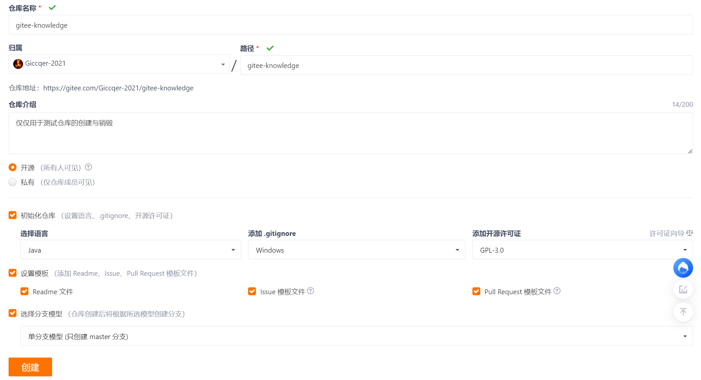

# 远程仓库

## gitee

1. 登陆 [gitee网站](https://gitee.com/) ,使用微信邮箱或手机号注册账号,在完成个人资料编辑等一系列操作后,在任意位置右键选择Git Bash Here,输入以下命令编辑或查看你本地的git用户身份配置(配置要与gitee中的相同):

   ```sh
   git config --global user.name 用户名
   git config --global user.email 邮箱地址
   
   git config --global user.name
   git config --global user.email
   ```

2. 点击**新建仓库**,输入仓库名称(这里为 gitee-knowledge ),简介等内容,点击创建,如下图:

   

   在网页中进入该仓库,选择克隆/下载,复制该仓库的地址(这里是 https://gitee.com/Giccqer-2021/gitee-knowledge.git ,用在下方).在电脑上创建并进入文件夹 gitee-knowledge 从远程仓库克隆该项目,依次输入以下指令(可能需要输入账号密码来验证身份):

   ```sh
   git init
   git remote add origin https://gitee.com/Giccqer-2021/gitee-knowledge.git
   git pull origin master
   ```

3. 尝试**将修改推送至远程仓库**:创建 [新文件](material\gitee-knowledge\要推送的文本文件.txt) 在其中输入写入一些文本,然后输入以下指令将所有的文件标记暂存后提交:

   ```sh
   git add .
   git commit -m "first commit"
   ```

   输入以下指令将其推送至远程仓库(master为主分支,可以根据需要提交到其他分支):

   ```sh
   git push origin master
   ```

   重新打开网页,推送后的远程仓库如下:

   

   关于git开源协议相关的内容详见 https://blog.csdn.net/kanhcj86/article/details/130755262 

4. **尝试将本地已有的仓库推送至远程仓库** :以 [git-knowledge](material\git-knowledge) 为例,在网页端新建空白仓库 git-knowledge (名字要一致,里面什么文件都不要有),在电脑中进入工程文件夹,然后输入以下指令:

   ```sh
   git remote add origin https://gitee.com/Giccqer-2021/git-knowledge.git
   git push -u origin master
   ```
   
   刷新网页,然后查看远程仓库中的文件是否传输成功.点击右侧的提交记录按钮,查看这段时间以来的提交记录

## github

1. 登陆 [github网站](https://github.com/) 注册一个自己的账号,如果速度较慢建议自定义域名与ip之间的映射关系,打开windows [host文件](C:\Windows\System32\drivers\etc\HOSTS) ,添加以下ip映射(需要管理员权限):

   ```tex
   20.205.243.166 github.com
   ```

   关于远程仓库的创建,拉取,推送等方法,github与gitee几乎相同,只需要将网址中的gitee地址变为github即可

2. [GitHub Desktop](https://github.com/apps/desktop) :一款便携式(远程)仓库管理软件,可以极大地节省输入指令的时间,建议下载并使用

## ssh公钥私钥配置(以gitee为例)

1. 有时,我们需要以管理者的身份对仓库执行拉取推送操作,这就需要使用ssh来验证自己的权限.在配置公钥前请配置好git的用户名和邮箱.输入以下命令并连按三次回车(其中 -t 为生成的秘钥类型, -C 为生成的文件头部的注释):

   ```sh
   ssh-keygen -t ed25519 -C "Git SSH Key"
   ```

   输入以下命令查看生成的公钥私钥文件和读取公钥内容(在 windows 中, ~/ 指代的是当前用户的目录)
   
   ```sh
   ls ~/.ssh/
   cat ~/.ssh/id_ed25519.pub
   ```

   然后将其中的内容全部复制,在网页中点击 设置-ssh公钥 一栏,设置标题并复制公钥后验证身份.使用需要ssh验证的clone指令克隆某个项目来验证秘钥配置是否成功
   
   ```sh
   git clone git@gitee.com:Giccqer-2021/NativeMethodTest.git
   ```
   
   查看是否能成功从外网远程克隆成功.对于github,操作方法相同(其实gitee生成的秘钥可以用在github中)

## 命令汇总

### 配置本地仓库所对应的git网址

设置并查看该工程对应的远程仓库url(这里以我以前的git工程 https://github.com/Giccqer-2021/NativeMethodTest.git 为例,可以添加多个, **origin** 就是其对应的网址别名),需要在一个与仓库名相同且执行过 git init 命令的文件夹中输入以下命令

```sh
git remote add origin https://github.com/Giccqer-2021/NativeMethodTest.git
git remote add gitee https://gitee.com/Giccqer-2021/NativeMethodTest.git
git remote -v
```

修改和删除远程仓库url配置:

```sh
git remote set-url origin https://gitee.com/Giccqer-2021/NativeMethodTest.git
git remote remove origin
```

### 拉取,推送,克隆

拉取和推送功能需要你在正确认证你的身份之后才可以使用(github需要ssh认证),在配置url后输入以下命令拉取内容(其中 origin 是你设置的网址别名, master 是你要推送到的分支名):

```sh
git pull origin master
```

同理,以下命令推送内容(其中 **-u** 表示将其设置为本地仓库默认的推送网址和分支,输入一次以下命令后,输入 git push 即可再次推送):

```sh
git push -u origin master
```

git克隆仓库指令,在网页中复制相关的http或ssh克隆网址后使用,执行命令后会在该目录下生成一个项目的工程文件夹:

```sh
git clone https://github.com/Giccqer-2021/SpringWebProject.git
```

## .gitignore忽略的上传文件配置

### 创建.gitignore

1. 在 [git-knowledge](material\git-knowledge) 中创建**文本文件** [.gitignore](material\git-knowledge\.gitignore) ,然后在相同位置下创建若干文件夹和文本文件(文本文件不需要写入任何内容),创建好后文件结构如下:

   

   在 [.gitignore](material\git-knowledge\.gitignore) 中写入以下规则,排除部分文件和文件夹:
   ```properties
   #忽略自身
   .gitignore
   
   #只忽略某个文件
   ❌要忽略的文档1❌.txt
   
   #忽略文件夹中的文件及该文件夹
   🔓文件夹1🔓/
   
   #忽略所有要忽略的文档
   **/❌要忽略的文档*❌.txt
   #排除以上正则匹配要忽略的文件
   !🔓文件夹2🔓/🔓文件夹3🔓/❌要忽略的文档-等等,不要忽略我!❌.txt
   ```

2. 依次输入以下指令,将内容更变推推送至远程仓库:
   ```sh
   git add .
   git commit -m 'Add .gitignore file'
   git push
   ```

3. 查看远程仓库目录,是否符合预期结果

   

### 将已纳入版本管理的文件剔除

在 [.gitignore](material\git-knowledge\.gitignore) 中,添加以下内容:
```properties
#新增要忽略的文件
🔓文件夹2🔓/😄我也来充个数😄.txt
```

此时使用上述方法推送文件是无法将该文件排除在外的(因为已经纳入了版本管理中了),需要输入以下指令更新并推送纳入管理的文件:
```sh
git rm -r --cached .
git add .
git commit -m 'Delete a text file'
git push
```

推送后,刷新gitee,查看是否成功剔除了文件

### 强制添加被排除的文件

使用以下方法强行将被忽略的文件纳入管理
```sh
git add -f 🔓文件夹2🔓/😄我也来充个数😄.txt
git commit -m "Readd the text file"
git push
```

### 查看某文件被哪一条规则忽略

```sh
git check-ignore -v App.class 🔓文件夹2🔓/🔓文件夹3🔓/❌要忽略的文档3❌.txt
```

控制台会输出在.gitignore文件中排除该文件的规则是什么

### .gitignore 正则表达式汇总

| 符号 |                             说明                             |
| :--: | :----------------------------------------------------------: |
|  #   |                           用于注释                           |
|  \   |            用于转义,若输入其本身则加入引号如 "\\"            |
|  ?   |                         匹配单个字符                         |
|  *   |                  匹配多个字符,匹配单级目录                   |
|  **  |                         匹配多级目录                         |
|  /   | 分隔目录,在开头时表示此路径从根目录开始匹配,结尾时表示匹配该目录下的全部内容 |
|  !   | 对于使用星号*表达式被排除的文件,使用该符号声明不排除某特定文件(如果该文件的父目录被排除则无效) |

