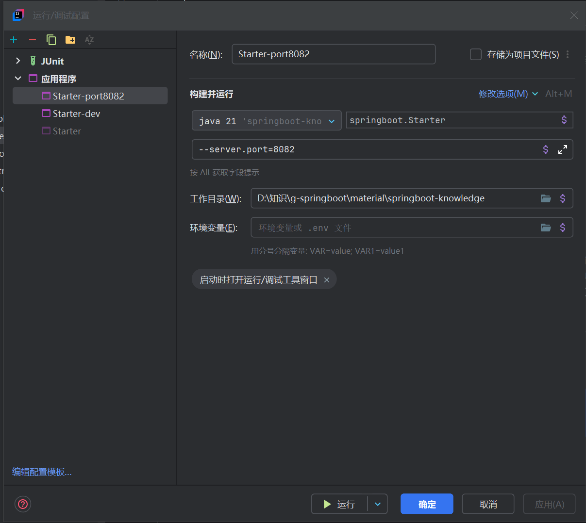
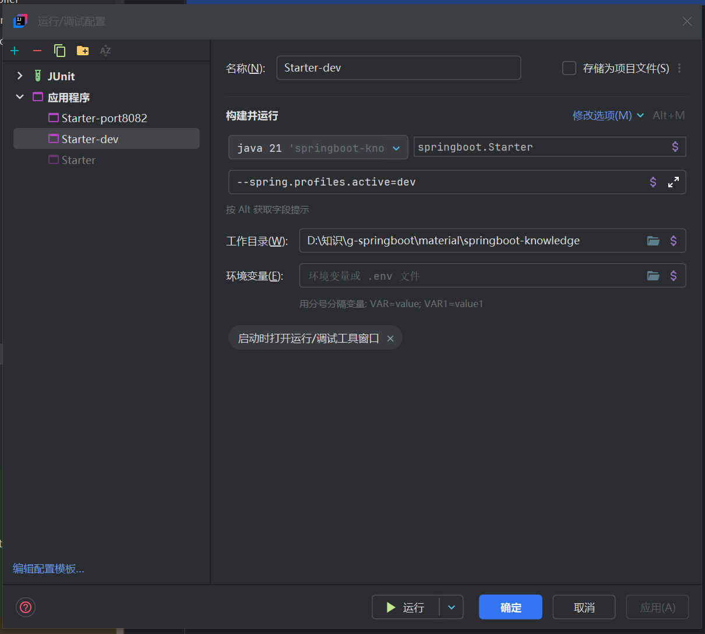
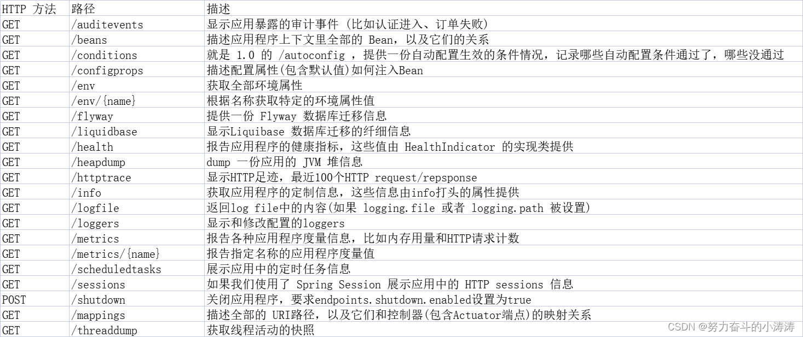

# 拦截器,自定义配置,监视线程

## 拦截器:

1. 将一个类声明为配置组件需添加 @Configuration 注解
   
2. 创建包interceptor,在其中创建类 [LoginInterceptor.java](material\springboot-knowledge\src\main\java\springboot\interceptor\LoginInterceptor.java)  实现HandlerInterceptor并重写preHandle方法(表示目标方法执行之前要执行的操作)编辑对拦截的页面进行放行的条件:
   ```java
   public class LoginInterceptor implements HandlerInterceptor {
       @Override
       public boolean preHandle(HttpServletRequest request, HttpServletResponse response, Object handler) throws Exception {
           System.out.println("正在验证...");
           Object token = request.getSession().getAttribute("token");//模拟验证token
           if (token == null) {
               System.out.println("验证失败");
               return false;//false:不放行
           } else {
               System.out.println("验证通过");
               return true;//true:放行
           }
       }
   }
   ```

   注:继承HandlerInterceptor接口还可以重写以下两个方法以实现某些功能:
   
   > postHandle :该方法将会在preHandle方法执行完成以后执行,可能不执行
   > postHandle :该方法将会在页面渲染完成以后执行,可能不执行
   
3. 创建包config,创建配置类 [InterceptorConfig.java](material\springboot-knowledge\src\main\java\springboot\config\InterceptorConfig.java) ,实现WebMvcConfigurer接口并重写addInterceptors方法设置拦截规则:
   ```java
   @Configuration
   public class InterceptorConfig implements WebMvcConfigurer {
       @Override
       public void addInterceptors(InterceptorRegistry registry) {
           String[] addPathPatterns = {"/interceptor/**"};//要拦截的网页白名单
           //白名单中要排除的,不进行拦截的网页
           String[] excludePathPatterns = {"/interceptor/allowed-page", "/interceptor/allowed-token-page"};
           //LoginInterceptor为自定义类
           registry.addInterceptor(new LoginInterceptor()).addPathPatterns(addPathPatterns).excludePathPatterns(excludePathPatterns);
       }
   }
   ```
   
4. 在 controller 包下创建相关的视图层控制文件 
   ```java
   @Controller
   @RequestMapping("/interceptor")
   public class InterceptorController {
       @GetMapping("/blocked-page")//该页面会被拦截
       public @ResponseBody String blockedPage() {
           return "<p>该页面的访问请求被拦截但验证通过</p>";
       }
       @GetMapping("/allowed-page")//该页面不会被拦截
       public @ResponseBody String allowedPage() {
           return "<p>该页面的访问请求未被拦截</p>";
       }
       @GetMapping("/allowed-token-page")//该页面会被拦截但会被验证通过并放行
       public void allowedTokenPage(HttpServletRequest request, HttpServletResponse response) throws ServletException, IOException {
           request.getSession().setAttribute("token", "123456");//模拟给予令牌的过程
           request.getRequestDispatcher("/interceptor/blocked-page").forward(request, response);//服务端跳转
       }
   }
   ```

5. 依次访问以下网址验证拦截器效果:

   > http://localhost:8081/springboot-knowledge/interceptor/allowed-page
   >
   > http://localhost:8081/springboot-knowledge/interceptor/blocked-page
   >
   > http://localhost:8081/springboot-knowledge/interceptor/allowed-token-page

6. 最后访问以下网址验证拦截器验证通过的效果(由于有令牌所以被放行通过)

   > http://localhost:8081/springboot-knowledge/interceptor/blocked-page

## 自定义配置

### 自定义开发,测试,生产环境

开发时,可以配置多个application文件来根据不同环境导入不同的配置,在 resources 文件夹下创建  [application-dev.yml](..\..\学习\Java学习\d-spring-web-advance\d1-spring-boot\src\main\resources\application-dev.yml), [application-prod.yml](..\..\学习\Java学习\d-spring-web-advance\d1-spring-boot\src\main\resources\application-prod.yml), [application-test.yml](..\..\学习\Java学习\d-spring-web-advance\d1-spring-boot\src\main\resources\application-test.yml)  文件并在  [application.yml](..\..\学习\Java学习\d-spring-web-advance\d1-spring-boot\src\main\resources\application.yml) 中写入:

```yml
spring:
  profiles:
    active:
      - dev #开发环境
      - test #测试环境
      - prod #生产环境
```

(选择其中一个进行使用,会覆盖默认配置.一般情况下使用程序实参来启动对应的配置文件,不建议在默认配置中直接声明)

### 自定义额外配置文件

有时,诸如mysql或redis的账号密码等配置数据会被写入一个单独的配置文件中,然后再让主配置文件去加载它.这里模拟创建这类文件,在resources目录下创建conf文件夹,并创建 [custom.yml](material\springboot-knowledge\src\main\resources\conf\custom.yml) , [custom2.yml](material\springboot-knowledge\src\main\resources\conf\custom2.yml) 配置文件,然后在 [application.yml](material\springboot-knowledge\src\main\resources\application.yml) 声明:
```yml
spring:
  config:
    import: classpath:conf/custom.yml,classpath:conf/custom2.yml
```

自定义的配置文件必须能够被找到否则报错

### 自定义配置字段

1. 在 [application.yml](material\springboot-knowledge\src\main\resources\application.yml) 文件中加入自定义配置:
   ```yml
   customInfo: #这里可以使用小写横线相连的写法或是小驼峰写法
     name: 百度 #属性名要能与类中属性名对应
     website: https://www.baidu.com/
     name-and-website: 网站:${customInfo.name:天猫}-网址:${customInfo.website:https://www.tmall.com/}
   ```
   
   关于yml文件中的 ${} 语法: ${key:defaultValue}表示先通过key获取yml文件中的值,如果没有获取到,则使用defaultValue.该表达式会在其他配置文件导入完毕后进行运算
   
2. 创建自定义组件包 component ,创建自定义类  [CustomComponent.java](material\springboot-knowledge\src\main\java\springboot\component\CustomComponent.java) ,写入:
   ```java
   @Component
   @ConfigurationProperties(prefix = "custom-info")//这里必须使用小写横线相连的书写方法
   @Data
   public class CustomComponent {
       private String name;
       private String website;
       private String nameAndWebsite;
   }
   ```
   
3. 在  [pom.xml](material\springboot-knowledge\pom.xml) 中导入依赖:
   ```xml
   <dependency>
       <groupId>org.springframework.boot</groupId>
       <artifactId>spring-boot-configuration-processor</artifactId>
       <optional>true</optional><!--该依赖不会向下穿透-->
   </dependency>
   ```

4. 创建测试类  [CustomComponentInfoTest.java](material\springboot-knowledge\src\test\java\springboot\CustomComponentInfoTest.java) ,写入:
   ```java
   @SpringBootTest
   public class CustomComponentInfoTest {
       @Autowired
       private CustomComponent customComponent;
       @Test
       public void printTest() {
           System.out.println("自定义网站:" + customComponent.getName());
           System.out.println("自定义网址:" + customComponent.getWebsite());
           System.out.println("自定义网站和网址: " + customComponent.getNameAndWebsite());
       }
   }
   ```
   
   运行测试并检查结果
   
5. 查看生成的 target 文件夹中是否存在 classes/META-INF/ [spring-configuration-metadata.json](material\springboot-knowledge\target\classes\META-INF\spring-configuration-metadata.json) 文件并检查其中的内容

### 运行配置

1. 在 controller 层的 [DefaultController.java](material\springboot-knowledge\src\main\java\springboot\controller\DefaultController.java) 中创建变量 port 用于获取服务器端口号,创建访问控制方法 getPort() 在网页中输出它
   ```java
   @Value("${server.port}")
   private int port;
   @GetMapping("/get-port")
   public @ResponseBody String getPort() {
       return "<p>当前服务器端口号为:" + this.port + "</p>";
   }
   ```

   启动服务器,访问 http://localhost:8081/springboot-knowledge/get-port 

2. 打开 idea 的运行配置文件,创建新的应用程序启动项,该启动项以 springboot.Starter 为主类启动服务器,添加程序实参改变端口号:

   > --server.port=8082

   

   使用该配置启动服务器,访问 http://localhost:8082/springboot-knowledge/get-port 查看端口号变化

3. 修改 resources 下的 [application-dev.yml](material\springboot-knowledge\src\main\resources\application-dev.yml) 文件:
   ```yml
   #开发环境配置文件
   server:
     port: 8083
   ```

   同理,创建新的启动项,程序实参设置为 --spring.profiles.active=dev

   

   使用该配置启动服务器,访问 http://localhost:8083/springboot-knowledge/get-port 查看端口号变化

## 监视线程

1. 在  [pom.xml](material\springboot-knowledge\pom.xml)  中导入依赖:
   ```xml
   <dependency>
       <groupId>org.springframework.boot</groupId>
       <artifactId>spring-boot-starter-actuator</artifactId>
   </dependency>
   ```

2. 在  [application.yml](material\springboot-knowledge\src\main\resources\application.yml)  中添加配置:
   ```yml
   management:
     server:
       port: 8100 #默认与服务器端口一致
       base-path: /management #网址前缀
     endpoint:
       shutdown:
         enabled: true #允许通过发送http请求关闭服务器,需开放相应端点
     endpoints:
       web:
         exposure:
           include: shutdown #开放shutdown端点,如果为 '*' 表示开放所有端点
   ```

3. 启动服务器,依次访问以下网址(注:不配置时默认仅开放这两个端点口):

   > http://localhost:8100/management/actuator
   >
   > http://localhost:8100/management/actuator/health

4. 使用 cmd 输入以下命令关闭服务器:
   ```cmd
   curl -X POST http://localhost:8100/management/actuator/shutdown
   ```
   
5. 监视线程端点口一览: