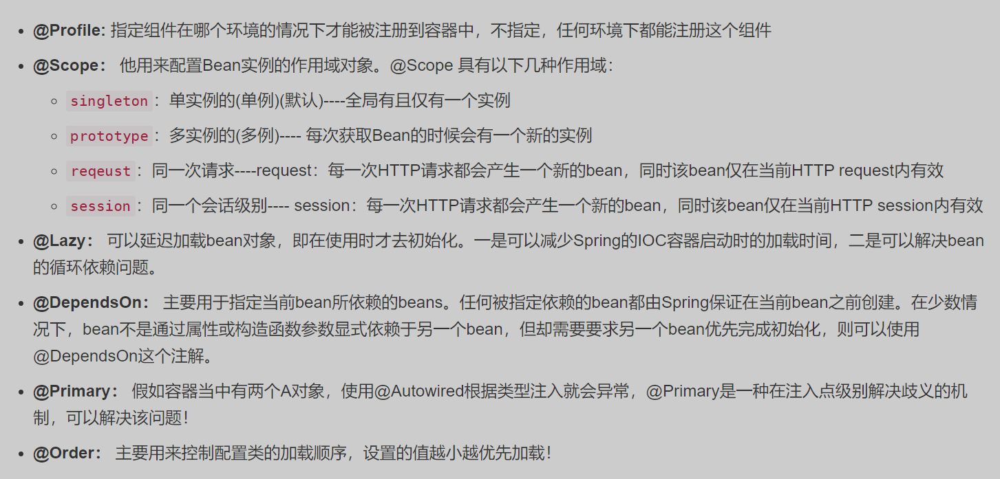

# 主方法,组件,视图层,热部署

## 主方法页面注解:

|             注解             |                 属性                  |                             用途                             | 用于 |
| :--------------------------: | :-----------------------------------: | :----------------------------------------------------------: | :--: |
|    @SpringBootApplication    |                                       |                         声明启动入口                         |  类  |
| @EnableTransactionManagement |                                       | 启用事务管理,同时在service层的方法上添加<br />@Transactional注解使该方法的回滚功能生效 |  类  |
|        @MapperScan()         | 要扫描的包名,<br />如"springboot.dao" | 声明某包为持久层,对该包下的类都有效,对于<br />单一类文件可添加@Mapper注解声明为持久层 |  类  |

## 通用组件

1. 注解:

|            注解            |                             属性                             |                             用途                             |   用于   |
| :------------------------: | :----------------------------------------------------------: | :----------------------------------------------------------: | :------: |
|         @Component         |                                                              |        将某类声明为组件创建对象并注入springIOC容器中         |    类    |
| @ConfigurationProperties() | 要从配置文件中<br />引用的对象,必须用小写<br />横线相连的写法 | 将配置文件中的某个对象及其中的属性引用至<br />类中的所有字段上 |    类    |
|        @Autowired()        | required默认为true注<br />入对象必须能被找到<br />false时未找到对象会被<br />设置为null | 寻找与字段名相同或与之类型相同但唯一的<br />实现类对象,使该字段指向它.如果实现类名<br />与字段名不符且该类型拥有多个实现类,则可<br />以在该字段中添加@Qualifier("实现类类名")<br /> 注解声明该字段具体指向哪一个实现类的对象<br />,或在实现类中添加@primary注解表明哪个<br />是主要的.注意:该注解无法为static或final<br />修饰的字段赋值 | 接口字段 |
|         @Resource          |                                                              | 与@Autowired几乎相同,该注解属于java<br />自带的注解,@Autowired属于spring注解 | 接口字段 |
|          @Bean()           |                      对象名,可以写多个                       | 将某方法的返回值对象注入springIOC容器中<br />,被注释的方法可以用static final修饰但必须<br />有返回值,默认以其方法名作为对象名,关于<br />该注解可以与哪些注解共同使用 ***详见下方*** |   方法   |
|          @Value()          | 要注入到字段的值,不能为<br />除了Map,List外的对象,不<br />能为static和final修饰的字段赋值 | 将某值赋予给某字段(必须是封装类),或是将<br />配置文件中的属性赋值给对象,关于其值的<br />表达式用法 ***详见下方*** |   字段   |

2. 关于 @Bean 注解:该注解在使用时可以与这些注解共同使用:
   
   在 @Bean 注解标记的方法中若有形参,则在执行该方法并创建该方法的返回值前默认会将与形参名相同的实例对象注入该形参中(相当于在形参中使用了 @Autowired 注解).同理,该形参可以使用@Qualifier("实现类类名")  手动声明要注入的对象
   若无相关配置,最后定义的 @Bean 对象会覆盖之前定义的(默认)同名对象,一般这种情况出现在自定义的 @Configuration 配置类中,用自定义继承父类(或父接口)的类的子实例覆盖默认的父对象

3. 关于 @Value 注解:将配置文件中的属性赋值给某字段时,格式为@Value{"${对象.属性名}"},例如 @Value("${zhangsan.age}")
   若注入List,例:

   ```java
   @Value("#{{'唱,跳,rap,篮球'}}")
   ```

   若注入Map,例:

   ```java
   @Value("#{{'语文':'90','数学':'100'}}")
   ```

## controller视图层:

### 类注解

|       注解        |                             属性                             |                             用途                             |  用于   |
| :---------------: | :----------------------------------------------------------: | :----------------------------------------------------------: | :-----: |
|    @Controller    |                                                              |                       声明该类为视图层                       |   类    |
|  @RestController  |                                                              |       声明该类为视图层,且所有方法视为拥有@ResponseBody       |   类    |
| @RequestMapping() | value:要映射的地址,<br />可添加多个<br />method:允许的方法,可添加多个 | 访问类中所有方法前要添加的地址前缀<br />不带method属性则默认允许所有方法访问地址 | 类,方法 |
|       @Api        |       tags:将生成的文档描述<br />归为哪一类,可添加多个       | 针对该接口类生成一个文档的描述，在生成的<br />Swagger的Api文档中会对该Controller进行介绍 |   类    |
|   @ApiOperation   |            value:描述的内容<br />notes:提示的内容            |      针对该接口进行描述,会在Swagger的Api文档中进行记录       |   类    |

关于 @RequestMapping() 中 url 路径的通配符: 问号 ? 代表任意单个字符,单星号 * 代表任意多个字符(包括零个字符,其中不可以出现路径分隔符 / ),双星号 ** 代表任意多个可以出现路径分隔符 / 的字符.使用单双星号时其左右不可以出现非 / 字符.

### 方法注解

|       注解        |                             属性                             |                             用途                             |  用于   |
| :---------------: | :----------------------------------------------------------: | :----------------------------------------------------------: | :-----: |
| @RequestMapping() | value:要映射的地址,<br />可添加多个<br />method:允许的方法,可添加多个 | 访问该方法前要添加的地址前缀<br />不带method属性则默认允许所有方法访问地址 | 类,方法 |
|   @GetMapping()   |                 要映射的地址,同理可添加多个                  |    该地址仅可用get方法访问,在RESTful写法中可代替 查 功能     |  方法   |
|  @PostMapping()   |                             同上                             |            同上,仅可用Post方法访问,可代替 增 功能            |  方法   |
| @DeleteMapping()  |                             同上                             |              同上,但不可直接访问,可代替 删 功能              |  方法   |
|   @PutMapping()   |                             同上                             |              同上,但不可直接访问,可代替 改 功能              |  方法   |
|  @CrossOrigin()   |                        带端口号的url                         |             允许源url为某值的请求跨域访问服务器              | 类,方法 |
|   @ResponseBody   |                                                              | 将方法的返回值直接写入回应体内返回,默认方法<br />的返回值是跳转路径而非返回的数据 |  方法   |
|    @InitBinder    |                                                              | 为当前控制器注册一个属性编辑器或者其他,<br />只对当前的Controller有效 |  方法   |

### 方法参数注解

|      注解       |                             属性                             |                             用途                             |   用于   |
| :-------------: | :----------------------------------------------------------: | :----------------------------------------------------------: | :------: |
| @RequestParam() |  value:url后缀的键值<br />required:是否为必填参数,默认为是   | 解析网址后缀有 ?xx=yy&zz=ww 的url,将结果赋值给<br />方法形参,如果合法形参类型可以不为字符串,如果<br />形参名与键名相同可以不写value值.该注解也可以解<br />析post方法中请求体内的参数(其数据格式即请求头<br />Content-Type 必须是 multipart/form-data 或<br />application/x-www-form-urlencoded ) | 方法参数 |
| @PathVariable() | value:url中{}内的地址段<br />required:是否为必填参数,默认为是 | 解析完整路径的url,如user/{username}/{gender}<br />大括号内为键值,其余用法与以上同理.当 required<br />为false时一般需要为该方法添加多个url映射适应<br />多个不同参数个数的请求,你可以声明传入类型的<br />参数为 List<String> 数组,在url中以 1,2,3 这样<br />的方式(如 /users/Lilith,HuTao,Walter )表示数组 | 方法参数 |
| @RequestBody()  |               required:请求是否必须具备请求体                | 将从前端传回的所有 post 请求体数据注入该参数,<br />该参数可以是字符串或自定义对象,方法中只能有一<br />个该注解,解析的数据格式类型必须是 <br />application/json .不添加该注解也可以解析请求体<br />数据,但可解析的数据类型 @RequestParam() 相同 | 方法参数 |

### 方法参数类型

在不添加任何注解的情况下,会根据前端传回来的参数自动匹配括号内类型与名称相同的数据(或包装类中的数据),当形参类型为以下种类时,对应的参数为

|      形参类型       |                参数说明                |
| :-----------------: | :------------------------------------: |
| HttpServletRequest  |      通过request对象获取请求信息       |
| HttpServletResponse |        通过response处理响应信息        |
|     HttpSession     | 通过session对象得到session中存放的对象 |
|  Model(或ModelMap)  |        使用该视图层对象创建页面        |

### 方法的返回值

|       返回值类型       |                             说明                             |
| :--------------------: | :----------------------------------------------------------: |
|      ModelAndView      |             视图解析器,系统会自动解析其中的属性              |
|         String         | 若方法上有@ResponseBody注解则为要返回给客户端的数据,如果没有则为要渲染并返回<br />给客户端的逻辑视图地址(默认为thymeleaf模板视图),或使用以下格式跳转至其他页面:<br />客户端跳转(重定向,客户端地址栏地址会改变) return "redirect:页面路径";<br />服务端跳转(转发,客户端地址栏地址不会改变) return "forward:页面路径"; |
|          void          | 需要添加类型为HttpServletRequest,HttpServletResponse的形参,并使用以下方法跳转页面:<br />客户端重定向: response.sendRedirect("url");<br />服务端转发: request.getRequestDispatcher("页面路径").forward(request,response); |
| ResponseEntity<String> | 以自定义的响应体为结果返回给前端,其中的泛型类型一般为String  |
|  非上述类型的 Object   |              默认以 json 格式返回给客户端的数据              |

## 代码热部署

1. 在  [pom.xml](material\springboot-knowledge\pom.xml) 导入依赖:

   ```xml
   <dependency>
       <groupId>org.springframework.boot</groupId>
       <artifactId>spring-boot-devtools</artifactId>
       <optional>true</optional><!-- 可以防止将devtools依赖传递到其他模块中 -->
   </dependency>
   ```

2. 在 [application.yml](material\springboot-knowledge\src\main\resources\application.yml)  配置文件中,添加配置启动热部署功能:

   ```yml 
   spring:
     devtools:
       restart:
         enabled: true
   ```

3. 在controller层中, [DefaultController.java](material\springboot-knowledge\src\main\java\springboot\controller\DefaultController.java) 类里找到 helloPage() 方法,启动服务器访问网址 http://localhost:8081/springboot-knowledge/hello ,在启动状态下更改其返回值:

   ```java
   return "<p>这个标签用来测试热部署依赖</p>";
   ```

   重新构建项目 (按Ctrl+F9) ,重新启动后刷新页面并观察页面变化
