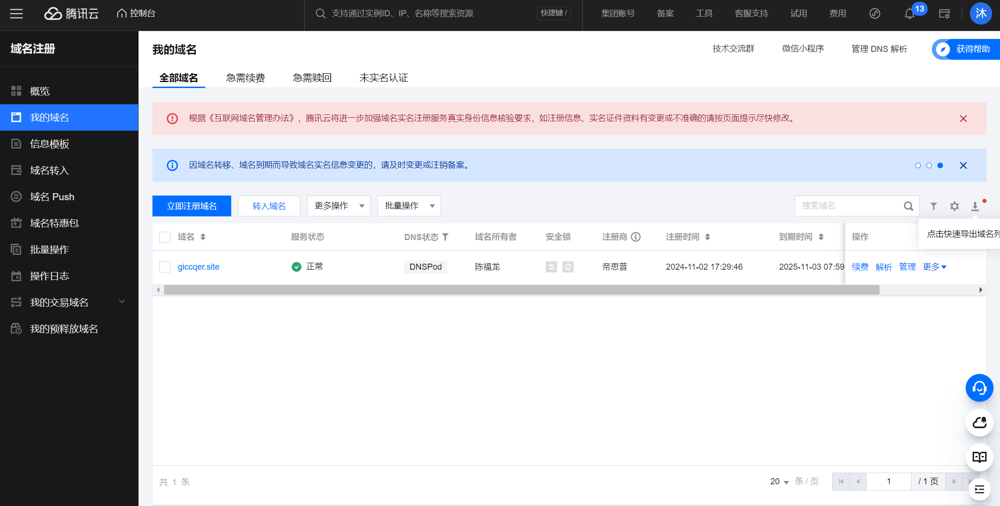
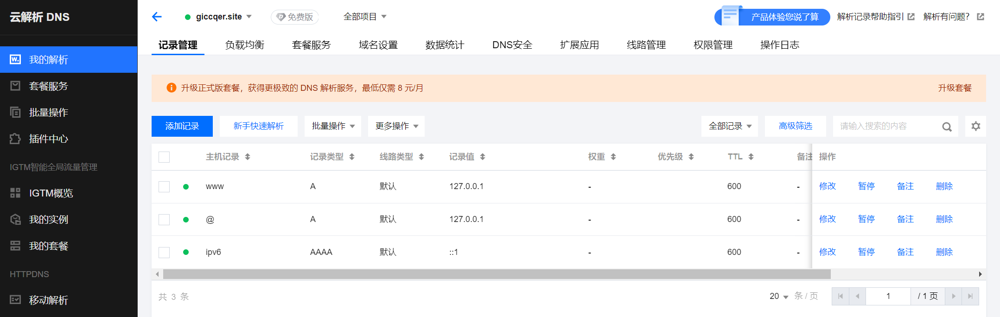
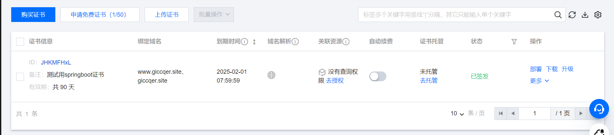
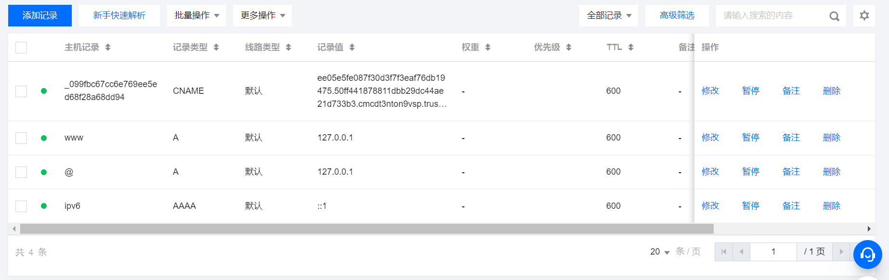
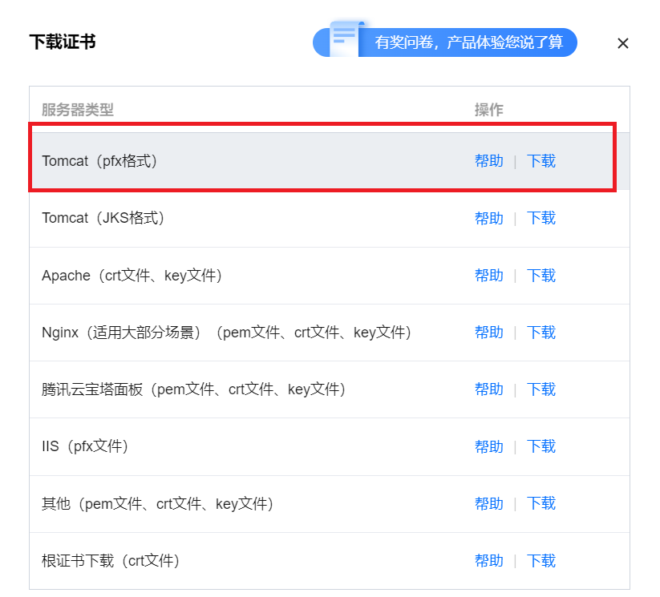

# ipv6,域名,ssl,内网穿透

*本说明使用工程 [外网连接知识](material\idea-external-network-knowledge.bat)* 

## ipv6

???

## 域名获取

1. 在工程文件的 controller 文件夹下创建  [HelloController.java](material\external-network-knowledge\src\main\java\springboot\controller\HelloController.java) ,并创建 helloPage() 方法:

   ```java
   @RestController
   public class HelloController {
       @GetMapping({"/hello", "/"})
       public String helloPage() {
           return "<p>访问springboot服务器成功!</p>";
       }
   }
   ```

   访问以下网址之一,测试是否能成功访问该页面

   > ipv4地址 http://localhost:8080/hello , http://127.0.0.1:8080/hello 
   > ipv6地址 http://ip6-localhost:8080/hello , [http://[::1]:8080/hello](http://[::1]:8080/hello) 

   本教程测试能否通过"正确"的域名,ssl加密或是内网穿透的方法访问这些网址
2. 以注册 [腾讯云域名](https://buy.cloud.tencent.com/domain/) 为例,需注册腾讯云账号并进行实名认证,查询要购买的域名后进行域名购买(这里不建议浪费宝贵的首购优惠),购买时需填写注册人信息模板,上传后需要对该域名和模板进行人工审核(可能需要1-3天),等待审核完毕后即可购买并使用该域名(注:域名强制为小写),之后打开 [腾讯云域名控制台](https://console.cloud.tencent.com/domain) ,点击 我的域名 即可看到刚刚申请完毕的域名
   
3. 接下来需要配置该域名映射哪些ip(ipv4或ipv6),点击 解析 按钮,弹出解析配置,选择新手快速解析,为该域名添加三个指向本地ip(前两个为ipv4地址 127.0.0.1,第三个为ipv6地址 ::1 )的子域名,等待一段时间
   
   然后启动springboot服务器,访问网址 http://giccqer.site:8080/ , http://www.giccqer.site:8080/ 或 http://ipv6.giccqer.site:8080/ (注意:某些服务商可能不提供ipv6的DNS解析服务)
   同理,使用DNS [域名解析网站](https://tool.dnspod.cn/) 可以检测这些网址是否能被解析,访问[腾讯云解析DNS](https://console.cloud.tencent.com/cns)可以查看刚刚创建的解析规则
4. 关于域名的分级:一个域名通常包含顶级域名,二级域名,三级域名,如 www.giccqer.site 中, .site 为顶级域名, giccqer 为二级域名, www 为三级域名
   对于顶级域名:通用的有 .com , .org , .net 等,国家或地区顶级域名: .us , .cn , .uk 等
   一个网址可以有无限多的低级域名,但至少要有顶级域名和二级域名

## ssl认证

### 基本配置

1. ssl认证原理为使用非对称加密方式验证网站自身身份和发送数据.其原理简单来说,在网站与服务器进行握手阶段,通过报文通信,服务器向客户端发送证书来验证自身的合法性(证书一般由第三方权威机构颁发,内含加密证书公钥),客户端从证书中获取证书公钥,并用证书公钥加密自身生成的通信私钥发送给服务端,服务端用证书私钥解密客户端发来的通信私钥,这样双方就有了相同的通信私钥,可以在不暴露私钥的情况下进行加密通信.相关详细原理可参见 [教程网站](https://blog.csdn.net/qq_38265137/article/details/90112705) 以及 [教程网站2](https://blog.csdn.net/qq_34583944/article/details/132429911) .其中相关的专有名词如下:

   > SSL: 安全套接字层
   > TLS: 安全传输协议,目前应用最广泛的加密协议,但由于习惯一般称呼其为ssl协议
   > CA 证书: 又被称为数字证书,包含证书拥有者的身份信息,CA机构的签名,公钥和私钥,由CA 机构颁发
   > SSL 证书: 是一个数字证书,用于认证网站的身份并启用加密连接,是CA机构颁发证书的其中一种

2. 以申请[腾讯云证书](https://console.cloud.tencent.com/ssl)为例,打开网站后申请免费证书,其绑定的域名为你需要添加证书的域名(这里为 www.giccqer.com ),有三种验证方式,选择 手动验证DNS ,需要根据教程自行额外添加一条域名解析并验证其是否添加成功(需根据官方教程进行操作),选择 自动验证DNS 则会省略这一过程(需要授权).不建议使用文件校验.申请成功后证书管理平台会添加如下记录:
   
   注:以下为选择手动验证DNS所自行添加的域名解析样例,证书签发完毕后可以删除这条解析.访问 [腾讯云解析DNS](https://console.cloud.tencent.com/cns) 查看.
   

3. 对于腾讯云相关产品(如云服务器),证书的部署较为容易.对于本地springboot服务器,需要在 [腾讯云证书](https://console.cloud.tencent.com/ssl) 控制台对应的证书页面中点击下载,在弹出的下载页面选择 Tomcat(pfx格式) 文件
   
   下载[压缩包](material\www.giccqer.site_tomcat.zip)后解压,在工程文件的 resources 资源文件夹中创建 ssl 文件夹用来放置加密证书,将压缩包中的 [www.giccqer.site.pfx](material\external-network-knowledge\src\main\resources\ssl) 文件放入其中,然后配置 [application.yml](material\external-network-knowledge\src\main\resources\application.yml) ,添加以下内容:

   ```yml
   server:
     address: www.giccqer.site  #声明本服务器的域名(能通过外网解析的)或ip地址(使用回环地址即可)
     port: 443 #https协议的默认端口443,与http协议所使用的80端口不同
     ssl: #证书配置
       key-alias: www.giccqer.site #证书所绑定的域名
       key-store-password: m332zkuwxfr #文件密码,由于申请证书时未设置私钥,所以需根据压缩包中的 keystorePass.txt 填写
       key-store-type: pkcs12 #证书类型
       key-store: classpath:ssl/www.giccqer.site.pfx #证书文件所在的位置
   ```

4. 启动服务器,依次访问

   > http://www.giccqer.site:443/ 结果:访问被服务器拒绝,禁止未经 TLS 加密的访问
   > https://localhost/ 结果:访问成功,但浏览器显示无法验证该网站身份,原因是服务器的域名与证书中的描述不符
   > https://www.giccqer.site/ 结果:访问成功,且浏览器显示该网站的身份验证成功

   注:使用加密证书后,对于https请求浏览器默认访问端口为443,该端口号可以不写.由于服务器使用的是ipv4证书,ipv6的任何地址将无法访问

5. 同理,为域名 ipv6.giccqer.site 申请证书,使用同样的方法(一般配置 server.address=[::1] )配置即可,但配置后访问网址 https://ipv6.giccqer.site/ ,但无法访问其他ipv4地址

### 保留原端口或http转https配置

1. 如果想保留原端口(80)可以正常访问,在 config 中创建类 [SSLConfig.java](material\external-network-knowledge\src\main\java\springboot\config\SSLConfig.java) 创建 tomcatServerCustomer() 方法进行如下配置:
   ```java
   @Configuration
   public class SSLConfig {
       @Bean
       public WebServerFactoryCustomizer<TomcatServletWebServerFactory> tomcatServerCustomer() {
               Connector connector = new Connector();//创建一个Connector,默认使用HTTP/1.1协议
               connector.setPort(80); //设置原端口号
               connector.setScheme("http"); //设置协议
               connector.setSecure(true); //设置该端口为安全端口,不进行跳转
               factory.addAdditionalTomcatConnectors(connector); //将自定义的Connector添加到工厂中
           };
       }
   }
   ```

   开启服务器后访问 http://localhost/ 或 http://www.giccqer.site/ ,可正常打印页面

2. 如果想要设置访问http端口时跳转至https端口,则修改 [SSLConfig.java](material\external-network-knowledge\src\main\java\springboot\config\SSLConfig.java) 中的 tomcatServerCustomer() 方法:
   ```java
   @Bean
   public WebServerFactoryCustomizer<TomcatServletWebServerFactory> tomcatServerCustomer() {
       return (factory) -> {
           factory.addContextCustomizers((context) -> { //添加安全约束
               SecurityConstraint constraint = new SecurityConstraint(); //创建安全约束对象
               constraint.setUserConstraint("CONFIDENTIAL"); //设置安全约束级别
               SecurityCollection collection = new SecurityCollection(); //创建安全集合对象
               collection.addPattern("/"); //设置要保护的路径
               constraint.addCollection(collection); //将安全集合对象添加到安全约束对象中
               context.addConstraint(constraint); //将安全约束对象添加到服务器工厂中
           });//注:如果仅仅是增加新的端口,则不必添加factory.addContextCustomizers()方法
           Connector connector = new Connector();//创建一个Connector,默认使用HTTP/1.1协议
           connector.setPort(80); //设置原端口号
           connector.setScheme("http"); //设置协议
           connector.setSecure(false); //该端口是否为安全端口,若不是则进行跳转
           connector.setRedirectPort(443); //设置重定向的端口号
           factory.addAdditionalTomcatConnectors(connector); //将自定义的Connector添加到工厂中
       };
   }
   ```

   开启服务器后访问 http://localhost/ 或 http://www.giccqer.site/ ,浏览器将会将 http 页面跳转至 https 页面

   从开发的角度讲,最好将 connector.setSecure() 设置为 true 以保证能访问 http 80 号端口

## 内网穿透

???
