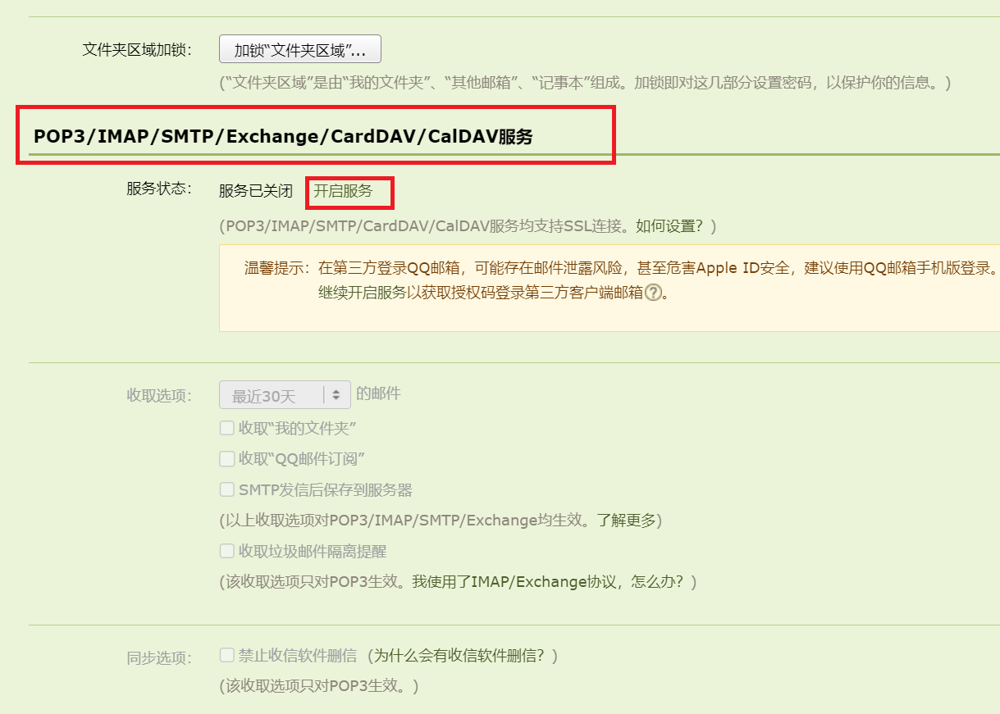

# 后端发送请求,springboot-mail

## springboot原生方法发送get,post请求

1. 需使用 RestTemplate 对象进行具体操作,该对象既可用于后端主动发送http请求,也可用于后端的主动上传下载等.在controller层中创建  [RequestController.java](material\external-network-knowledge\src\main\java\springboot\controller\RequestController.java) ,发送get请求获取百度页面,然后再把页面发送给后端:

   ```java
   @Controller
   @RequestMapping("/request")
   public class RequestController {
       @GetMapping("/baidu")
       @ResponseBody
       public String getBaiduPage() {
           RestTemplate restTemplate = new RestTemplate(); //创建RestTemplate配置后,这句话可以删掉,转而使用全局对象
           String url = "https://www.baidu.com/";
           return restTemplate.getForObject(url, String.class); //返回由纯字符串组成的html页面
       }
   }
   ```

   启动服务器,访问页面 http://localhost/request/baidu ,会返回全是乱码的百度页面(注意:要开启 http 80 号端口)

2. 在config文件夹中创建,以解决编码问题,并进行一些自定义的配置:

   ```java
   @Configuration
   public class RestTemplateConfig {
       @Bean
       public RestTemplate restTemplate() {
           SimpleClientHttpRequestFactory factory = new SimpleClientHttpRequestFactory(); //创建请求工厂
           factory.setReadTimeout(5000); //设置读取超时时间,单位毫秒
           factory.setConnectTimeout(5000); //设置连接超时时间,单位毫秒
           RestTemplate restTemplate = new RestTemplate(factory); //使用工厂对象创建restTemplate
           //设置对象的编码格式
           restTemplate.getMessageConverters().set(1, new StringHttpMessageConverter(StandardCharsets.UTF_8));
           return restTemplate;
       }
   }
   ```

   在 [RequestController.java](material\external-network-knowledge\src\main\java\springboot\controller\RequestController.java) 中注入该全局变量,删除方法内的 new RestTemplate() 对象,使用该变量进行发生get请求操作:

   ```java
   @Autowired
   private RestTemplate restTemplate;
   ```

   再次启动服务器并访问 http://localhost/request/baidu ,返回页面的编码恢复正常

3. 在 [RequestController.java](material\external-network-knowledge\src\main\java\springboot\controller\RequestController.java) 中测试post方法,使用 [apifox网站](https://echo.apifox.com) 网站进行接口测试:

   ```java
   @GetMapping("/apifox")
   public ResponseEntity<?> postToApifox() {
       String url = "https://echo.apifox.com/post";
       MultiValueMap<String, String> params = new LinkedMultiValueMap<>(); //请求体内的参数集合
       params.add("userName", "堂吉诃德");
       params.add("userPassword", "123456");
       //请求头,注意不要主动将Content-Type设置为application/json否则发出的参数会多出一对引号
       HttpHeaders headers = new HttpHeaders(); 
       HttpEntity<MultiValueMap<String, String>> httpEntity = new HttpEntity<>(params, headers);//封装请求体请求头
       return restTemplate.postForEntity(url, httpEntity, String.class); //发送请求并返回响应体
   }
   ```

   启动服务器,访问 http://localhost/request/apifox ,观察从 apifox网站 返回的数据

## hutool工具包发送get,post请求

在 [build.gradle](material\external-network-knowledge\build.gradle) 的 dependencies 中导入hutool工具包依赖

```groovy
implementation 'cn.hutool:hutool-all:5.8.32'
```

在 [RequestController.java](material\external-network-knowledge\src\main\java\springboot\controller\RequestController.java) 中,创建发送get请求的控制器方法:

```java
@GetMapping("/apifox2")
public ResponseEntity<String> hutoolGet() {
    String url = "https://echo.apifox.com/get?param1=以实玛利&param2=都是你的错";
    String responseBodyStr = HttpRequest.get(url) // 发送get请求
            .header(Header.CONTENT_TYPE, "application/json") // 设置请求头
            .timeout(20000) // 设置超时时间
            .execute().body(); // 执行get方法,获取响应体内的字符串数据
    MultiValueMap<String, String> responseBody = new LinkedMultiValueMap<>(); //自定义响应体,封装获取到的字符串数据
    responseBody.add("Content-Type", "application/json;charset=UTF-8");
    return new ResponseEntity<>(responseBodyStr, responseBody, HttpStatus.OK);
}
```

启动服务器,访问 http://localhost/request/apifox2 ,观察从 apifox网站 返回的数据

同理,发送post请求方法为:

```java
@GetMapping("/apifox3")
public ResponseEntity<String> hutoolPost() {
    String url = "https://echo.apifox.com/post";
    HashMap<String, String> paramsMap = new HashMap<>(); // 请求体参数
    paramsMap.put("userName", "格里高尔");
    paramsMap.put("userPassword", "654321");
    String responseBodyStr = HttpRequest.post(url)
            .header(Header.CONTENT_TYPE, "application/json")
            .formStr(paramsMap) // 使用formStr()方法封装请求体
            .timeout(20000)
            .execute().body();
    MultiValueMap<String, String> responseBody = new LinkedMultiValueMap<>();
    responseBody.add("Content-Type", "application/json;charset=UTF-8");
    return new ResponseEntity<>(responseBodyStr, responseBody, HttpStatus.OK);
}
```

启动服务器后访问 http://localhost/request/apifox3

## springboot-mail发送简单文本邮件

1. 以QQ邮箱为例,将自己的邮件账号作为邮件发送人再发送给自己.首先需要开通smtp协议服务并取得第三方授权登录码,打开QQ邮箱网页页面选择 设置->账号 ,在下面某一栏中选择开启相关服务,经过一系列验证通过后完成
   

2. 在 [build.gradle](material\external-network-knowledge\build.gradle) 的 dependencies 中导入spring-boot-starter-mail邮件工具依赖:

   ```groovy
   implementation 'org.springframework.boot:spring-boot-starter-mail'
   ```
   
3. 在 [application.yml](material\external-network-knowledge\src\main\resources\application.yml) 中,使用刚刚生成的授权码进行配置:

   ```yml
   spring:
     mail: #邮件服务器配置
       host: smtp.qq.com #邮件服务器地址
       port: 465 #或587,qq邮箱的smtp服务使用这两个端口
       protocol: smtp #smtp,电子邮件传输协议
       username: 1293711097@qq.com #发件人账号
       password: ${secret.password} #qq邮箱的第三方授权登陆码,注意这并非是qq邮箱的网页登录密码
       default-encoding: UTF-8 #默认编码格式
       properties: #配置邮件服务器
         mail.smtp.starttls.enable: true #开启tls加密
         mail.smtp.starttls.required: true #强制使用tls加密
         mail.smtp.ssl.enable: true #开启ssl加密
     config:
       import: classpath:conf/secret-info.yml #导入 secret-info.yml秘密配置文件
   ```

4. 创建测试类 [SendEmailTest.java](material\external-network-knowledge\src\test\java\springboot\SendEmailTest.java) ,创建邮件发送方法:

   ```java
   @SpringBootTest
   public class SendEmailTest {
       @Autowired
       private JavaMailSender javaMailSender; //默认的邮件发送对象.
       @Value("${spring.mail.username}")
       private String username; //邮件发送者账号,使用@Value()注解从配置文件中注入字符串值
       @Test
       public void sendSimpleEmail() { //发送纯文本简单邮件.
           SimpleMailMessage simpleMailMessage = new SimpleMailMessage(); // 创建简单邮件对象
           simpleMailMessage.setFrom(username); // 发送者
           simpleMailMessage.setTo("1293711097@qq.com"); // 接收者
           simpleMailMessage.setSubject("你好,我是springboot"); // 邮件标题
           simpleMailMessage.setText("这是一封来自springboot工程的测试用简单邮件."); // 邮件内容
           javaMailSender.send(simpleMailMessage); // 发送邮件
       }
   }
   ```

   运行测试,之后查看自己的邮箱中是否接收到相关的邮件

## springboot-mail发送附带文件的邮件

以工程文件夹下的 download 中的某文件为附加文件,在 [SendEmailTest.java](material\external-network-knowledge\src\test\java\springboot\SendEmailTest.java) 中创建发送方法:

```java
@Test
public void sendFileByEmail() {
    MimeMessage mimeMailMessage = javaMailSender.createMimeMessage(); //创建mine(多用途互联网邮件扩展)格式邮件对象
    try {
        MimeMessageHelper helper = new MimeMessageHelper(mimeMailMessage, true); //创建邮件帮助对象
        helper.setFrom(username);
        helper.setTo("1293711097@qq.com");
        helper.setSubject("你好,我是springboot");
        helper.setText("附赠好听的歌曲一首");
        File sendFile = new File("download\\ChipiChipiChapaChapa.ogg"); //要发送的文件
        helper.addAttachment(sendFile.getName(),sendFile); //添加附件,如果有多个附件可以多次添加
        javaMailSender.send(mimeMailMessage);
    } catch (MessagingException e) {
        throw new RuntimeException(e);
    }
}
```

运行测试方法,查看自己的邮箱中接收到的文件,并尝试下载附加在其中的文件

