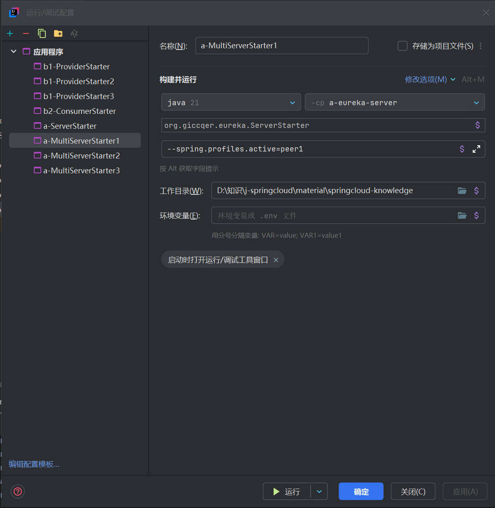
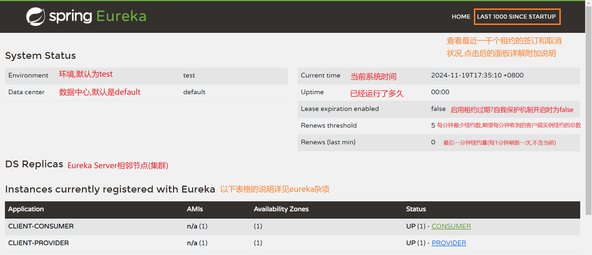
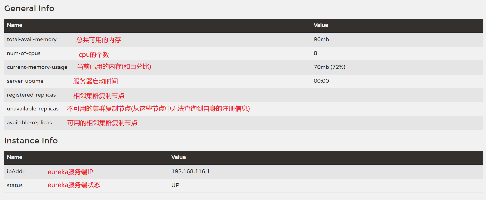
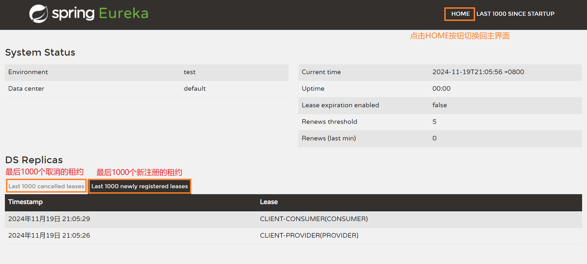

# eureka服务端与客户端

本说明使用工程 [springcloud知识](material\idea-springcloud-knowledge.bat) 

## 服务端(注册中心)与客户端搭建

1. 本例使用 maven 多模块来构建springcloud服务端和客户端.创建maven项目后在 [pom.xml](material\springcloud-knowledge\pom.xml) 中添加以下标签声明自身为父依赖(可同时删除src源码文件夹):
   ```xml
   <packaging>pom</packaging>
   ```

   添加springboot和springcloud依赖管理标签<dependencyManagement>:
   ```xml
   <dependencyManagement><!--子项目会继承父项目的依赖管理标签-->
       <dependencies>
           <dependency><!--spring boot依赖管理-->
               <groupId>org.springframework.boot</groupId>
               <artifactId>spring-boot-dependencies</artifactId>
               <version>3.3.4</version>
               <type>pom</type>
               <scope>import</scope>
           </dependency>
           <dependency><!--spring cloud依赖管理-->
               <groupId>org.springframework.cloud</groupId>
               <artifactId>spring-cloud-dependencies</artifactId>
               <version>2023.0.3</version><!--谜一样的版本号,下次建议用上海地铁站名称命名-->
               <type>pom</type>
               <scope>import</scope>
           </dependency>
       </dependencies>
   </dependencyManagement>
   ```

   (可选)之后添加<dependencies>依赖:
   ```xml
   <dependencies><!--所有子项目都会导入这个依赖-->
       <dependency><!--监视线程依赖,在eureka管理面板中用得上-->
           <groupId>org.springframework.boot</groupId>
           <artifactId>spring-boot-starter-actuator</artifactId>
       </dependency>
   </dependencies>
   ```
   
2. 创建服务器(注册中心)子项目模块 [a-eureka-server](material\springcloud-knowledge\a-eureka-server) ,规范起见在其 [pom.xml](material\springcloud-knowledge\a-eureka-server\pom.xml) 中添加一个自定义的<groupId>:
   ```xml
   <groupId>org.giccqer.eureka</groupId><!--这里并未继承父项目的<groupId>-->
   ```

   添加eureka服务器依赖:
   ```xml
   <dependencies>
       <dependency><!--spring boot web-->
           <groupId>org.springframework.boot</groupId>
           <artifactId>spring-boot-starter-web</artifactId>
       </dependency>
       <dependency><!--eureka服务器,奈飞公司出品-->
           <groupId>org.springframework.cloud</groupId>
           <artifactId>spring-cloud-starter-netflix-eureka-server</artifactId>
       </dependency>
   </dependencies>
   ```
   
   在 resources 文件夹下创建 [application.yml](material\springcloud-knowledge\a-eureka-server\src\main\resources\application.yml) 进行相应的配置:
   ```yml
   spring:
     application:
       name: DEFAULT-SERVER #必须要添加,否则服务注册到注册中心后会丢失
   server:
     port: 8761 #端口号,根据行业规范最好设置成8761
   eureka:
     instance:
     #服务器或客户端实例名称,要保证在注册中心是唯一的,否则注册实例会被相互覆盖
       instance-id: ${spring.application.name} 
       hostname: localhost #服务实例的主机名,一般会自动检测并配置这个值,但是在某些情况下需要手动配置
     client:
       register-with-eureka: false #表示不把自己视为是客户端,不注册自己(默认为true)
       fetch-registry: false #表示自己就是注册中心,不检索注册服务(默认为true)
     server:
       enable-self-preservation: true #是否开启自我保护,默认为 true
       eviction-interval-timer-in-ms: 60000 #Eureka服务端清理失效服务的时间间隔,单位毫秒(默认是60000毫秒)
   #以下为监控相关的可选内容.需添加 spring-boot-starter-actuator 依赖使其生效
   management:
     endpoints:
       web:
         exposure:
           include: info #开放info端点
     info:
       env:
         enabled: true #必须设置为true才能在网页中获取到监控信息
   info: #以下是自定义的监控信息
     app:
       name: ${spring.application.name}
       status: ${spring.application.name}服务器运转良好
   ```
   
   创建主类 [ServerStarter.java](material\springcloud-knowledge\a-eureka-server\src\main\java\org\giccqer\eureka\ServerStarter.java) 添加 main 方法(需添加 @EnableEurekaServer 注解)
   
   ```java
   @SpringBootApplication
   @EnableEurekaServer
   public class ServerStarter {
       public static void main(String[] args) {
           SpringApplication.run(ServerStarter.class, args);
       }
   }
   ```
   
   启动该主类,访问 http://localhost:8761/ 查看eureka控制台
   
3. 在顶层父类中创建 [b-eureka-client](material\springcloud-knowledge\b-eureka-client) 子项目,由于需要添加两个客户端模块因此需将 [b-eureka-client](material\springcloud-knowledge\b-eureka-client) 也声明为父项目,在该项目的  [pom.xml](material\springcloud-knowledge\b-eureka-client\pom.xml) 文件中添加以下依赖项:
   ```xml
   <dependencies>
       <dependency><!--spring boot web-->
           <groupId>org.springframework.boot</groupId>
           <artifactId>spring-boot-starter-web</artifactId>
       </dependency>
       <dependency><!--eureka客户端依赖-->
           <groupId>org.springframework.cloud</groupId>
           <artifactId>spring-cloud-starter-netflix-eureka-client</artifactId>
       </dependency>
       <dependency><!--lombok注解依赖,肯定用得上-->
           <groupId>org.projectlombok</groupId>
           <artifactId>lombok</artifactId>
       </dependency>
   </dependencies>
   ```
   
   在该模块中建立两个子项目,一个名为 [b1-provider](material\springcloud-knowledge\b-eureka-client\b1-provider) (信息提供者,假设该项目负责从数据库中查询数据),在 [pom.xml](material\springcloud-knowledge\b-eureka-client\b1-provider\pom.xml) 文件中添加<groupId>标签(规范起见):

   ```xml
   <groupId>org.giccqer.provider</groupId>
   ```
   
   其配置文件 [application.yml](material\springcloud-knowledge\b-eureka-client\b1-provider\src\main\resources\application.yml) 内容如下:
   
   ```yml
   spring:
     application:
       name: CLIENT-PROVIDER #必须写上
   server:
     port: 8080 #tomcat默认端口号
   eureka:
     instance:
       hostname: localhost
       instance-id: PROVIDER #不可与在注册中心中的其他连接实例的该值相同!
       prefer-ip-address: true #优先使用IP地址而非域名作为注册中心实例的主机名
       status-page-url-path: /actuator/info #自定义监控信息页面地址,默认就是 /actuator/info
       lease-renewal-interval-in-seconds: 30 #每隔多少秒向服务端发送心跳报文,默认30秒
       lease-expiration-duration-in-seconds: 90 #超过多少秒没收到服务器返回的心跳报文就认为服务器已宕机,默认90秒
     client:
       service-url: #服务端(注册中心)地址,可配置多个
         defaultZone: http://localhost:8761/eureka
   #同理,可选配置
   management:
     endpoints:
       web:
         exposure:
           include: info
     info:
       env:
         enabled: true
   info:
     app:
       name: CLIENT-${eureka.instance.instance-id}
       status: ${eureka.instance.instance-id}客户端运转良好
   ```
   
   其主方法 [ProviderStarter.java](material\springcloud-knowledge\b-eureka-client\b1-provider\src\main\java\org\giccqer\provider\ProviderStarter.java) 为:
   ```java
   @SpringBootApplication
   public class ProviderStarter {
       public static void main(String[] args) {
           SpringApplication.run(ProviderStarter.class, args);
       }
   }
   ```
   
   另一个子项目名为 [b2-consumer](material\springcloud-knowledge\b-eureka-client\b2-consumer) (信息消费者,获取来自提供者的信息并负责处理外部网页请求),在 [pom.xml](material\springcloud-knowledge\b-eureka-client\b2-consumer\pom.xml) 中添加标签:
   ```xml
   <groupId>org.giccqer.consumer</groupId>
   ```
   
   配置文件 [application.yml](material\springcloud-knowledge\b-eureka-client\b2-consumer\src\main\resources\application.yml) :
   ```yml
   spring:
     application:
       name: CLIENT-CONSUMER
   server:
     port: 8090 #这样与其他客户端的区分度大一些
   eureka:
     instance:
       instance-id: CONSUMER
       prefer-ip-address: true
     client:
       service-url:
         defaultZone: http://localhost:8761/eureka
   management:
     endpoints:
       web:
         exposure:
           include: info
     info:
       env:
         enabled: true
   info:
     app:
       name: CLIENT-CONSUMER
       status: CONSUMER客户端运转良好
   ```
   
   主方法 [ConsumerStarter.java](material\springcloud-knowledge\b-eureka-client\b2-consumer\src\main\java\org\giccqer\consumer\ConsumerStarter.java) 与 provider 相同
   
4. 依次启动 服务端,provider客户端,consumer客户端,访问 http://localhost:8761/ (eureka控制台),观察在 *"Instances currently registered with Eureka"* 一栏中是否能显示已注册的两个客户端.点击 "**Status**" 一栏中的连接,观察是否能输出自定义的信息
   运行完毕后建议保存所有启动项配置(已命名为 a-ServerStarter , b1-ProviderStarter , b2-ConsumerStarter )

## 客户端之间消息传递

1. 在客户端工程 [b1-provider](material\springcloud-knowledge\b-eureka-client\b1-provider) 提供者中的 controller 层创建 [InfoProviderController.java](material\springcloud-knowledge\b-eureka-client\b1-provider\src\main\java\org\giccqer\provider\controller\InfoProviderController.java) 信息提供类,创建方法 provideHelloInfo() 提供字符串信息:
   ```java
   @RestController
   public class InfoProviderController {
       @Value("${eureka.instance.instance-id}")
       public String providerInstanceId; //提供者的实例Id,读取自 application.yml 文件中的配置.
       @GetMapping({"/provide-hello-info", "/"})
       public String provideHelloInfo() { //就当这些文字是从数据库拿到的吧😎
           return "<p>😊这条消息来自Client Provider提供者客户端😊,提供者的实例ID是: " + providerInstanceId + "</p>";
       }
   }
   ```

   尝试使用另一个客户端,通过服务器(注册中心)访问该方法并得到这些字符串
   
2. 在客户端工程  [b2-consumer](material\springcloud-knowledge\b-eureka-client\b2-consumer) 消费者的 config 包中创建 [RestTemplateConfig.java](material\springcloud-knowledge\b-eureka-client\b2-consumer\src\main\java\org\giccqer\consumer\config\RestTemplateConfig.java) 配置类:
   ```java
   @Configuration
   public class RestTemplateConfig {
   //配置RestTemplate,在controller中使用它主动发送请求.必须添加 @LoadBalanced 注解,添加后restTemplate可以通过服务名来调用其他服务,而不需要指定具体的服务实例的地址.spring Cloud会根据服务名自动选择可用的服务实例,并进行负载均衡
       @Bean
       @LoadBalanced
       public RestTemplate restTemplate() {
           SimpleClientHttpRequestFactory factory = new SimpleClientHttpRequestFactory(); //使用工厂类配置对象
           factory.setReadTimeout(5000); //连接超时时间,单位毫秒
           factory.setConnectTimeout(5000); //读取超时时间,单位毫秒
           RestTemplate restTemplate = new RestTemplate(factory); //根据工厂类的配置创建RestTemplate对象
           //设置编码格式,getMessageConverters()方法会得到一个属性集合,用新的编码转换器替换掉原编码转换器(第一个属性)
           restTemplate.getMessageConverters().set(1, new StringHttpMessageConverter(StandardCharsets.UTF_8));
           return restTemplate;
       }
   }
   ```

3. 在消费者的 controller 层中创建 [InfoConsumerController.java](material\springcloud-knowledge\b-eureka-client\b2-consumer\src\main\java\org\giccqer\consumer\controller\InfoConsumerController.java) 类,使用该 restTemplate 对象向提供者发送请求
   ```java
   @RestController
   public class InfoConsumerController {
       @Autowired
       private RestTemplate restTemplate;
   	//用来操作负载均衡器的对象,通过该对象可动态调整负载均衡策略,监控负载均衡情况,更新服务实例等,本例用于获取提供者的url
       @Autowired
       private LoadBalancerClient loadBalancerClient;
       @GetMapping("/hello")
       public String helloInfo() {
           //提供者的url,CLIENT-PROVIDER为其在注册中心中的名字
           String helloProviderUrl = "http://CLIENT-PROVIDER/provide-hello-info";
           String resultFromProvider = restTemplate.getForObject(helloProviderUrl, String.class); //发送请求
           String providerUrl = loadBalancerClient.choose("CLIENT-PROVIDER").getUri().toString(); //获取提供者的url
           return "<p>这条消息来自Client Consumer消费者客户端</p>" + resultFromProvider + "<p>提供者的url: " + providerUrl + "</p>";
       }
   }
   ```

4. 依次启动 服务器,提供者客户端,消费者客户端,访问 http://localhost:8090/hello ,观察浏览器输出情况.eureka服务器面板访问地址为: http://localhost:8761/ 

## 负载均衡策略

1. 当存在多个提供者(客户端)为消费者(客户端)提供服务时,消费者会根据这些提供者的负载状况判断从哪个提供者获取信息会更加流畅.默认情况下会采取轮询法(让自身的请求轮流分配给提供者处理).
   首先创建三个 PROVIDER提供者启动项,以 [b1-provider](material\springcloud-knowledge\b-eureka-client\b1-provider) 中的 [ProviderStarter.java](material\springcloud-knowledge\b-eureka-client\b1-provider\src\main\java\org\giccqer\provider\ProviderStarter.java) 为启动类,这些启动项的程序实参如下:
   b1-MultiProviderStarter1

   > --server.port=8081
   > --eureka.instance.instance-id=MULTI-PROVIDER1

   b1-MultiProviderStarter2

   > --server.port=8082
   > --eureka.instance.instance-id=MULTI-PROVIDER2

   b1-MultiProviderStarter3

   > --server.port=8083
   > --eureka.instance.instance-id=MULTI-PROVIDER3

   注意:除了需配置不同的端口号,还需要配置不同的 instance-id ,否则在服务器中这些实例会相互覆盖

2. 启动默认服务器,并依次启动上述启动项,然后启动 [b2-consumer](material\springcloud-knowledge\b-eureka-client\b2-consumer) 消费者的默认启动项,首先访问服务器面板 http://localhost:8761/ 观察所有连接是否正常(可以看到多个 **MULTI-PROVIDER** 在 **CLIENT-PROVIDER** 一栏中),然后访问 http://localhost:8090/hello 并多次刷新该页面,查看输出的提供者的 url 的端口号是否会发生改变

   > 观察结果:端口号会按照一定的顺序不停地发生改变,符合轮询特征

3. 将负载均衡策略调整为随机:在不关闭所有程序的情况下,在 [b2-consumer](material\springcloud-knowledge\b-eureka-client\b2-consumer) 消费者中添加配置类 [RandomLoadBalancerConfig.java](material\springcloud-knowledge\b-eureka-client\b2-consumer\src\main\java\org\giccqer\consumer\config\RandomLoadBalancerConfig.java) :
   ```java
   @Configuration
   public class RandomLoadBalancerConfig {
       @Bean //修改负载均衡策略为随机,基本上是固定写法,照写便是.
       public ReactorLoadBalancer<ServiceInstance> randomLoadBalancer(Environment environment, LoadBalancerClientFactory loadBalancerClientFactory) {
           String name = environment.getProperty(LoadBalancerClientFactory.PROPERTY_NAME);
           return new RandomLoadBalancer(loadBalancerClientFactory.getLazyProvider(name, ServiceInstanceListSupplier.class), name);
       }
   }
   ```

   在主类 [ConsumerStarter.java](material\springcloud-knowledge\b-eureka-client\b2-consumer\src\main\java\org\giccqer\consumer\ConsumerStarter.java) 中添加类注解 @LoadBalancerClients ,使用刚刚创建好的配置类:
   ```java
   @LoadBalancerClients(@LoadBalancerClient(name = "CLIENT-PROVIDER", configuration = RandomLoadBalancerConfig.class)) //注意:在@LoadBalancerClients该注解的子注解中name和configuration属性二者缺一不可
   ```

   重启消费者服务器,然后访问 http://localhost:8090/hello 并多次刷新,观察端口号的变化

   > 观察结果:端口号的改变几乎完全随机

## 服务器集群配置

1. 将域名 peer1 peer2 peer3 调整为指向自身(回环地址),在 windows [host](C:\Windows\System32\drivers\etc\HOSTS)文件中添加并保存下面一行(需要管理员权限):
   ```tex
   127.0.0.1 peer1 peer2 peer3
   ```

2. 在 [a-eureka-server](material\springcloud-knowledge\a-eureka-server) 服务器项目中的 resources 文件夹下创建三个即将使用的集群服务器(多例运行)配置,其中 [application-peer1.yml](material\springcloud-knowledge\a-eureka-server\src\main\resources\application-peer1.yml) 配置如下:

   ```yml
   spring:
     application:
       name: FIRST-SERVER #对于集群服务器,该名称要有所不同
   server:
     port: 8762 #注意端口号不要重复
   eureka:
     instance:
       instance-id: FIRST-SERVER #服务实例的主机名,要与其他服务器客户端皆不相同
       hostname: peer1 #主机名,已在 host 文件中配置指向 127.0.0.1
     client:
       register-with-eureka: true #服务器之间需要相互注册,选择true
       fetch-registry: true #服务器之间需要相互注册,选择true
       service-url:
         defaultZone: http://peer2:8763/eureka,http://peer3:8764/eureka #指向其他集群服务器,可配置多个
   ```

   其他配置文件 [application-peer2.yml](material\springcloud-knowledge\a-eureka-server\src\main\resources\application-peer2.yml) , [application-peer3.yml](material\springcloud-knowledge\a-eureka-server\src\main\resources\application-peer3.yml) 同理,不再赘述

3. 添加三个新的启动配置,以上述三个文件为基本配置(名称分别为 a-MultiServerStarter1,a-MultiServerStarter2,a-MultiServerStarter3),以 [ServerStarter.java](material\springcloud-knowledge\a-eureka-server\src\main\java\org\giccqer\eureka\ServerStarter.java) 为主类,分别添加程序实参 --spring.profiles.active=peer1 , --spring.profiles.active=peer2 , --spring.profiles.active=peer3 ,其中的 peer1 配置示例如下:

   

4. 启动这三个启动项(先启动的服务器会因为没有找到其他未启动的服务器报错,但不影响运行),依次访问这三个服务器的eureka面板网址: http://localhost:8762/ , http://localhost:8763/ , http://localhost:8764/ 观察 *"DS Replicas"* 一栏连接地址是否指向其他服务器,观察 *"Instances currently registered with Eureka"* 一栏中所注册的其他服务器,并点击 "**Status**" 中的连接观察信息输出

5. 在不关闭服务器的情况下,创建一个客户端启动项 b1-ConnectMultiServerTest 连接这些服务器:以 [b1-provider](material\springcloud-knowledge\b-eureka-client\b1-provider) 中的主类 [ProviderStarter.java](material\springcloud-knowledge\b-eureka-client\b1-provider\src\main\java\org\giccqer\provider\ProviderStarter.java) 为启动类,添加以下启动项参数(也可以把三个服务器地址都写上,以逗号隔开它们):

   > --eureka.client.service-url.defaultZone=http://peer1:8762/eureka

   启动该客户端,分别打开 http://localhost:8762/ , http://localhost:8763/ , http://localhost:8764/ 的服务端面板,可以观察到即使客户端只声明连接某一个服务器,在其他服务器中也能看到它

## eureka面板详解





点击上方黄色边框中的按钮后:



## eureka杂项

### eureka面板Instances currently registered with Eurek表格详解

- Application :实例名称,等于spring.application.name或eureka.instance.appname(优先级更高)配置的名称,都没配置则为unknown

- AMIs: n/a (1),字符串n/a+实例的数量
- Availability Zones: 实例的数量
- Status: 实例的状态加id,显示eureka.instance.instance-id配置的值,若未配置则显示一个由Eureka自动生成的编号.实例的状态标识符详见下方

### 实例的状态标识符

- UP: 服务正常运行,进入自我保护模式时,所有的服务将保持UP状态,所以需要做好熔断重试等容错机制应对灾难性网络出错情况
- OUT_OF_SERVICE: 不再提供服务,其他的Eureka Client将调用不到该服务,一般有人为的调用接口设置的,如:强制下线
- UNKNOWN: 未知状态
- STARTING: 表示服务正在启动中
- DOWN: 表示服务已经宕机,无法继续提供服务

### 自我保护机制

默认情况下,如果eureka服务器在一定时间(默认90秒)内没有收到某个实例的心跳,服务器就会将该实例移除.但如果在15分钟内超过85%的实例都没有发送正常的心跳,那么服务端就会认为客户端与注册中心出现了网络故障,并进入自我保护机制,不会剔除这些客户端实例的注册

该保护机制的目的是避免网络连接故障(网络抖动)导致的误删客户端实例,否则即使成功重新连接,客户端也不会发送重新注册的请求,这会导致客户端无法感知到服务端的存在.
当自我保护机制开启,关闭,配置关闭时,eureka面板会用不同的红字进行提醒

当需要关闭自我保护机制时的配置如下:
```yml
eureka:
    server:
        enable-self-preservation: false
```

