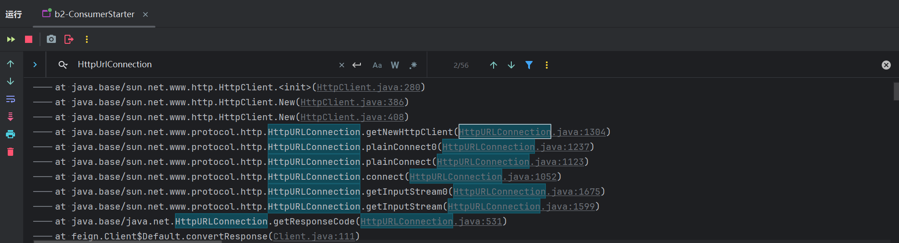
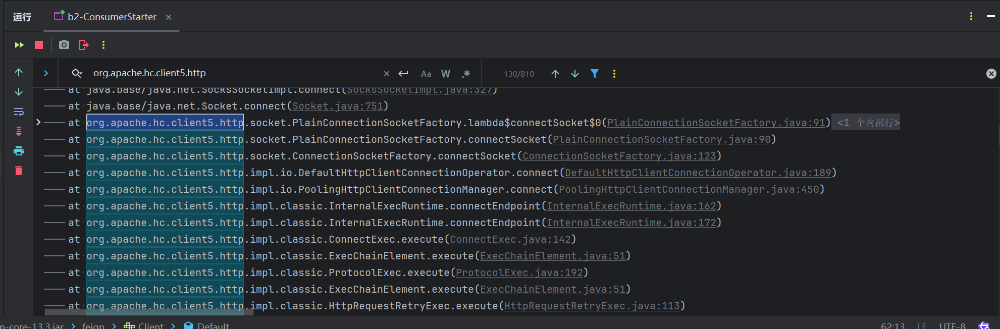
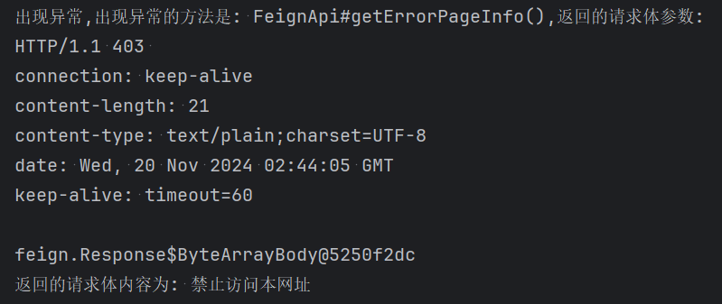

# OpenFeign数据传输对象

## 使用OpenFeign建立通信

1. OpenFeign的意义在于代替 RestTemplate 在 springcloud 中建立更可靠的客户端相互通信的机制,一般提供者不需要做出什么改变.在提供者工程 [b1-provider](material\springcloud-knowledge\b-eureka-client\b1-provider) controller层中的 [InfoProviderController.java](material\springcloud-knowledge\b-eureka-client\b1-provider\src\main\java\org\giccqer\provider\controller\InfoProviderController.java) 类里添加方法:
   ```java
   @GetMapping("/feign-str/{info}")
   public String sendStrToConsumer(@PathVariable("info") String info) {
       return "已接收到来自消费者的消息---" + info;
   }
   ```

   这次尝试使用 OpenFeign 使得消费者与提供者建立连接并访问该方法

2. 在消费者 [b2-consumer](material\springcloud-knowledge\b-eureka-client\b2-consumer) 工程的 [pom.xml](material\springcloud-knowledge\b-eureka-client\b2-consumer\pom.xml) 文件中导入相关依赖:

   ```xml
   <dependencies>
       <dependency><!--OpenFeign消息传递依赖-->
           <groupId>org.springframework.cloud</groupId>
           <artifactId>spring-cloud-starter-openfeign</artifactId>
       </dependency>
   </dependencies>
   ```

   创建 feign 包,在其中创建调用 OpenFeign 的api接口  [FeignApi.java](material\springcloud-knowledge\b-eureka-client\b2-consumer\src\main\java\org\giccqer\consumer\feign\FeignApi.java) :
   ```java
   //使用OpenFeign进行通信时,需要调用该接口.需添加@FeignClient注解进行声明,注解中必须要添加一个name或value属性(一般为name) 声明注册中心提供者的名称.contextId属性表明了该接口实例注入IOC容器时的对象名.url属性表示发送请求的具体地址,若存在,则feign会根据该地址向提供者发送请求而不是从注册中心获取提供者的地址,因此在生产阶段记得删除该属性
   @FeignClient(name = "CLIENT-PROVIDER", contextId = "feignApi", url = "http://localhost:8080")
   public interface FeignApi {
       //注解@GetMapping内的网址为从提供者获取的页面的地址,用get方法.consumerInfo变量值会替换{info}字符串
       @GetMapping("/feign-str/{info}")
       String sendStrToProvider(@PathVariable("info") String consumerInfo);
   }
   ```

   在主方法 [ProviderStarter.java](material\springcloud-knowledge\b-eureka-client\b1-provider\src\main\java\org\giccqer\provider\ProviderStarter.java) 中添加注解 @EnableFeignClients 启用Feign客户端,其中basePackages属性为要从哪个包中扫描feign api接口:
   ```java
   @EnableFeignClients(basePackages = "org.giccqer.consumer.feign")
   ```

3. 在controller层中的 [InfoConsumerController.java](material\springcloud-knowledge\b-eureka-client\b2-consumer\src\main\java\org\giccqer\consumer\controller\InfoConsumerController.java) 类里创建方法:
   ```java
   @Autowired
   private LoadBalancerClient loadBalancerClient;
   @Autowired
   private FeignApi feignApi;
   @GetMapping("/feign-hello")
   public String feignHello() {
       String resultFromProvider = feignApi.sendStrToProvider("你好我是消费者"); //直接调用feign api中的方法即可
       //同上,获取提供者的url.注意:由于注册中心未必会启动,因此需要进行非空判断
       ServiceInstance providerInstance = loadBalancerClient.choose("CLIENT-PROVIDER");
       String providerUrl;
       if (providerInstance != null) {
           providerUrl = providerInstance.getUri().toString();
       } else {
           providerUrl = "NULL";
       }
       return "<p>提供者返回的内容是: " + resultFromProvider + " ,提供者的url是: " + providerUrl + "</p>";
   }
   ```
   
4. 依次启动 提供者客户端(端口号需是8080,b1-ProviderStarter) , 消费者客户端(b2-ConsumerStarter) ,无需启动注册中心.访问 http://localhost:8090/feign-hello 页面,测试是否能正常访问

## OpenFeign通信时的特殊情况处理

### 获得dto数据传输对象数据列表

1. 在消费者和提供者客户端中同时创建 dto 包并创建相同的数据传输类 (消费者为 [ConsumerDto.java](material\springcloud-knowledge\b-eureka-client\b2-consumer\src\main\java\org\giccqer\consumer\dto\ConsumerDto.java) ,提供者为 [ProviderDto.java](material\springcloud-knowledge\b-eureka-client\b1-provider\src\main\java\org\giccqer\provider\dto\ProviderDto.java) ):
   ```java
   @Data
   @AllArgsConstructor
   @NoArgsConstructor
   public class ConsumerDto {
       private String name;
       private Integer age;
       private Long phone;
   }
   ```

2. 在提供者 [b1-provider](material\springcloud-knowledge\b-eureka-client\b1-provider) 的 [InfoProviderController.java](material\springcloud-knowledge\b-eureka-client\b1-provider\src\main\java\org\giccqer\provider\controller\InfoProviderController.java) 类中创建提供列表信息的方法(模拟从数据库中获取到的用户信息列表):
   ```java
   @GetMapping("/feign-consumers-list")
   public List<ProviderDto> provideConsumerInfoList() {
       return List.of(new ProviderDto("张三", 18, 12345678901L),
               new ProviderDto("李四", 19, 12345678902L),
               new ProviderDto("王五", 20, 12345678903L));
   }
   ```

3. 在消费者 [b2-consumer](material\springcloud-knowledge\b-eureka-client\b2-consumer) 的 [FeignApi.java](material\springcloud-knowledge\b-eureka-client\b2-consumer\src\main\java\org\giccqer\consumer\feign\FeignApi.java) 接口中提供相应的访问api:
   ```java
   @GetMapping("/feign-consumers-list")
   List<ConsumerDto> getConsumersInfoList();
   ```

   在 [InfoConsumerController.java](material\springcloud-knowledge\b-eureka-client\b2-consumer\src\main\java\org\giccqer\consumer\controller\InfoConsumerController.java) 中添加对应的访问网址:
   ```java
   @GetMapping("/feign-consumers-list")
   public String getConsumersList() {
       return "<p>从提供者得到的顾客信息列表: " + feignApi.getConsumersInfoList().toString() + "</p>";
   }
   ```

4. 启动提供者和消费者,访问网页 http://localhost:8090/feign-consumers-list ,观察是否能正确获取信息

### 用post方法传输dto数据

1. 对于提供者的 [InfoProviderController.java](material\springcloud-knowledge\b-eureka-client\b1-provider\src\main\java\org\giccqer\provider\controller\InfoProviderController.java) ,添加方法:

   ```java
   @PostMapping("/feign-receive-post-dto")
   public String receivePostDto(@RequestBody ProviderDto consumer) {
       return "post方法已收到顾客信息---姓名" + consumer.getName() + "，年龄---" + consumer.getAge() + ", 电话---" + consumer.getPhone();
   }
   ```

2. 对于消费者,在 [FeignApi.java](material\springcloud-knowledge\b-eureka-client\b2-consumer\src\main\java\org\giccqer\consumer\feign\FeignApi.java) 中添加api方法:
   ```java
   //consumes属性表明以何种数据类型传递给提供者,默认就是 application/json ,可以不写
   @PostMapping(value = "/feign-receive-post-dto", consumes = "application/json")
   String sendDtoToProvider(ConsumerDto consumer);
   ```

   在 [InfoConsumerController.java](material\springcloud-knowledge\b-eureka-client\b2-consumer\src\main\java\org\giccqer\consumer\controller\InfoConsumerController.java) 中添加方法:
   ```java
   @GetMapping("/feign-post-send-dto")
   public String sendConsumerInfo() {
       return "<p>成功传输客户数据,并返回结果: " + feignApi.sendDtoToProvider(new ConsumerDto("小明", 18, 1234567890L)) + "</p>";
   }
   ```

3. 启动提供者和消费者,访问 http://localhost:8090/feign-post-send-dto ,观察页面

### 用get方法传输dto数据

1. 同理,对于提供者 [InfoProviderController.java](material\springcloud-knowledge\b-eureka-client\b1-provider\src\main\java\org\giccqer\provider\controller\InfoProviderController.java) :
   ```java
   @GetMapping("/feign-receive-get-dto")
   public String receiveGetDto(ProviderDto consumer) {
       return "get方法已收到顾客信息---姓名" + consumer.getName() + "，年龄---" + consumer.getAge() + ", 电话---" + consumer.getPhone();
   }
   ```

2. 对于消费者,在 [FeignApi.java](material\springcloud-knowledge\b-eureka-client\b2-consumer\src\main\java\org\giccqer\consumer\feign\FeignApi.java) 中添加api方法:
   ```java
   //必须添加 @SpringQueryMap 注解,该注解用于将待传输的dto数据转化为get方法的url请求后缀(问号形式)
   @GetMapping("/feign-receive-get-dto")
   String sendDtoToProvider2(@SpringQueryMap ConsumerDto consumer);
   ```

   在 [InfoConsumerController.java](material\springcloud-knowledge\b-eureka-client\b2-consumer\src\main\java\org\giccqer\consumer\controller\InfoConsumerController.java) 中添加方法:
   ```java
   @GetMapping("/feign-get-send-dto")
   public String sendConsumerInfo2() {
       return "<p>成功传输客户数据,并返回结果: " + feignApi.sendDtoToProvider2(new ConsumerDto("王小美", 26, 7417417474741L)) + "</p>";
   }
   ```

3. 启动提供者和消费者,访问 http://localhost:8090/feign-get-send-dto ,观察页面

## 启用注册中心,日志,hc5

1. 在启用注册中心时,建议移除 [FeignApi.java](material\springcloud-knowledge\b-eureka-client\b2-consumer\src\main\java\org\giccqer\consumer\feign\FeignApi.java) 类注解 @FeignClient 中的 url 属性,否则 feign 固定会向该url发送请求.
   依次启动服务器(启动配置为 a-ServerStarter ),提供者和消费者,访问服务器面板 http://localhost:8761/ 和 http://localhost:8090/feign-hello 网址(开启注册中心后,启动提供者和消费者时将不会再报错)
   同理,在移除上述所说的 url 属性后,可以同时启用服务器,三个负载均衡的提供者客户端(启动项为 b1-MultiProviderStarter1,b1-MultiProviderStarter2,b1-MultiProviderStarter3)再启动消费者,访问并多次刷新 http://localhost:8090/feign-hello 观察提供者端口号的变化

2. 启用日志的方法:不关闭服务器和提供者,在消费者中创建配置类 [FeignConfig.java](material\springcloud-knowledge\b-eureka-client\b2-consumer\src\main\java\org\giccqer\consumer\config\FeignConfig.java) ,设置OpenFeign的日志级别:
   ```java
   @Configuration
   public class FeignConfig {
       @Bean
       public Level feignLoggerLevel() {
           return Level.FULL; //打印请求体和响应体的头部,内容和元数据
       }
   }
   ```

   在 [application.yml](material\springcloud-knowledge\b-eureka-client\b2-consumer\src\main\resources\application.yml) 中配置日志级别,指定 feign 包输出 debug 级别的日志:
   ```yml
   logging: #日志配置
     level:
       org.giccqer.consumer.feign: debug
   ```

   重启消费者,访问 http://localhost:8090/feign-hello ,观察控制台输出(其中输出了这个过程中feign向提供者发送请求的url,可以直接点击进行测试)

3. 默认情况下,feign发送http请求所使用的底层对象为 HttpURLConnection ,由jdk自带.该对象无连接池,效率低,推荐更换为 hc5 库.
   仅启动消费者,然后清空控制台,访问 http://localhost:8090/feign-hello ,网页会打印错误日志(服务器内部异常),此时观察控制台.按 Ctrl+F ,搜索对象  HttpURLConnection 所在错误堆栈中的位置:
   
   在 [pom.xml](material\springcloud-knowledge\b-eureka-client\b2-consumer\pom.xml) 文件中导入 hc5 库依赖:

   ```xml
   <dependency><!--hc5网络连接底层处理对象-->
       <groupId>io.github.openfeign</groupId>
       <artifactId>feign-hc5</artifactId>
   </dependency>
   ```

   不需要额外的配置,重启消费者,清空控制台,访问 http://localhost:8090/feign-hello ,在控制台中搜索字符串: org.apache.hc.client5.http :
   

   然后再搜索对象 HttpURLConnection ,观察程序是否还在使用它.底层网络连接处理器已被替换.若不想使用 hc5 ,在 [application.yml](material\springcloud-knowledge\b-eureka-client\b2-consumer\src\main\resources\application.yml) 中添加如下配置即可:
   ```yml
   spring:
     cloud:
       openfeign:
         httpclient:
           hc5:
             enabled: false #默认为true
   ```

## feign自定义异常网页处理

1. 在提供者 [b1-provider](material\springcloud-knowledge\b-eureka-client\b1-provider) 的 [InfoProviderController.java](material\springcloud-knowledge\b-eureka-client\b1-provider\src\main\java\org\giccqer\provider\controller\InfoProviderController.java) 创建一个将会返回异常响应体的方法,模拟在应用环境中出现错误的情景:
   ```java
   @GetMapping("/feign-error-page")
   ResponseEntity<String> sendExceptionInfo() {
       return ResponseEntity.status(HttpServletResponse.SC_FORBIDDEN).body("禁止访问本网址");
   }
   ```

   消费者需要访问它,并处理其所返回的异常

2. 在消费者 [b2-consumer](material\springcloud-knowledge\b-eureka-client\b2-consumer) 的配置文件 [FeignConfig.java](material\springcloud-knowledge\b-eureka-client\b2-consumer\src\main\java\org\giccqer\consumer\config\FeignConfig.java) 中,创建处理异常的相关Bean:
   ```java
   //该配置详细阐明了当向提供者发送请求发生错误时,该抛出什么异常.形参methodKey表示出现错误的FeignApi中的完整方法名,形参response表示从提供者那里返回的包含错误状态码的响应体
   @Bean
   public ErrorDecoder errorDecoder() {
       return (methodKey, response) -> {
           System.out.println("出现异常,出现异常的方法是: " + methodKey + ",返回的请求体参数:\n" + response);
           //若想得知返回体的错误信息,需要先获取相关的输入流,将流转化为字符串后进行输出
           StringBuilder stringBuilder = new StringBuilder();
           try (BufferedReader bufferedReader = new BufferedReader(new InputStreamReader(response.body().asInputStream()))) {
               String line;
               while ((line = bufferedReader.readLine()) != null) {
                   stringBuilder.append(line);
                   stringBuilder.append(System.lineSeparator());
               }
           } catch (IOException e) {
               throw new RuntimeException(e);
           }
           System.out.println("返回的请求体内容为: " + stringBuilder);
           //根据响应体中不同的状态码返回不同的异常
           return switch (response.status()) {
               case 400 -> new RuntimeException("请求参数错误,状态码:400");
               case 403 -> new RuntimeException("请求被阻止,状态码:403");
               case 404 -> new RuntimeException("请求页面不存在,状态码:404");
               case 405 -> new RuntimeException("请求方法不允许,状态码:405");
               case 500 -> new RuntimeException("服务器内部错误,状态码:500");
               default -> new RuntimeException("其他异常,状态码:" + response.status());
           };
       };
   }
   ```

3. 在 [FeignApi.java](material\springcloud-knowledge\b-eureka-client\b2-consumer\src\main\java\org\giccqer\consumer\feign\FeignApi.java) 中创建相关的访问方法:
   ```java
   @GetMapping("/feign-error-page")
   String getErrorPageInfo();
   ```

   在 [InfoConsumerController.java](material\springcloud-knowledge\b-eureka-client\b2-consumer\src\main\java\org\giccqer\consumer\controller\InfoConsumerController.java) 中创建相关的网址:
   ```java
   @GetMapping("/feign-error")
   public String getErrorInfo() {
       return "<p>提供者返回的异常消息是: " + feignApi.getErrorPageInfo() + "</p>";
   }
   ```

4. 启动提供者和消费者,清空消费者的控制台,访问网址 http://localhost:8090/feign-error ,浏览器会返回500异常页面,在控制台中能找到以下输出的异常信息:

   

## 超时与重试

### 超时设置

1. 在提供者中, [InfoProviderController.java](material\springcloud-knowledge\b-eureka-client\b1-provider\src\main\java\org\giccqer\provider\controller\InfoProviderController.java) 添加以下方法:
   ```java
   @GetMapping("/feign-delay-info/{refresh-count}")
   public String sendDelayedInfo(@PathVariable("refresh-count") Integer refreshCount) {
       if (refreshCount % 3 != 0) { //每刷新三次页面就有一次不再延迟返回消息
           try {
               TimeUnit.SECONDS.sleep(3);
           } catch (InterruptedException e) {
               throw new RuntimeException(e);
           }
       }
       return "已发送延迟响应的消息,你的刷新次数为---" + refreshCount;
   }
   ```

   消费者需访问该页面,以测试自定义的超时配置

2. 在消费者中, [FeignApi.java](material\springcloud-knowledge\b-eureka-client\b2-consumer\src\main\java\org\giccqer\consumer\feign\FeignApi.java) 添加如下方法:
   ```java
   @GetMapping("/feign-delay-info/{refresh-count}")
   String getDelayedInfo(@PathVariable("refresh-count") Integer refreshCount);
   ```

   在 [InfoConsumerController.java](material\springcloud-knowledge\b-eureka-client\b2-consumer\src\main\java\org\giccqer\consumer\controller\InfoConsumerController.java) 中,添加一个静态变量记录前端页面刷新次数,并添加相应的控制层方法:
   ```java
   public static int refreshCount = 1;//注意:这是页面刷新次数而不是重连次数
   @GetMapping("/feign-delay")
   public String getDelayedInfo() {
       return "<p>提供者返回的延时消息是: " + feignApi.getDelayedInfo(refreshCount++) + "</p>";
   }
   ```

3. 依次启动提供者和消费者,访问 http://localhost:8090/feign-delay ,然后至少刷新两次,体会延迟接受消息和非延迟接受消息的区别.在消费者的 [application.yml](material\springcloud-knowledge\b-eureka-client\b2-consumer\src\main\resources\application.yml) 添加以下超时配置:
   ```yml
   spring:
     cloud:
         client:
           config: #此处可以配置全局参数,也可单独为某个Feign接口配置参数,这里仅用来配置超时相关的设置(单位毫秒)
             default: # default 为默认配置
               connect-timeout: 100000 #连接超时时间,如果在该时间内未能与网站建立tcp握手连接则报错,默认10秒
               read-timeout: 600000 #读取超时时间,如果在该时间内未能从网站中获取数据则报错,默认60秒
             feignApi: #设置特定的FeignApi配置,该配置的名称要与@FeignClient注解中的name,value或contextId属性值一致,三者中要优先以contextId为主
               connect-timeout: 1000 #1秒
               read-timeout: 2000 #2秒
   ```

   重启消费者,再次访问 http://localhost:8090/feign-delay ,观察连接超时时的页面报错信息和控制台输出消息(time out),然后至少刷新两次,以正常获取数据

### 重试设置

在消费者的配置类 [FeignConfig.java](material\springcloud-knowledge\b-eureka-client\b2-consumer\src\main\java\org\giccqer\consumer\config\FeignConfig.java) 中,添加断线重连配置:
```java
@Bean
public Retryer retryer() {
    //参数1:重试间隔时间(毫秒),参数2:重试最大间隔时间(毫秒),参数3:最大重试次数
    return new Retryer.Default(100, 1000, 3);
}
```

启动提供者和消费者,访问 http://localhost:8090/feign-delay ,等待页面加载完成后查看控制台输出time out消息的次数(会显示连接了三次).然后再尝试刷新两次页面(建议多次刷新,但所需时间较长),使其输出正常消息并观察页面刷新次数的变化

## 熔断器与限流器

### 熔断器

1. 熔断器的作用在于当消费者客户端多次向提供者客户端发送请求时出现大量异常后,消费者便会认为与提供者的通信网络出现了阻塞或是故障(甚至是DDOS),此时便需要消费者尽可能阻断过多的请求来保证网络通畅.
   在提供者 [InfoProviderController.java](material\springcloud-knowledge\b-eureka-client\b1-provider\src\main\java\org\giccqer\provider\controller\InfoProviderController.java) 中创建一个有50%几率返回错误响应体的方法,以模拟网络通信中可能会出现的随机故障:

   ```java
   @GetMapping("/feign-allowed-number")
   public String getAllowedNumber(@RequestParam("number") Integer number, HttpServletResponse response) {
       if (number < 51) {
           response.setStatus(HttpServletResponse.SC_FORBIDDEN);
           return "你输入的数字是" + number + ",其值不大于50,不允许访问!🤬🤬🤬";
       } else {
           return "你输入的数字是" + number + ",其值大于50,允许访问!😃😃😃";
       }
   }
   ```

   消费者需向这个方法发送 1~100 之间的随机数来触发熔断

2. 在消费者 [pom.xml](material\springcloud-knowledge\b-eureka-client\b2-consumer\pom.xml) 中,导入相关的熔断器依赖(注意:aop依赖是熔断器所需的必要依赖)
   ```xml
   <dependency><!--resilience4j熔断器依赖-->
       <groupId>org.springframework.cloud</groupId>
       <artifactId>spring-cloud-starter-circuitbreaker-resilience4j</artifactId>
   </dependency>
   <dependency><!--resilience4j熔断器依赖所需的必要组件aop依赖-->
       <groupId>org.springframework.boot</groupId>
       <artifactId>spring-boot-starter-aop</artifactId>
   </dependency>
   ```

   在 [FeignApi.java](material\springcloud-knowledge\b-eureka-client\b2-consumer\src\main\java\org\giccqer\consumer\feign\FeignApi.java) 中,创建对应的方法,添加访问提供者方法相关的api,并添加 @CircuitBreaker 注解表明为该api添加熔断机制
   ```java
   //在注解 @CircuitBreaker 中,name 属性为该熔断器的名字,fallbackMethod 属性为当该方法调用失败(出现异常或触发熔断时) 需要调用的备选方法的名字.该方法要与本方法处于同一个接口中,用 default 关键字声明为默认实现的方法
   @GetMapping("/feign-allowed-number")
   @CircuitBreaker(name = "sendRandomNumberService", fallbackMethod = "sendRandomNumberFallback")
   String sendRandomNumber(@RequestParam("number") Integer number);
   ```

   为这个抽象方法添加一个默认实现的备选方法 sendRandomNumberFallback():
   ```java
   //当sendRandomNumber 方法调用失败时,会调用该方法.该方法的返回值要与原方法相同,形参需要在原方法的基础上添加一个 Throwable 类型的形参,用来指明错误类型,该方法必须要与原方法处于同一个接口中,如果不写该方法,则消费者会正常向网页用户抛出异常消息(一般为500)
   default String sendRandomNumberFallback(Integer number, Throwable e) {
       return "😵请求已被阻断,本条消息来自于熔断器😵,你输入的数字是:" + number + "<br>错误消息: " + e.getMessage();
   }
   ```

3. 添加与断路器相关的配置,在消费者 [application.yml](material\springcloud-knowledge\b-eureka-client\b2-consumer\src\main\resources\application.yml) 中,添加以下内容:
   ```yml
   resilience4j: #断路器配置
     circuitbreaker:
       configs:
         default: #默认配置,所有没有单独配置的熔断器实例默认使用该配置
         	#滑动窗口类型,即判断失败率的方式,COUNT_BASED 表示按失败次数计算,TIME_BASED 表示按一定时间内的请求计算
           slidingWindowType: COUNT_BASED 
           failureRateThreshold: 30.0 #当请求失败率达到多少百分比时,断路器断开,并进行服务降级
           #若为 COUNT_BASED ,则按照最近多少次的请求计算失败率.若为 TIME_BASED ,则按照最近多少秒内的请求计算失败率
           sliding-window-size: 5 
           minimum-number-of-calls: 5 #至少接收到多少次请求才开始计算失败率,一般与 sliding-window-size 配置相同
           waitDurationInOpenState: 3s #从断开状态到半开状态需要等待的秒数
           permitted-number-of-calls-in-half-open-state: 5 #半开状态下,允许通过的请求数量
           slowCallDurationThreshold: 5s #若某些请求所需时间超过多少秒,则这些请求视为慢调用.慢调用一般被视为失败调用
           slowCallRateThreshold: 50.0 #当慢调用的百分比超过多少时,断路器断开
           #即使没有请求,是否会自动将断路器从断开状态转换为半开状态
           automatic-transition-from-open-to-half-open-enabled: true 
           record-exceptions: #会被计入失败率的异常的白名单
             - java.lang.RuntimeException
           #ignore-exceptions: #不会被计入失败率的异常的黑名单
       instances: #为某些特定的实例单独配置熔断器参数,可选
         sendRandomNumberService: #其属性要与 @CircuitBreaker 注解中的 name 属性一致
           baseConfig: default #继承默认配置,若有需要可以单独配置某些参数,可配置的参数同上所写
           failureRateThreshold: 50.0
           waitDurationInOpenState: 5s
   ```

4. 在 [InfoConsumerController.java](material\springcloud-knowledge\b-eureka-client\b2-consumer\src\main\java\org\giccqer\consumer\controller\InfoConsumerController.java) 中,添加访问该 api 网址的方法,生成一个 1~100 的随机数发送给提供者

   ```java
   @Autowired
   CircuitBreakerRegistry circuitBreakerRegistry;
   @GetMapping("/feign-send-random-number")
   public String sendAllowedNumber() {
       //获取断路器实例并获取其统计到的请求失败率,通用写法,照写便是
       float failureRate = circuitBreakerRegistry.circuitBreaker("sendRandomNumberService").getMetrics().getFailureRate();
       int randomNumber = 1 + (int) (Math.random() * 100);
       return "<p>提供者返回的消息是:<br>" + feignApi.sendRandomNumber(randomNumber) + "<br>目前的请求失败率是:" + failureRate + "%</p>";
   }
   ```

   启动提供者和消费者,访问 http://localhost:8090/feign-send-random-number 网页,然后多次刷新,观察由消费者或熔断器提供的页面返回内容,当页面返回内容由熔断器提供时,观察控制台输出的错误响应体内容.多次刷新网页,错误消息出现以下字样时表明已经出发了熔断(失败率大于50%):

   > CircuitBreaker 'sendRandomNumberService' is OPEN and does not permit further calls

   此时不论如何刷新页面,feign也不会再向提供者发送请求了.等待一段时间断路器变为半开状态后即可正常提供服务

### 限流器

1. 当消费者向提供者发送过多的请求时(表现为调用过多的feign api方法),为避免流量峰值,往往会对这些请求进行限流.在提供者的 [InfoProviderController.java](material\springcloud-knowledge\b-eureka-client\b1-provider\src\main\java\org\giccqer\provider\controller\InfoProviderController.java) 中,添加网页请求方法:
   ```java
   public static int getCurrentLimitingRequestCount = 1;
   @GetMapping("/feign-current-limiting-info")
   public String sendCurrentLimitingInfo() {
       return "🎈这是来自提供者返回的消息,本方法已接收到的请求次数为🎈: " + getCurrentLimitingRequestCount++;
   }
   ```

   消费者将会频繁访问本方法,以制造流量峰值

2. 在消费者的 [pom.xml](material\springcloud-knowledge\b-eureka-client\b2-consumer\pom.xml) 中添加相关的限流器依赖:
   ```xml
   <dependency><!--resilience4j的限流器依赖-->
       <groupId>io.github.resilience4j</groupId>
       <artifactId>resilience4j-ratelimiter</artifactId>
   </dependency>
   ```

3. 在消费者 [FeignApi.java](material\springcloud-knowledge\b-eureka-client\b2-consumer\src\main\java\org\giccqer\consumer\feign\FeignApi.java) 中创建api:

   ```java
   @GetMapping("/feign-current-limiting-info")
   //@RateLimiter注解表明该该方法使用限流器,其属性与断路器相同,只不过当某些请求超时时抛出异常并调用fallbackMethod中的方法
   @RateLimiter(name = "getCurrentLimitingInfoService", fallbackMethod = "getCurrentLimitingInfoServiceFallback")
   String getCurrentLimitingInfo();
   ```

   其对应的备选方法:
   ```java
   default String getCurrentLimitingInfoServiceFallback(Throwable e) {
       return "🤯🤯🤯请勿刷屏,您发送请求的次数太多了!错误消息: " + e.getMessage();
   }
   ```

4. 在消费者配置文件 [application.yml](material\springcloud-knowledge\b-eureka-client\b2-consumer\src\main\resources\application.yml) 中,对限流器做出以下配置:
   ```yml
   resilience4j:
     ratelimiter: #限流器相关的配置,与熔断器相似,也可以单独配置某个限流器实例
       configs:
         default:
           limitForPeriod: 5 #每个周期最多允许通过的请求数量,超过这个值的请求将会被限制
           limitRefreshPeriod: 3s #每个周期的时长
           timeoutDuration: 0ms #被限制的请求最多等待被限制多久,若超过这个时长则不再等待而是直接返回异常,设置为0则不会等待
   ```

   在 [InfoConsumerController.java](material\springcloud-knowledge\b-eureka-client\b2-consumer\src\main\java\org\giccqer\consumer\controller\InfoConsumerController.java) 中创建访问方法,该方法将会连续多次调用 feignApi.getCurrentLimitingInfo() 方法以制造流量峰值:
   ```java
   @GetMapping("/feign-send-multiInfo")
   public String sendMultiInfo() {
       for (int count = 0; count < 4; count++) {
           feignApi.getCurrentLimitingInfo();
       }
       return "<p>一共发送了5次请求,最后一次请求提供者返回的消息是:<br>" + feignApi.getCurrentLimitingInfo() + "</p>";
   }
   ```

5. 启动提供者和消费者,访问 http://localhost:8090/feign-send-multiInfo 并快速多次刷新该网址,查看网页输出.当网页出现以下字样时,无论如何刷新网页,feign都不会再向提供者发送请求了

   > RateLimiter 'getCurrentLimitingInfoService' does not permit further calls


