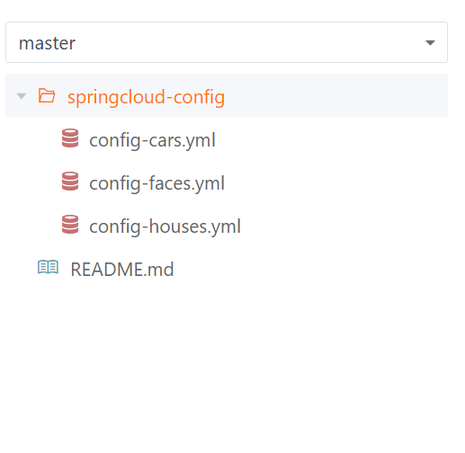

# Configuration center配置中心

## 配置中心实例的创建

1. 配置中心的作用在于对项目中的各种配置进行统一规定和存储,该配置依赖于git的远程仓库.在顶级父项目中创建工程 [d-configuration-center](material\springcloud-knowledge\d-configuration-center) 并在其 [pom.xml](material\springcloud-knowledge\d-configuration-center\pom.xml) 文件中配置 <groupId> 并添加相关依赖(即使不使用 bootstrop 依赖也可以配置,不过处于行业规范和对未来的规划,建议使用它)
   ```xml
   <groupId>org.giccqer.configuration</groupId>
   <dependencies>
       <dependency><!--配置中心服务端依赖-->
           <groupId>org.springframework.cloud</groupId>
           <artifactId>spring-cloud-config-server</artifactId>
       </dependency>
       <dependency><!--该依赖用于在项目启动前读取相关的 bootstrap.yml 文件中的依赖-->
           <groupId>org.springframework.cloud</groupId>
           <artifactId>spring-cloud-starter-bootstrap</artifactId>
       </dependency>
       <dependency><!--eureka客户端依赖-->
           <groupId>org.springframework.cloud</groupId>
           <artifactId>spring-cloud-starter-netflix-eureka-client</artifactId>
       </dependency>
   </dependencies>
   ```

   在配置文件中创建启动方法  [ConfigurationStarter.java](material\springcloud-knowledge\d-configuration-center\src\main\java\org\giccqer\configuration\ConfigurationStarter.java) :
   ```java
   @SpringBootApplication //与一般的Springboot启动基本项一致,只需要添加 @EnableConfigServer 注解
   @EnableConfigServer
   public class ConfigurationStarter {
       public static void main(String[] args) {
           SpringApplication.run(ConfigurationStarter.class, args);
       }
   }
   ```

2. 以 gitee 为例,创建新仓库并存储要读取的 yml 配置文件,本说明使用的仓库为: https://gitee.com/Giccqer-2021/springcloud-configuration-center.git ,其目录结构如下:

   

   这些配置文件内容为
    [config-cars.yml](material\springcloud-knowledge\remote-config\springcloud-config\config-cars.yml) :

   ```yml
   custom-cars:
     train: 🚆
     automobile: 🚗
     plane: ✈
   ```

    [config-faces.yml](material\springcloud-knowledge\remote-config\springcloud-config\config-faces.yml) :

   ```yml
   custom-faces:
     smiling-face: 😊
     crying-face: 😭
     calm-face: 😐
   ```

    [config-houses.yml](material\springcloud-knowledge\remote-config\springcloud-config\config-houses.yml) :
   ```yml
   custom-houses:
     city: 🏢
     farm: 🏕
     forest: 🏞
   ```

3. 在 resources 中创建 [application.yml](material\springcloud-knowledge\d-configuration-center\src\main\resources\application.yml) ,根据配置仓库的地址,写入以下配置(重点在于 cloud.config.server.git 中的相关配置):
   ```yml
   server:
     port: 8110 #8080+10+10+10
   spring:
     application:
       name: CONFIGURATION-CENTER
   eureka:
     instance:
       instance-id: CONFIGURATION-CENTER
       hostname: localhost
     client:
       service-url:
         defaultZone: http://localhost:8761/eureka
   management:
     endpoints:
       web:
         exposure:
           include: info
     info:
       env:
         enabled: true
   info:
     app:
       name: CONFIGURATION-CENTER
       status: CONFIGURATION-CENTER注册中心运转良好
   ```

   同时,在 resources 中创建 [bootstrap.yml](material\springcloud-knowledge\d-configuration-center\src\main\resources\bootstrap.yml) 启动加载配置:
   ```yml
   #bootstrap文件,主要用于配置应用启动时需要加载的外部配置中心的配置
   #如SpringCloudConfig服务器的地址,配置文件的标签,配置文件的名称和环境等
   spring:
     cloud:
       config:
         server:
           git: #配置中心相连接的git库
             uri: https://gitee.com/Giccqer-2021/springcloud-configuration-center.git # 配置文件git仓库地址
             username: Giccqer-2021 #git用户名
             password: ${secret.password} #git密码
             default-label: master #该配置文件所在的git工程分支
             search-paths: #配置git该仓库存放的具体目录
               - springcloud-config
             basedir: #将远程仓库克隆到本地的什么位置,建议配置绝对路径
               remote-config # 我~恨~你~!这个别乱写,如果文件夹已存在则在克隆仓库时里面的文件会被删除!!!
             clone-on-start: false #是否在启动时将git仓库克隆到本地,默认否
             skip-ssl-validation: false #是否忽略git仓库的ssl证书,默认否
           bootstrap: true #是否在启动时加载bootstrap配置文件,默认否,如果想要使bootstrap文件生效要设置为true
           #以下皆为启用本地配置的可选选项,如不需要本地配置可以不写
           native:
             search-locations:
               - remote-config/springcloud-config #本地配置文件存放的目录
     profiles:
       active: #以下两种配置模式根据实际需求任选其一
         - default #默认配置,即启用远程仓库配置
   #      - native #本地配置,即启用本地配置文件
     config:
       import: classpath:secret-info.yml
   ```
   
4. 启动项目,不必启动其他实例,以下列格式访问相关网址(大括号内的地址段可写可不写):

   > http://该项目的url/{git分支名}/文件名

   本说明所用网址 http://localhost:8110/master/config-faces.yml , http://localhost:8110/config-cars.yml , http://localhost:8110/config-houses.yml .点击后查看服务器所返回的结果.然后再查看项目下所新创建的克隆文件夹 [remote-config](material\springcloud-knowledge\remote-config) 
   同时,修改位于远程仓库中相关的配置文件中的配置,刷新页面,查看配置是否已被修改

5. 启用本地配置:只需要在上述配置的基础上,在 [bootstrap.yml](material\springcloud-knowledge\d-configuration-center\src\main\resources\bootstrap.yml) 中做出以下调整:
   ```yml
   spring:
     profiles:
       active:
         #- default
         - native
   ```

   启动配置中心,访问 http://localhost:8110/config-houses.yml ,然后修改位于本地的相关文件 [config-houses.yml](material\springcloud-knowledge\remote-config\springcloud-config\config-houses.yml) (不修改远程仓库中的文件) ,刷新页面,观察页面内容是否变化

## 其他客户端加载配置中心配置

### 直接连接

1. 以消费者工程 [b2-consumer](material\springcloud-knowledge\b-eureka-client\b2-consumer) 为例,在 controller 层中创建类  [ConfigurationController.java](material\springcloud-knowledge\b-eureka-client\b2-consumer\src\main\java\org\giccqer\consumer\controller\ConfigurationController.java) ,并创建获取消费者实例的相关配置,并返回给前端的方法
   ```java
   @RefreshScope
   @RestController
   public class ConfigurationController {
       @Value("${custom-cars.train}") //要读取的配置文件为配置中心的 custom-cars.yml
       private String config1;
       @Value("${custom-cars.automobile}")
       private String config2;
       @Value("${custom-cars.plane}")
       private String config3;
       @Autowired //Environment 对象通常用于存储应用程序的环境配置信息,例如数据库连接字符串,API密钥等.
       private Environment env;
       @GetMapping("/get-remote-config")
       public String getRemoteConfig() {
           String remoteConfig = "配置参数1: " + config1 + " ,配置参数2: " + config2 + " ,配置参数3: " + config3;
           String environmentConfig = "配置参数1: " + env.getProperty("custom-cars.train") + " ,配置参数2: " +
                   env.getProperty("custom-cars.automobile") + " ,配置参数3: " + env.getProperty("custom-cars.plane");
           return "<p>使用注解注入得到的参数配置:<br>" + remoteConfig + "<br>使用Environment对象得到的参数配置:<br>" + environmentConfig + "</p>";
       }
   }
   ```

   尝试令本controller组件加载配置中心中的配置,然后注入对应的变量中

2. 在消费者工程中导入依赖,声明自己为配置中心配置的使用者:
   ```xml
   <dependency><!--配置中心客户端依赖,需要 bootstrap 依赖配合使用-->
       <groupId>org.springframework.cloud</groupId>
       <artifactId>spring-cloud-starter-config</artifactId>
   </dependency>
   <dependency><!--该依赖用于在项目启动前读取相关的 bootstrap.yml 文件中的依赖-->
       <groupId>org.springframework.cloud</groupId>
       <artifactId>spring-cloud-starter-bootstrap</artifactId>
   </dependency>
   ```

   在 resources 文件夹中创建 [bootstrap.yml](material\springcloud-knowledge\b-eureka-client\b2-consumer\src\main\resources\bootstrap.yml) ,添加如下配置:
   ```yml
   spring:
     cloud:
       config:
         uri: http://localhost:8110 #配置中心url,如果启用配置中心发现服务则不必使用它
         label: master #配置文件的分支,对应git仓库的分支
         name: config #配置文件的名称
         profile: cars #配置文件的环境,与name一同指明了配置文件的文件名,该文件的文件名是 config-cars.yml
   ```

3. 同时启动配置中心和消费者,访问网址 http://localhost:8090/get-remote-config ,查看相关配置是否被正确加载
   关于同名配置覆盖的顺序: 在 [bootstrap.yml](material\springcloud-knowledge\b-eureka-client\b2-consumer\src\main\resources\bootstrap.yml) 的同名配置会被 [application.yml](material\springcloud-knowledge\b-eureka-client\b2-consumer\src\main\resources\application.yml) 所覆盖,而位于 [application.yml](material\springcloud-knowledge\b-eureka-client\b2-consumer\src\main\resources\application.yml) 的配置会被配置中心的配置覆盖

### 使用注册中心连接

1. 在消费者中,需要将 [bootstrap.yml](material\springcloud-knowledge\b-eureka-client\b2-consumer\src\main\resources\bootstrap.yml) 中的配置 spring.cloud.config.uri 移除,同时加入以下配置:
   ```yml
   spring:
     cloud:
       config:
         discovery:
           enabled: true #启用服务发现,在注册中心中查找配置中心的实例名,启用后建议将uri配置移除
           service-id: CONFIGURATION-CENTER #在注册中心中要查找的配置中心的实例名
   ```

   同理,配置中心工程也需要按照eureka客户端的配置将自身注册进服务端

2. 同时启动服务端(注册中心),配置中心和消费者,再次访问 http://localhost:8090/get-remote-config 观察相关配置是否被正确加载.本说明所使用的eureka服务端面板为 http://localhost:8761/
   与集群客户端同理,你也可以设置同时创建多个配置中心实例,消费者会根据负载均衡算法选择一个配置中心并读取其中的配置

## 手动刷新已载入的配置

1. 刷新配置需要导入相关的监视线程依赖(本服务器已在顶级父项目 [pom.xml](material\springcloud-knowledge\pom.xml) 中导入了该依赖)
   ```xml
   <dependency><!--监视线程依赖-->
       <groupId>org.springframework.boot</groupId>
       <artifactId>spring-boot-starter-actuator</artifactId>
   </dependency>
   ```

2. 在消费者配置文件 [application.yml](material\springcloud-knowledge\b-eureka-client\b2-consumer\src\main\resources\application.yml) 中,开放监视线程的端点 refresh ,配置如下:
   ```yml
   management:
     endpoints:
       web:
         exposure:
           include: refresh
   ```

   然后在 [ConfigurationController.java](material\springcloud-knowledge\b-eureka-client\b2-consumer\src\main\java\org\giccqer\consumer\controller\ConfigurationController.java) 类中添加如下类注解:
   ```java
   @RestController
   ```

3. 访问  http://localhost:8090/get-remote-config ,然后修改位于远程仓库中的配置文件 [config-cars.yml](material\springcloud-knowledge\remote-config\springcloud-config\config-cars.yml) (实际上在本地克隆好的仓库中修改然后再推上去即可,如果只读取本地配置则直接修改即可),打开cmd面板,输入以下指令使用post方法访问该端点:

   > curl -X POST http://localhost:8090/actuator/refresh

   等待一段时间后,观察cmd面板输出,同时刷新浏览器网页,查看对应的配置是否已被更新

